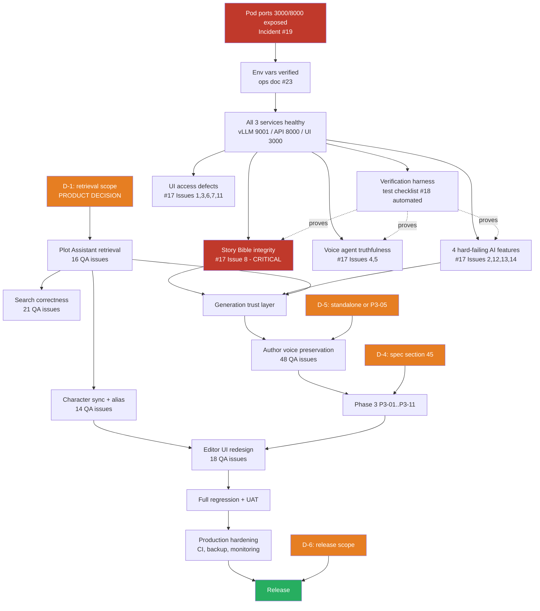

# NarratIQ Master Execution Plan and Document Implementation Order

**Document type:** Program-level execution plan and audit
**Prepared by:** Senior TPM / Software Architect / AI Systems Engineer / Production Readiness Auditor
**Date:** 2026-07-24
**Repository:** `/workspace/narratiq-ai` — branch `main`, commit `c226fd4`
**Status:** Analysis only — no application code, configuration, schema, infrastructure or existing document was modified in producing this plan.

**Method.** Every document listed in §2 was opened and read (`.docx` files were unzipped and their XML extracted to text — they were not classified by filename). Every status claim taken from a document was then checked against the actual codebase. Where a document and the code disagree, the code is treated as authoritative and the disagreement is recorded in §5. Claims that could not be verified by reading alone are marked **UNVERIFIED** and converted into an explicit verification task rather than an assumption.

---

## 1. Executive Summary

### 1.1 Where the project actually stands

NarratIQ AI is a **feature-complete but quality-incomplete** product. Phase 1 (manuscript platform) and Phase 2 (manuscript intelligence) are both structurally delivered: 24 backend routers, a 20-module voice subsystem, 15 Alembic migrations, PostgreSQL 16 + pgvector HNSW, and a production-hardening pass (rate limiting, upload guards, concurrency semaphores, orphan-job recovery) are all present in the repository and match what the phase documents claim was built.

The gap is not *missing features*. It is that **the features that exist do not yet produce trustworthy output**, and several fail outright. Two QA reports — one from Phase 1 covering the AI layer, one from Phase 2 covering production testing — document approximately **168 distinct defects** between them. Spot-checking the highest-severity claims against the code confirmed them as real, and in three cases revealed the root cause is architectural rather than a simple bug.

The single most important framing for this plan: **NarratIQ's remaining work is a quality, correctness and trust problem, not a build-out problem.** Scheduling Phase 3's eleven new capabilities before the retrieval and generation layers are trustworthy would build new features on a foundation that authors already do not trust.

### 1.2 Major remaining work, in order of importance

1. **Deployment is currently blocked at the infrastructure layer.** The most recent incident report (2026-07-24) confirms the pod exposes only ports 22, 8888 and 19123. Ports 3000 and 8000 — the frontend and the entire API — are unreachable from the browser. The application is healthy; nobody can reach it. Nothing else in this plan can be user-verified until this is fixed.
2. **A critical data-trust defect in the Story Bible.** It generates content unsupported by the manuscript, and separately, it can persist error placeholder strings while marking the job `completed`. The Story Bible is positioned as the author's source of truth; a hallucinating source of truth is worse than no source of truth.
3. **Four core AI features fail outright** — plot hole detection, chapter continuation, scene outline, continuity analysis. Verification showed these are not one shared bug as the root README claims, but a shared *pattern*: strict validation of model output with a hard failure and no degraded path.
4. **The Plot Assistant retrieves only from chapters at or before the current chapter.** This is deliberate code, not a bug — and it directly causes nine of the sixteen Plot Assistant QA issues. It requires a product decision, not an engineering fix.
5. **The AI transform layer rewrites instead of edits.** 48 issues in the Phase 1 QA report reduce to one architectural cause: there is no preservation mode and no "no change required" decision layer. Phase 3's P3-02 and P3-05 are designed to solve exactly this — creating a scheduling dependency described in §7.
6. **Test coverage is minimal relative to surface area** — 5 backend test files and 2 frontend spec files against 17+ AI features. There is no CI, no Dockerfile, no backup procedure and no monitoring.

### 1.3 Highest risks

| # | Risk | Severity | Why it matters |
|---|---|---|---|
| R1 | Story Bible hallucination poisons downstream features | **Critical** | The bible feeds author decisions and other AI context. Fabricated timeline events propagate. |
| R2 | No backup or restore procedure exists anywhere in the repo | **Critical** | A single-pod PostgreSQL instance holds every author's manuscript. Manuscript loss is unrecoverable and product-fatal. |
| R3 | Deployment blocked by pod port configuration | **Critical** | Ports are fixed at pod creation on RunPod; fixing this requires a stop/edit/start cycle, not a redeploy. |
| R4 | Plot Assistant retrieval scope is a product decision blocking ~9 QA issues | **High** | Engineering cannot resolve it; work will stall or be redone if guessed. |
| R5 | Rate limiting is in-memory and per-process | **High** | Silently degrades to no effective limit the moment uvicorn runs >1 worker. |
| R6 | 168 open QA issues with no triage or ownership | **High** | Without triage this becomes an unbounded backlog and blocks any credible release decision. |
| R7 | No CI — nothing prevents a regression from reaching main | **High** | Every fix in this plan risks silently breaking a previously working feature. |
| R8 | Phase 3 spec has unresolved stakeholder decisions (its own §45) | **Medium** | Starting implementation before these are closed guarantees rework. |

### 1.4 Recommended execution strategy

Nine phases, gated. The controlling principle is **trust before expansion**:

> Stabilise the environment → stop the bleeding on critical defects → make retrieval correct → make generation trustworthy → *then* build new capability → then polish → then prove it with tests → then harden for release.

Three sequencing decisions distinguish this plan from a naive reading of the documents:

- **The Phase 1 QA report is split across three separate places in the execution order**, not handled as one document. It is not one report — it is nine consolidated sub-reports covering unrelated subsystems with wildly different urgency. Its search-truncation bugs are near-term correctness work; its UI redesign recommendation is a large, low-urgency programme. Treating the file as a single work item would either delay critical fixes or pull a UI redesign forward past broken AI features.
- **Phase 3 is scheduled after retrieval and generation quality work**, despite being the newest and most detailed specification in the repository — with one deliberate exception described in §7.3, where the preservation-rules capability is pulled forward because it *is* the fix for the largest cluster of Phase 1 QA issues.
- **Testing is not a single late phase.** A verification harness is built early (execution order item 6) because otherwise none of the defect fixes in Phases 2–4 can be proven, and the QA reports cannot be re-run to confirm closure.

---

## 2. Repository Documentation Inventory

26 documentation files were inventoried. 18 are substantive project documents; 5 are navigational indexes; 2 are generated Word duplicates of Markdown sources; 1 is an annotated configuration template.

| # | Document | File Path | Purpose | Current Status | Still Applicable | Depends On | Priority |
|---|---|---|---|---|---|---|---|
| 1 | Project README | `README.md` | Landing page, quick start, known issues, feature status | **Active** — 2 stale claims (see §5.4, §5.5) | Yes | CLAUDE.md | High |
| 2 | Architecture Reference | `CLAUDE.md` | Authoritative architecture, config gotchas, hardening record | **Active** — most accurate system description; 2 internal contradictions (§5.6) | Yes | — | **Critical** |
| 3 | Changelog | `CHANGELOG.md` | Release history through v3.1.0 + Unreleased section | **Active** | Yes | — | Medium |
| 4 | Documentation Index | `docs/README.md` | Navigation, status overview, reading order | **Active** (navigational) | Yes | All | Medium |
| 5 | Phases Index | `docs/phases/README.md` | Phase status overview | **Active** (navigational) | Yes | Phase docs | Low |
| 6 | Issues Index | `docs/issues-and-bugs/README.md` | Issue triage workflow | **Active** (navigational) | Yes | Issue docs | Low |
| 7 | Operations Index | `docs/operations/README.md` | Ops document routing | **Active** (navigational) | Yes | Ops docs | Low |
| 8 | Archive Index | `docs/archive/README.md` | Archive rationale + stale-path mapping | **Active** (navigational) | Yes | Archive docs | Low |
| 9 | Product & Technical Documentation | `docs/specifications/narratiq-ai-product-and-technical-documentation.docx` | Master product spec, v4.1, "Phase 1 Complete — Phase 2 Planned" | **Active but lagging** — predates Phase 2 delivery and Phase 3 hardening | Partially | Phase 1 docs | High |
| 10 | Author-Style & Copyright Features | `docs/specifications/author-style-and-copyright-risk-features.md` | Design + impl reference for 2 features | **Active** — implementation present, sits in CHANGELOG "Unreleased" | Yes | CLAUDE.md | Medium |
| 11 | Phase 1 Production Implementation Report | `docs/phases/phase-1-completed/phase-1-production-implementation-report.docx` | v3.0.0 architecture record, 19 tables, 17 features | **Completed record** — migration numbering conflicts with CLAUDE.md (§5.6) | Historical | — | Medium |
| 12 | Phase 1 Status Update | `docs/phases/phase-1-completed/phase-1-status-update.docx` | v3 spec vs delivered, all 55 items | **Completed record** — reliable, cites grep verification | Historical | Doc 11 | Medium |
| 13 | Phase 2 Intelligence Expansion Roadmap | `docs/phases/phase-2-completed/phase-2-intelligence-expansion-roadmap.docx` | P2-01…P2-11 authoritative spec | **Completed record** — all tasks structurally shipped, quality unverified | Yes (as acceptance criteria) | Docs 11, 12 | High |
| 14 | Phase 3 Author-Centric AI Workflow | `docs/phases/phase-3-planned/phase-3-author-centric-ai-workflow.md` | P3-01…P3-11 design spec, 4151 lines | **Pending** — verified not implemented | Yes | Docs 12, 13, 10 | High |
| 15 | Phase 3 (Word copy) | `docs/phases/phase-3-planned/phase-3-author-centric-ai-workflow.docx` | Generated Word copy | **Duplicate** — 0.999 similarity to #14 | Review only | Doc 14 | — |
| 16 | Phase 1 AI Writing Tools QA Issues | `docs/issues-and-bugs/open/phase-1-ai-writing-tools-qa-issues.docx` | 9 consolidated sub-reports, ~154 issues | **Open — partial** | Yes | — | **Critical** |
| 17 | Phase 2 Production Testing Issues | `docs/issues-and-bugs/open/phase-2-production-testing-issues.docx` | 14 defects from production testing | **Open — partial** | Yes | Doc 13 | **Critical** |
| 18 | Author Feature Test Checklist | `docs/testing/author-feature-test-checklist.docx` | One manual test per feature | **Active** — the only test plan in the repo | Yes | Docs 13, 9 | High |
| 19 | RunPod Port 3000 Incident Report | `docs/incidents/runpod-port-3000-404-incident-report.md` | Root-cause analysis, 2026-07-24 | **Active — fix not yet applied** | Yes | — | **Critical** |
| 20 | Incident Report (Word copy) | `docs/incidents/runpod-port-3000-404-incident-report.docx` | Generated Word copy | **Duplicate** — 1.000 similarity to #19 | Sharing only | Doc 19 | — |
| 21 | How to Run | `docs/operations/how-to-run.md` | Per-service startup and verification | **Active** | Yes | Doc 23 | High |
| 22 | RunPod Deployment | `docs/operations/runpod-deployment.md` | Pod creation, storage, troubleshooting | **Active** — must absorb the incident's port lesson | Yes | Doc 23 | **Critical** |
| 23 | RunPod Environment Variables | `docs/operations/runpod-environment-variables.md` | Env var precedence, obsolete vars, recovery | **Active** — most rigorous ops doc; self-marks UNVERIFIED items | Yes | — | **Critical** |
| 24 | Technical Analysis Report v2 | `docs/archive/narratiq-ai-technical-analysis-report-v2.docx` | Mid-Phase-1 analysis | **Superseded** — self-declares superseded; all gaps closed | No | — | None |
| 25 | Documentation Recovery Changelog | `docs/archive/documentation-recovery-changelog.md` | Record of a completed doc task | **Historical** | No | Doc 23 | None |
| 26 | Environment Template | `.env.example` | Annotated configuration template | **Active** | Yes | `backend/config.py` | High |

### 2.1 Classification totals

| Classification | Count | Documents |
|---|---|---|
| **Active / current** | 16 | 1, 2, 3, 4, 5, 6, 7, 8, 9, 10, 18, 19, 21, 22, 23, 26 |
| **Completed records** | 3 | 11, 12, 13 |
| **Partial** (features exist, defects open) | 2 | 16, 17 |
| **Pending** (not started) | 1 | 14 |
| **Blocked** | 0 | *(no document is blocked; specific tasks within them are — see §6.6)* |
| **Outdated / duplicated** | 4 | 15, 20 (generated duplicates); 24, 25 (archived) |

### 2.2 A note on document #16's true scale

`phase-1-ai-writing-tools-qa-issues.docx` is not a single QA report. Heading extraction shows it is **nine consolidated sub-reports** bundled into one file:

| Sub-report | Issues | Highest severity | Subsystem |
|---|---|---|---|
| AI Writing Tools (tone, emotion, audience, style, translation) | 38 + 10 cross-module (A–J) | Critical | `ai_transform.py`, `ai_service.py` prompts |
| AI Plot Assistant | 16 | **Critical (overall)** | RAG retrieval, `plot_assistant.py` |
| AI Suggestions / Writing Tips | 16 | Critical | `ai_service.py` suggestion prompts |
| Character Recognition & Management | 14 | Critical | `characters.py`, alias resolution |
| Continuity / Story Intelligence | 15 | Critical | `analysis.py`, continuity prompts |
| Writing Analytics | 6 | Medium | analytics endpoints + UI |
| Semantic Search | 9 | Critical | `search.py` |
| Exact Search & Replace | 12 | Critical | `search.py` |
| Editor UI / Author Workspace | 18 | Critical | frontend layout architecture |
| **Total** | **~154** | | |

Combined with document #17's 14 defects, the open defect population is **approximately 168 issues**. This is materially larger than the file's name suggests and is the primary reason the execution order in §8 splits this one document across three separate positions.

---

## 3. Sources of Truth

Where documents overlap, this table declares which one wins. Disagreements are listed in §5.

| Domain | Source of truth | Why | Do **not** rely on |
|---|---|---|---|
| **Current architecture as it runs today** | `CLAUDE.md` | Continuously maintained; matches verified code (router names, migration chain, hardening items, config defaults) | Doc #9 (v4.1, predates Phase 2 delivery); Doc #24 (archived) |
| **Phase 1 scope and delivery** | `phase-1-status-update.docx` (#12) | Feature-by-feature audit with cited grep verification, more rigorous than #11 | Doc #24 |
| **Phase 2 scope and acceptance criteria** | `phase-2-intelligence-expansion-roadmap.docx` (#13) | Self-declares "the authoritative Phase 2 specification"; its §16 Production Rules and §19 task specs remain the acceptance bar | `CLAUDE.md` Phase 2 router table (contains 3 non-existent filenames — §5.6) |
| **Phase 3 / upcoming work** | `phase-3-author-centric-ai-workflow.md` (#14) — **Markdown, not the .docx** | Markdown is the versioned source; the .docx is a generated copy | Doc #15 for any authoritative reading |
| **Open defects — AI layer** | `phase-1-ai-writing-tools-qa-issues.docx` (#16) | Only comprehensive AI QA record | README "Known Issues" (a 5-item summary of a 154-item report) |
| **Open defects — production behaviour** | `phase-2-production-testing-issues.docx` (#17) | Only production-testing record; severity ratings are usable as-is | — |
| **AI workflow design intent** | Doc #14 §8, §12.3, §24.1 | Only document defining prompt assembly, budgeting and lock guarantees | — |
| **Deployment & pod configuration** | `runpod-deployment.md` (#22) **plus** the incident report (#19) | #22 is the procedure; #19 supplies the port-exposure requirement #22 currently lacks | `start.sh`, `scripts/verify_runpod_setup.sh` (both use the wrong port — §5.4) |
| **Environment variables** | `runpod-environment-variables.md` (#23) | Static analysis with explicit confidence marking and an UNVERIFIED section | Any stale value in the RunPod UI |
| **Testing** | `author-feature-test-checklist.docx` (#18) | The only test plan that exists | — |
| **Production readiness** | **None exists** | No document covers backup, monitoring, rollback or release approval | See §12 |

---

## 4. Duplicate, Outdated, and Superseded Documents

**Nothing in this section should be deleted.** Each entry is retained deliberately.

### 4.1 Confirmed generated duplicates

Verified by extracting `word/document.xml`, normalising to lowercase word sets, and computing Jaccard similarity:

| Pair | Similarity | Disposition |
|---|---|---|
| `docs/incidents/runpod-port-3000-404-incident-report.md` ↔ `.docx` | **1.000** | Keep both. `.md` is source of truth; `.docx` is for sharing with non-technical stakeholders. |
| `docs/phases/phase-3-planned/phase-3-author-centric-ai-workflow.md` ↔ `.docx` | **0.999** | Keep both. Same rule. The 0.001 delta is table-rendering artefacts, not content. |

**Risk:** these pairs will silently diverge the moment the Markdown is edited without regenerating the Word copy. See §12, gap PG-11.

### 4.2 Superseded

| Document | Superseded by | Evidence |
|---|---|---|
| `docs/archive/narratiq-ai-technical-analysis-report-v2.docx` | `phase-1-production-implementation-report.docx` | The v2 report's own executive summary states the v3.0 documentation "has been superseded by this report", and the v2 report has itself since been superseded. Every outstanding gap it lists — hardcoded secret key, SQLite, numpy cosine, missing OCR cleanup — is verifiably closed in the current code. |
| `docs/archive/documentation-recovery-changelog.md` | — (task complete) | Records a finished one-off documentation task at commit `9827587`. Its deliverable (#23) remains active. |

### 4.3 Partially outdated but still active

| Document | What is stale | Recommendation |
|---|---|---|
| `docs/specifications/narratiq-ai-product-and-technical-documentation.docx` (#9) | Titled "v4.1 (Phase 1 Complete — Phase 2 Planned)". Phase 2 is delivered and a production-hardening pass has landed since. Its implementation-status tables now understate the system. | Do **not** archive — it is the only complete product-level spec. Schedule a v5 refresh (execution order item 11). Until then, treat `CLAUDE.md` as authoritative for implementation status. |

### 4.4 Referenced but missing

| Document | Referenced from | Status |
|---|---|---|
| `NarratIQ_Project_Recovery_Report.docx` | `README.md` (now annotated as absent), `docs/archive/documentation-recovery-changelog.md:282` | **Not in the repository.** Cited as a code-level audit supporting the issue reports. Either locate and commit it, or formally retire the reference. Tracked as decision **D-7** in §5. |

---

## 5. Conflicts and Required Decisions

Each conflict lists all involved paths, both positions, an assessment, and either a recommendation or a formal decision point. **No conflicting document was modified.**

### 5.1 CONFLICT C-1 — Plot Assistant retrieval scope *(the most consequential conflict in the repository)*

- **Document position:** `phase-1-ai-writing-tools-qa-issues.docx`, Plot Assistant sub-report, rates the subsystem **Critical overall**. Critical Issue 1 — "Plot Assistant Only Uses Chapter 1 Context"; Critical Issue 5 — "Wrong Chapter Retrieval"; Critical Issue 9 — "Story-Wide Character Memory Failure"; High Issue 11 — "Later-Chapter Content Underrepresented". The report's stated expectation is *"Story-Wide Plot Intelligence"*.
- **Code position:** `backend/routers/plot_assistant.py:90` and `:138` both pass `max_chapter_number=data.current_chapter_number` into `retrieve_relevant_chunks()` and `retrieve_chunks_from_store()`. The retrieval functions honour it via `AND chapter_number <= :max_ch` (`ai_service.py:3158`, `:3327`).
- **Assessment:** This is **not a bug**. It is a deliberate spoiler-prevention design — while drafting Chapter 3, the assistant will not surface Chapter 20 content. It is also a complete and sufficient explanation for at least 9 of the 16 Plot Assistant QA issues. An author testing from Chapter 1 receives Chapter-1-only context and correctly reports "it only knows Chapter 1". Both parties are right.
- **Additional contributing factor:** retrieval breadth is narrow — `top_k=4` for suggestions, `top_k=5` when character context is injected, `top_k=8` otherwise (`plot_assistant.py:90,135–138`). Even unrestricted, this is a thin evidence base for story-wide questions.

> **DECISION REQUIRED — D-1 (Product owner). Blocking.**
> Should the Plot Assistant answer from the whole manuscript, or only from chapters up to the author's current position?
> **Options:** (a) always story-wide; (b) keep the spoiler guard, add an explicit "search whole story" toggle; (c) mode-dependent — QA mode story-wide, creative-suggestion mode capped.
> **Auditor's recommendation: (b).** It preserves the original design intent, resolves the QA complaint, and makes the behaviour visible to the author instead of silent — which is the actual defect. Silent scope limiting is what makes this read as a bug.
> **Cannot be resolved by engineering.** Roughly 9 QA issues, and any re-test of the Plot Assistant, are blocked until D-1 is answered.

### 5.2 CONFLICT C-2 — Story Bible "completed" status semantics

- **Document position:** `phase-2-production-testing-issues.docx` Issue 8 rates Story Bible hallucination **Critical**. `README.md` separately reports the bible "can persist placeholder text while marking the job `completed`".
- **Code position — both claims confirmed:**
  - `backend/routers/story_bible.py:136–141` — on `AIServiceUnavailableError` the section body is set to the literal string `"[AI temporarily unavailable — please regenerate]"`; on any other exception, `f"[Error generating {section}: {exc}]"`. Control then falls through to `:145–147`, which sets `status = "completed"` and commits.
  - Hallucination has a **context-starvation root cause**, not merely a prompt weakness. The system prompt at `ai_service.py:3646–3650` already instructs *"ground everything in what is actually in the text. Do not invent details not supported by the provided context."* But `_build_full_context()` in `story_bible.py` assembles context from chapter summaries truncated to **300 characters each**. The model is asked for a comprehensive timeline while being shown a heavily compressed digest — so it interpolates.
- **Assessment:** No document conflict; a **document-to-code** conflict. Both defects are real and independent. Prompt-only remediation will not fix Issue 8.
- **Recommendation:** Treat as two separate tasks — (i) status integrity: a section that failed must yield `status = "partial"` or `"failed"`, never `"completed"`; (ii) grounding: raise the context budget, cite chapter provenance per bible entry, and require the model to emit an explicit "not established in the manuscript" marker rather than filling gaps. No decision needed; both are unambiguous engineering fixes.

### 5.3 CONFLICT C-3 — "Shared root cause" for the four failing AI features

- **Document position:** `README.md` — *"Outline / continuation / continuity / plot-hole failures share one root cause — invalid AI output is not handled gracefully in the response parsing layer."* Matches `phase-2-production-testing-issues.docx` Issues 2, 12, 13, 14 (all High).
- **Code position:** The parsing layer is **already robust**. `_extract_json()` (`ai_service.py:272–310`) tries clean parse → code-fence strip → every balanced-brace span in both stripped and raw text → trailing-comma repair, and logs the raw head on total failure. What is *not* graceful is the **caller**: `ai_service.py:1589–1594` checks `if not isinstance(result, dict) or "issues" not in result:` and `raise ValueError("Plot hole analysis failed: AI model returned invalid output. Please try again.")`.
- **Assessment:** The README's diagnosis is **directionally right, mechanically wrong**. The shared cause is not weak parsing — it is **strict schema validation with a hard failure and no degraded path**. This distinction changes the fix: hardening `_extract_json` further would accomplish nothing. The fix belongs at the call sites — schema-coercion, a bounded reprompt-on-invalid-output retry, and partial-result return instead of an exception.
- **Recommendation:** Adopt the code-level diagnosis. Audit *all* callers of `_extract_json` for the same pattern before fixing only the four reported ones — the reported four are likely a sample, not the population.

### 5.4 CONFLICT C-4 — vLLM port (8001 vs 9001)

- **9001:** `backend/config.py:59` default, `start-narratiq.sh:17`, `CLAUDE.md`, `.env.example`.
- **8001:** `start.sh:25`, `scripts/verify_runpod_setup.sh:14`.
- **Assessment:** Long-documented and unresolved. `CLAUDE.md` and #23 both state 9001 is correct and that `verify_runpod_setup.sh` reports a **false failure** against a working stack. A verification script that fails on a healthy system actively trains operators to ignore verification output — that is the real cost.
- **Recommendation:** Fix the two legacy files to 9001, or delete `start.sh` if superseded. Requires **D-2** below only because deleting a file is not reversible by an automated agent without owner consent.

> **DECISION REQUIRED — D-2 (Tech lead). Non-blocking.** Retire `start.sh`, or repair it to 9001? `docs/operations/how-to-run.md:247` already declares it superseded by `start-narratiq.sh`.

### 5.5 CONFLICT C-5 — Plot-hole batched/hierarchical strategies

- **Document position:** `README.md` known issue 5 — *"Plot hole detection caps at 60 chapters (`ai_service.py:1534`); the batched and hierarchical strategies are written but not enabled."*
- **Code position:** The cap is real — `_PLOT_HOLE_MAX_CHAPTERS = 60` at `ai_service.py:1533`. But the strategies are **not written**. `grep -n "async def _strategy"` returns exactly two functions: `_strategy_single_pass` (`:1536`) and `_strategy_manuscript_summary_pass` (`:1777`). Lines `1607–1610` are commented-out *registry entries* pointing at functions that do not exist.
- **Assessment:** README materially overstates readiness. "Written but not enabled" implies a config flag; reality is a full implementation task. Same pattern at `:1884–1885` for the manuscript-report strategies.
- **Recommendation:** Correct the README claim (execution order item 11) and size the batched strategy as genuine implementation work, not enablement.

### 5.6 CONFLICT C-6 — `CLAUDE.md` internal contradictions

Two contradictions **inside a single file**, which is also the declared architecture source of truth:

1. **Non-existent routers.** The Phase 2 feature table lists `continuation.py` (P2-02), `voice.py` (P2-05), `outline.py` (P2-07). The same file's *Key Files* table explicitly states *"there is no `continuation.py` or `outline.py`"* and *"there is no `voice.py`"*. Verified: `ls backend/routers/` confirms none exist; the functionality lives in `writing_tools.py` and `characters.py`.
2. **Migration numbering.** `CLAUDE.md` assigns `0008` = story_bibles, `0009` = narrative_threads, `0010` = pacing_goals. `phase-1-production-implementation-report.docx` lists `0003_story_bibles.py`, `0004_narrative_threads.py`, `0005_pacing_goals.py`. Verified: `ls backend/migrations/versions/` matches **CLAUDE.md** — `0008`, `0009`, `0010` exist; `0003`–`0006` were never created.
- **Recommendation:** CLAUDE.md's Key Files table and the on-disk migration list are correct. Fix CLAUDE.md's Phase 2 table; annotate the Phase 1 report as superseded on numbering only. Low risk, high confusion-cost — an agent following the Phase 2 table will look for files that do not exist.

### 5.7 CONFLICT C-7 — Phase 3 vs Phase 3

- `CLAUDE.md` has a section titled "Production Hardening (Phase 3)" describing 8 **completed** items.
- `docs/phases/phase-3-planned/` contains "Phase 3 — Author-Centric AI Workflow", **not implemented**.
- **Assessment:** Two unrelated workstreams share a name. Already mitigated by warnings in `docs/README.md` and `docs/phases/README.md`, but the ambiguity remains in `CLAUDE.md` itself.
- **Recommendation:** Rename in documentation to **"Production Hardening (completed)"** and **"Phase 3 — Author-Centric AI Workflow (planned)"**. Zero code impact; prevents an expensive misunderstanding.

### 5.8 CONFLICT C-8 — Rate limiting storage

- `middleware/rate_limit.py:67` builds `Limiter(key_func=get_remote_address)` with no `storage_uri`. `SLOWAPI_STORAGE_URI` appears in comments and prose only and is read by nothing. `CLAUDE.md` documents this honestly and corrects an earlier false claim.
- **Assessment:** Not a document conflict — a **latent production defect**. In-memory storage is per-process. `CLAUDE.md` documents backend startup with `--workers 1`, which masks it. Any scaling change silently multiplies every rate limit by the worker count.
- **Recommendation:** Do not treat as documentation. Track as a production-readiness task (§12, PG-05).

### 5.9 Consolidated decision register

| ID | Decision | Owner | Blocking? | Blocks |
|---|---|---|---|---|
| **D-1** | Plot Assistant retrieval scope (§5.1) | Product owner | **Yes** | ~9 QA issues; Plot Assistant re-test; execution item 4 |
| **D-2** | Retire or repair `start.sh` (§5.4) | Tech lead | No | Item 2 completion |
| **D-3** | Multi-worker deployment target? Determines whether Redis-backed rate limiting is mandatory (§5.8) | Tech lead / infra | No | PG-05 sizing |
| **D-4** | Phase 3 §45 stakeholder decisions — the spec's own open-questions section | Product + Eng | **Yes** for Phase 3 | Execution item 7 |
| **D-5** | Author-voice preservation: ship standalone, or only as Phase 3 P3-05? (§7.3) | Product + Eng | **Yes** | Items 5 and 7 sequencing |
| **D-6** | Release scope — which of the ~168 issues are release-blocking? | Product owner | **Yes** | Gate 4; any release date |
| **D-7** | Locate or formally retire `NarratIQ_Project_Recovery_Report.docx` (§4.4) | Doc owner | No | Item 11 |
| **D-8** | Target chapter ceiling — is the 60-chapter cap acceptable at launch? (§5.5) | Product owner | No | Batched-strategy sizing |

---

## 6. Current Project State

### 6.1 Completed and verified

Verified by direct code inspection, not by document claim.

| Item | Evidence |
|---|---|
| PostgreSQL 16 + pgvector, HNSW indexes | `0001_pgvector_hnsw_indexes.py`; `<=>` operator in raw SQL at `ai_service.py:3158`, `:3327` |
| Alembic migration chain, 15 migrations | `ls backend/migrations/versions/` — `0001, 0002, 0007`–`0015` |
| `SECRET_KEY` mandatory, no hardcoded default | `CLAUDE.md` Config Gotchas; validator rejects <32 chars |
| Chapter-number-aware RAG filter | `ai_service.py:3137`, `:3310` — implemented and used |
| Robust LLM JSON extraction | `ai_service.py:272–310`, 4 fallback strategies |
| Production hardening — rate limits, upload guards, concurrency semaphores, orphan recovery | `backend/middleware/`, `backend/startup/orphan_recovery.py`, `backend/exceptions.py`, `backend/logger.py` |
| 24 backend routers covering all P1 + P2 features | `ls backend/routers/` |
| Voice agent subsystem, 20 modules | `ls backend/services/voice/` |
| Frontend lazy-loading, bundle reduction | `CLAUDE.md`; `next/dynamic` panels |
| Author-style + copyright-risk features | `copyright_risk.py`, `_AUTHOR_STYLES` registry, `backend/tests/test_author_style_and_copyright.py` |

### 6.2 Implemented but not verified — *the largest category*

Structurally present; **quality, correctness or integration unproven**. Every P2 feature falls here, because document #17 was produced by testing exactly these and found 14 defects.

| Item | Why unverified |
|---|---|
| Emotional arc (P2-01) | No test; no QA result either way |
| Chapter continuation (P2-02) | **Reported failing** — #17 Issue 13 |
| Duplicate scene detection (P2-03) | No test |
| Style drift (P2-04) | No test |
| Character voice check (P2-05) | Distinct from voice agent; no test |
| Story bible (P2-06) | **Reported Critical** — #17 Issue 8 |
| Outline / beat sheet (P2-07) | **Reported failing** — #17 Issue 12 |
| Continuity check (P2-08) | **Reported failing** — #17 Issue 14 |
| Pacing goals (P2-09) | No test; no AI dependency, likely lowest risk |
| OCR inject (P2-10) | **Reported UI-inaccessible** — #17 Issue 6 |
| Audio transcription (P2-11) | `clean_transcript()` had a signature bug fixed during hardening; never re-tested end-to-end |
| Author-style / copyright risk | Has a unit test; no end-to-end author verification; still in CHANGELOG "Unreleased" |

### 6.3 Partially completed

| Item | Done | Not done |
|---|---|---|
| Plot hole detection | `single_pass` strategy, dispatcher, registry pattern | `batched` / `hierarchical` / `deep_audit` / `multi_book` — registry comments only, no functions (§5.5). 60-chapter ceiling. |
| Manuscript report | `summary_pass` | `deep_pass`, `multi_pass` — same pattern, `:1884–1885` |
| Character management | CRUD, relationships, graph, embeddings | Alias resolution, dedup, unrecognised-name sync (14 QA issues; #17 Issue 9) |
| Search | Semantic + exact + replace implemented | Query truncation, character-level matching, match counting, highlighting, chunk dedup (21 QA issues across two sub-reports) |
| Voice agent | STT, intent, planner, orchestrator, adapters, guards | Reliable execution and truthful completion reporting (#17 Issues 4, 5) |
| Rate limiting | Per-endpoint limits, per-user keying, 429 handler | Shared storage — per-process only (§5.8) |
| JWT auth | Configurable algorithm and expiry | HttpOnly cookie migration — explicitly deferred to "Phase B" in `CLAUDE.md` |

### 6.4 In progress

No document describes active in-flight development. The most recent commits are documentation-only (`ff8bdf0`, `85ece07`, `c226fd4`). **Treat the project as paused between phases** — which is the correct moment for this plan.

### 6.5 Pending — not started

| Item | Source |
|---|---|
| Phase 3 P3-01 … P3-11 (11 capabilities, 1 new table) | Doc #14 — verified absent: no P3 classes in `models.py`, migrations stop at `0015` |
| Editor UI / author-workspace redesign (18 issues) | Doc #16, Editor UI sub-report |
| Batched / hierarchical plot-hole strategies | §5.5 |
| CI pipeline | No `.github/` directory exists |
| Containerisation | No `Dockerfile` or compose file exists |
| Backup / restore procedure | Absent from every document and the repo |
| Monitoring / alerting | No Sentry, no Prometheus scrape target, no healthcheck orchestration |

### 6.6 Blocked

| Blocked work | Blocked by | Type |
|---|---|---|
| **All user-facing verification of every feature** | Pod ports 3000/8000 unexposed (Doc #19) | Infrastructure — requires pod stop/edit/start |
| Plot Assistant retrieval fixes (~9 issues) | **D-1** | Product decision |
| Phase 3 implementation | **D-4** (spec §45 open questions) | Product decision |
| Author-voice preservation work | **D-5** (standalone vs P3-05) | Scheduling decision |
| Any release date | **D-6** (release-blocking scope) | Product decision |
| Redis-backed rate limiting sizing | **D-3** | Infrastructure decision |

### 6.7 Unclear or conflicting

All eight conflicts in §5. The four that most affect execution: **C-1** (retrieval scope — product decision), **C-3** (root-cause misdiagnosis — changes the fix), **C-5** (strategies not written — changes the estimate), **C-6** (architecture doc contradicts itself — misdirects implementers).

---

## 7. Dependency Map

### 7.1 Controlling chain

```
Pod port exposure (D-19 incident)
        └── everything user-verifiable
                └── Environment variables correct
                        └── Services healthy (vLLM + backend + frontend)
                                └── Critical data-integrity defects
                                        └── Retrieval correctness  ←── D-1
                                                └── Generation quality  ←── D-5
                                                        └── Phase 3 features  ←── D-4
                                                                └── UI redesign
                                                                        └── Full QA pass
                                                                                └── Production hardening
                                                                                        └── Release  ←── D-6
```

### 7.2 Diagram



### 7.3 The Phase 3 / Phase 1-QA overlap — a deliberate scheduling exception

This is the most important non-obvious dependency in the repository, and it is why documents #14 and #16 must be planned together rather than sequentially.

The Phase 1 QA report's largest cluster — 38 transform issues plus cross-module Critical Issues A–J — reduces to one architectural statement: **the transform engine rewrites when it should edit, and has no mechanism to decide that no change is required.**

The Phase 3 specification independently designs exactly that mechanism:

| Phase 3 capability | Phase 1 QA issues it addresses |
|---|---|
| **P3-02** — sentence-level lock + partial regeneration | 1.2, 1.6, 3.4, 4.2 (excessive/unnecessary rewriting) |
| **P3-05** — preservation rules + deterministic post-check | 1.1, 1.4, 4.7, 4.10, Critical A, B, D, I, J (voice/style/identity preservation) |
| **P3-04** — side-by-side version comparison | 1.3, 4.9 (detecting drift and quality regression) |

**Consequence:** fixing the QA issues generically *and then* implementing P3-02/P3-05 would build the same capability twice, with the second implementation likely replacing the first. Conversely, deferring all 48 issues until Phase 3 completes leaves the product's most-used feature untrustworthy for the entire Phase 3 cycle.

**Auditor's recommendation (decision D-5):** pull **P3-05 (preservation rules)** and **P3-02 (sentence-level lock)** forward out of Phase 3 and implement them as the resolution to the Phase 1 transform QA cluster — execution item 5. Leave the remaining nine P3 capabilities in Phase 3. This resolves 48 issues and 2 of 11 Phase 3 capabilities with one body of work, and it is the single highest-leverage sequencing choice available.

### 7.4 Safe-to-parallelise vs strictly sequential

| Relationship | Type |
|---|---|
| Port exposure → everything | **Strict** — hard blocker |
| Story Bible integrity ∥ hard-failing features ∥ voice truthfulness ∥ UI access defects | **Parallel** — different files, no shared state |
| D-1 → Plot Assistant → Search → Character sync | **Strict** — shared retrieval layer; concurrent edits to `ai_service.py` retrieval will conflict |
| Verification harness ∥ all defect fixes | **Parallel, and should be** — the harness proves the fixes |
| Preservation layer → remaining Phase 3 | **Strict** — P3-03/04/06+ build on P3-02's segment model |
| UI redesign ∥ backend work | **Parallel** — but must follow Phase 3 API shape to avoid rework |
| CI / Dockerfile / backup ∥ everything | **Fully parallel** — no dependency; start immediately |

---

## 8. Recommended Document Completion Order

Twelve positions. Note that document #16 occupies **three** positions (4, 5, 8) because it bundles nine unrelated sub-reports with different urgencies (§2.2).

---

### Position 1 — RunPod Port 3000 Incident Report

| Field | Value |
|---|---|
| **1. Sequence** | 1 |
| **2. Workstream** | Restore external reachability of the application |
| **3. Source path** | `docs/incidents/runpod-port-3000-404-incident-report.md` |
| **4. Current status** | Root cause confirmed at 100% confidence against RunPod's own API; **fix not yet applied** |
| **5. Why first** | Absolute hard blocker. The application is healthy and completely unreachable. No defect fix, QA re-test, UAT or stakeholder demo is possible until this is resolved. Every other item in this plan is unverifiable while it stands. |
| **6. Dependencies** | None |
| **7. Blocking issues** | RunPod ports are fixed at pod creation. Requires a **stop → edit → start** cycle, not a redeploy. Confirm the network volume persists across the cycle before stopping. |
| **8. Required actions** | 1. Snapshot/verify the network volume and confirm `/workspace` persistence. 2. Stop the pod. 3. Add HTTP ports **3000** and **8000** to the pod configuration. 4. Start the pod. 5. Re-run `start-narratiq.sh`. 6. Confirm the new pod ID and regenerate `frontend/.env.local` — `NEXT_PUBLIC_API_URL` is inlined at **build** time, so a rebuild is mandatory. 7. Verify `https://{POD_ID}-3000.proxy.runpod.net` returns 200 and `https://{POD_ID}-8000.proxy.runpod.net/api/health` returns healthy. 8. Fold the port requirement into `docs/operations/runpod-deployment.md` as a pod-creation prerequisite. |
| **9. Deliverables** | Reachable frontend; reachable API; deployment doc updated with the port contract; incident marked resolved |
| **10. Affected areas** | Infrastructure, RunPod configuration, frontend build, operational documentation |
| **11. Validation** | Both public URLs return 200 from an external browser. A 404 carrying `server: cloudflare` with an empty body must never again be diagnosed as an application fault. |
| **12. Definition of done** | An external user loads the app, logs in, opens a project, and a live AI call succeeds end-to-end through the proxy |
| **13. Risk** | **Critical** |
| **14. Complexity** | **Small** (configuration only — but with a stop/start risk window) |
| **15. Parallel?** | No — blocks everything |
| **16. Next** | Proceed to Position 2 while the stack warms |

> ⚠️ The incident report also records that this pod ran **1× NVIDIA A40**, not the 2× Blackwell documented in `CLAUDE.md`, and an effective `max-model-len` of **8192**, not 16384. Re-confirm actual hardware after restart and reconcile `CLAUDE.md` (folded into Position 11).

---

### Position 2 — RunPod Environment Variables

| Field | Value |
|---|---|
| **1. Sequence** | 2 |
| **2. Workstream** | Environment configuration correctness |
| **3. Source path** | `docs/operations/runpod-environment-variables.md` (with `docs/operations/runpod-deployment.md`, `docs/operations/how-to-run.md`, `.env.example`) |
| **4. Current status** | Active, rigorous, self-marks UNVERIFIED items |
| **5. Why second** | A stale `VLLM_BASE_URL` in the RunPod UI silently overrides `backend/.env` and produces a healthy-looking backend where every AI call returns 503. Debugging Positions 3–5 against that state would waste enormous effort chasing phantom AI failures. Cheap to eliminate now. |
| **6. Dependencies** | Position 1 |
| **7. Blocking issues** | **D-2** (retire or repair `start.sh`) |
| **8. Required actions** | 1. Audit the RunPod UI env vars against §4 of the source doc; delete every obsolete key. 2. Confirm `SECRET_KEY` is set and stable — changing it invalidates all sessions. 3. Verify `/api/health` reports vLLM available, not `"unavailable"`. 4. Resolve **C-4**: correct `start.sh:25` and `scripts/verify_runpod_setup.sh:14` to 9001, or retire per D-2. 5. Re-run `verify_runpod_setup.sh` and confirm it passes truthfully against a working stack. 6. Close out the source doc's UNVERIFIED §11 items now that a live pod exists. |
| **9. Deliverables** | Clean env var set; verification script that passes honestly; UNVERIFIED items closed |
| **10. Affected areas** | Configuration, ops scripts, ops documentation |
| **11. Validation** | `curl /api/health` → all subsystems healthy; one real AI generation succeeds; `verify_runpod_setup.sh` exits 0 |
| **12. Definition of done** | Fresh pod start reaches full health with zero manual env intervention, and the verification script agrees |
| **13. Risk** | **High** |
| **14. Complexity** | **Small** |
| **15. Parallel?** | Partially — the `start.sh` cleanup can run alongside Position 3 |
| **16. Next** | Position 3; hold environment stable as the baseline for all defect work |

---

### Position 3 — Phase 2 Production Testing Issues

| Field | Value |
|---|---|
| **1. Sequence** | 3 |
| **2. Workstream** | Critical defects and data integrity |
| **3. Source path** | `docs/issues-and-bugs/open/phase-2-production-testing-issues.docx` |
| **4. Current status** | Open — 14 defects: 1 Critical, 7 High, 4 Medium–High, 2 Medium |
| **5. Why third** | Contains the only **Critical**-rated defect in the repository (Issue 8, Story Bible hallucination) plus four features that fail outright. These are the defects an author hits within minutes of first use. Every item is scoped, reproducible and independently fixable — the highest ratio of user-visible improvement to effort in the entire plan. |
| **6. Dependencies** | Positions 1, 2 |
| **7. Blocking issues** | None — no decisions required. **Fix Issues 1 and 11 together**; they are the same toolbar with contradictory required behaviours. |
| **8. Required actions** | Grouped by root cause, not by issue number: <br>**Group A — data trust (Issue 8, Critical).** Fix `story_bible.py:136–147` so a failed section yields `status = "partial"`/`"failed"`, never `"completed"`. Separately fix grounding: raise `_build_full_context()` beyond the 300-char summary truncation, attach chapter provenance to each bible entry, and require an explicit "not established in the manuscript" marker instead of interpolation. Add a regression test asserting no bible entry lacks provenance.<br>**Group B — hard-failing AI features (Issues 2, 12, 13, 14, all High).** Per §5.3 the fix is at the call sites, not in `_extract_json`. Replace `raise ValueError` at `ai_service.py:1591–1594` with schema-coercion → one bounded reprompt → partial result with an explicit `degraded: true` flag. **Audit every caller of `_extract_json` for the same pattern** — the four reported are a sample.<br>**Group C — voice agent truthfulness (Issues 4, 5, both High).** Success must be asserted from the adapter's actual return value, never from plan completion. Issue 5 is a trust defect: a false success is worse than an honest failure.<br>**Group D — UI access (Issues 1, 3, 6, 7, 11).** Toolbar dismiss-on-deselect and suppression while the AI sidebar is open (`frontend/components/studio/SelectionToolbar.tsx`); analytics vertical scroll; OCR upload surface (`OCRPanel.tsx` exists — diagnose why it renders empty); notes load reliability (Issue 7 — investigate as a race or cache-invalidation defect, not a retry problem).<br>**Group E — data sync (Issue 9).** Remove characters from the unresolved queue once matched or merged. Overlaps 14 Position-4 issues — coordinate.<br>**Group F — IA (Issue 10).** Notes/threads navigation duplication. Defer to Position 8 (UI redesign); do not fix twice. |
| **9. Deliverables** | 13 of 14 issues closed (Issue 10 deferred by design); regression tests for Groups A–C; a documented degraded-output contract |
| **10. Affected areas** | Backend AI services, story bible, voice agent, frontend editor/analytics/OCR/notes, character management |
| **11. Validation** | Re-run every one of the 14 reported scenarios on a real manuscript. Group A additionally requires an author to confirm the bible contains no unsupported events. |
| **12. Definition of done** | All 4 previously-failing AI features return usable results or an honest, actionable error; the Story Bible never reports `completed` on partial content and never asserts unsupported facts |
| **13. Risk** | **Critical** |
| **14. Complexity** | **Large** |
| **15. Parallel?** | Yes — Groups A–E are independent. Recommended split: backend engineer on A+B, second backend on C+E, frontend on D. |
| **16. Next** | Position 4 once Group B is stable — its degraded-output contract is reused by retrieval work |

---

### Position 4 — Phase 1 QA Report, Part 1: Retrieval & Data Correctness

| Field | Value |
|---|---|
| **1. Sequence** | 4 |
| **2. Workstream** | Retrieval correctness — Plot Assistant, Search, Character sync |
| **3. Source path** | `docs/issues-and-bugs/open/phase-1-ai-writing-tools-qa-issues.docx` — Plot Assistant (16), Semantic Search (9), Exact Search (12), Character Recognition (14) sub-reports |
| **4. Current status** | Open — 51 issues. Plot Assistant rated **Critical overall** by the report |
| **5. Why fourth** | Retrieval is the foundation every other AI feature stands on. Continuity, story bible, plot holes, suggestions and manuscript reports all consume retrieved context — improving their *prompts* while retrieval returns the wrong chapters produces confident, well-written, wrong answers. Fixing generation before retrieval is strictly wasted effort. Search bugs (query truncation, character-level matching) are additionally straightforward correctness defects with no design ambiguity. |
| **6. Dependencies** | Position 3 Group B; **D-1** |
| **7. Blocking issues** | **D-1 is a hard blocker for the Plot Assistant sub-report.** Search and Character sub-reports are *not* blocked and should start immediately. |
| **8. Required actions** | 1. **Obtain D-1.** Then implement the chosen scope at `plot_assistant.py:90,138`. Under recommended option (b), add an explicit scope toggle and surface the active scope in the UI — silent limiting is the actual defect.<br>2. Revisit retrieval breadth: `top_k=4/5/8` is thin for story-wide questions. Tune against the 800-token character budget and the chunk budget.<br>3. Address ranking issues 6, 7, 8, 12 — context prioritisation, existing-information-reported-as-missing, retrieval-vs-knowledge-failure confusion. Issue 8 requires the system to **distinguish "not retrieved" from "not in the story"** and say so; this is a correctness *and* trust fix.<br>4. Fix search: query truncation, character-level vs full-term matching, match counting, highlighting, chunk dedup, overlapping-chunk results (21 issues, two sub-reports, largely the same defects reported twice — dedupe before starting).<br>5. Character alias resolution, dedup, mention-to-character linking, unrecognised-name queue refresh (14 issues) — coordinate with Position 3 Group E.<br>6. Add retrieval regression tests using a fixed manuscript fixture and known-answer queries. |
| **9. Deliverables** | Story-scope-correct Plot Assistant; correct search across both modes; synchronised character recognition; a retrieval regression suite |
| **10. Affected areas** | `ai_service.py` retrieval layer, `plot_assistant.py`, `search.py`, `characters.py`, pgvector queries, frontend search UI |
| **11. Validation** | Fixed multi-chapter fixture with known ground truth. Explicit assertion: a question about a late chapter returns late-chapter evidence (subject to the D-1 scope rule). Search assertions on exact match counts. |
| **12. Definition of done** | Plot Assistant answers story-wide questions with citations from the correct chapters; search returns exact and correct results; no character appears simultaneously as recognised and unrecognised |
| **13. Risk** | **High** |
| **14. Complexity** | **Very Large** |
| **15. Parallel?** | Search and Character work parallel with each other and with the D-1 wait. Plot Assistant retrieval is strictly sequential — one owner on `ai_service.py` retrieval to avoid conflicts. |
| **16. Next** | Position 5 — generation quality is only meaningful on correct retrieval |

---

### Position 5 — Phase 1 QA Report, Part 2: Generation Quality & Author Voice

| Field | Value |
|---|---|
| **1. Sequence** | 5 |
| **2. Workstream** | AI generation trustworthiness — transforms, suggestions, continuity |
| **3. Source path** | `docs/issues-and-bugs/open/phase-1-ai-writing-tools-qa-issues.docx` — Writing Tools (38 + 10 cross-module), AI Suggestions (16), Continuity/Story Intelligence (15), Writing Analytics (6) |
| **4. Current status** | Open — 85 issues |
| **5. Why fifth** | This is the product's core value proposition and its largest defect cluster. It is scheduled after retrieval because continuity and suggestion quality depend on retrieved context. It is scheduled before Phase 3 because Phase 3 builds *on top of* the generation loop — building generation management over a generator that destroys author voice compounds the problem. **This position implements P3-05 and P3-02 early per §7.3 and D-5.** |
| **6. Dependencies** | Position 4; **D-5** |
| **7. Blocking issues** | **D-5** determines whether preservation ships here or in Phase 3. Recommendation: here. |
| **8. Required actions** | 1. **Preservation architecture** (resolves Critical A, B, D, I, J + issues 1.1–1.7, 3.4, 4.1–4.2, 4.7, 4.10). Implement Phase 3 **P3-05 preservation rules** — a constraint plus a deterministic post-generation check — and **P3-02 sentence-level locks**. Read doc #14 §24.1 for how locked text is actually guaranteed rather than merely requested.<br>2. **"No change required" decision layer** (Critical C; issues 3.6, 4.8, 3.4). The system must be able to conclude that text already satisfies the request and return it unchanged. Today it always rewrites.<br>3. **Transformation strength control** (issue 4.3) — expose intensity so "adjust" and "rewrite" become distinct operations.<br>4. **Suggestions overhaul** (16 issues). The report's finding is blunt: suggestions are *praise, not suggestions*, with positive bias and no weakness detection. Requires prompt redesign toward developmental-editing critique plus recommendation prioritisation. Consider an explicitly adversarial critique pass.<br>5. **Continuity false positives** (Critical 1, 2, 3, 6). False continuity breaks are worse than none — they train authors to ignore the feature. Require evidence citation for every reported contradiction and suppress unsupported findings.<br>6. **Analytics transparency** (6 issues) — explain readability and dialogue-ratio scores rather than emitting bare numbers.<br>7. Establish **prompt versioning** before changing prompts at this scale (see §12, PG-08) — otherwise quality regressions become untraceable. |
| **9. Deliverables** | Preservation-first transform engine; no-change decision layer; strength control; critique-capable suggestions; evidence-cited continuity; explained analytics; a versioned prompt registry |
| **10. Affected areas** | `ai_service.py` prompts, `ai_transform.py`, `analysis.py`, `manuscript_report.py`, transform UI, new preservation tables |
| **11. Validation** | **AI quality evaluation is required here, not manual spot-checks.** Build a golden-set: N author passages × M transforms, scored for voice preservation, unnecessary-change rate, and genre drift. Baseline before changes; require measured improvement. Manual author review on top. |
| **12. Definition of done** | A tone transform on a passage needing no change returns it unchanged; transforms preserve author voice under blind author review; suggestions identify real weaknesses; continuity reports no contradiction it cannot cite evidence for |
| **13. Risk** | **High** |
| **14. Complexity** | **Very Large** |
| **15. Parallel?** | Suggestions, continuity and analytics parallel with each other. The preservation architecture is sequential and must land first — the others build on its evaluation harness. |
| **16. Next** | Position 6 — lock in the gains with an automated harness before Phase 3 |

---

### Position 6 — Author Feature Test Checklist

| Field | Value |
|---|---|
| **1. Sequence** | 6 |
| **2. Workstream** | Verification harness |
| **3. Source path** | `docs/testing/author-feature-test-checklist.docx` |
| **4. Current status** | Active — the only test plan in the repository; entirely manual |
| **5. Why sixth** | This document is the closest thing to a product acceptance specification: one concrete test per feature across editor, transforms, story intelligence, characters, ingestion and platform. Positions 3–5 will have changed a large fraction of the system with only 5 backend and 2 frontend test files guarding against regression. Automating this checklist converts an unenforceable manual ritual into an enforceable gate — and it must exist **before** Phase 3 adds eleven more capabilities. Scheduling it later would mean building Phase 3 with no regression safety net. |
| **6. Dependencies** | Positions 3, 4, 5 (so the harness encodes fixed behaviour, not broken behaviour) |
| **7. Blocking issues** | Requires a stable seeded fixture manuscript with known characters (the checklist references Devika, Mara, Sant, Vance) |
| **8. Required actions** | 1. Build a seeded fixture manuscript + deterministic test user. 2. Convert every checklist row into an automated API-level integration test. 3. Add Playwright end-to-end tests for the editor, transform toolbar, analytics and OCR flows (`frontend/tests/` already uses spec files — extend that). 4. Encode the 14 Position-3 scenarios and Position-4 retrieval assertions as permanent regression tests. 5. Stand up **CI** (§12, PG-01) and make this suite the merge gate. 6. Keep an explicitly manual UAT subset for subjective AI-quality judgements that cannot be asserted programmatically. |
| **9. Deliverables** | Automated integration + E2E suite; fixture manuscript; CI pipeline running it on every push; documented manual UAT subset |
| **10. Affected areas** | `backend/tests/`, `frontend/tests/`, new `.github/workflows/`, test fixtures |
| **11. Validation** | Suite passes green on a clean pod; deliberately reintroducing a Position-3 defect turns it red |
| **12. Definition of done** | Every feature in the checklist has an automated test or a documented reason it must stay manual; CI blocks merges on failure |
| **13. Risk** | **High** (of *not* doing it) |
| **14. Complexity** | **Large** |
| **15. Parallel?** | CI scaffolding can start immediately, in parallel with Position 1. Test authoring must follow the fixes. |
| **16. Next** | Position 7 — Phase 3 with a safety net |

---

### Position 7 — Phase 3 Author-Centric AI Workflow

| Field | Value |
|---|---|
| **1. Sequence** | 7 |
| **2. Workstream** | New capability — generation management |
| **3. Source path** | `docs/phases/phase-3-planned/phase-3-author-centric-ai-workflow.md` (**Markdown is authoritative**; the `.docx` is a generated copy) |
| **4. Current status** | Pending — design approved for planning, verified not implemented |
| **5. Why seventh** | The most detailed specification in the repository (4151 lines, 11 capabilities, explicit storage and cost analysis, only 1 new table and no new infrastructure). It is scheduled here — not earlier — because it optimises the *loop around* generation, and a lossless loop around an untrustworthy generator preserves untrustworthy output more efficiently. With Positions 3–5 complete, Phase 3 delivers its intended value. Note P3-02 and P3-05 were pulled forward to Position 5 per §7.3. |
| **6. Dependencies** | Positions 3, 4, 5, 6; **D-4** |
| **7. Blocking issues** | **D-4 — the spec's own §45 ("What decisions do stakeholders owe us") is unresolved.** Do not begin implementation before closing it. The spec also flags §7.4 "What is broken today that blocks this" — reconcile that list against what Positions 3–5 actually fixed. |
| **8. Required actions** | 1. Close **D-4** by working through §45. 2. Re-read §7.4 and confirm each blocker is cleared. 3. Confirm P3-02/P3-05 as delivered in Position 5 and re-baseline the remaining scope. 4. Implement remaining capabilities in the spec's own dependency order — P3-01 pins first (P3-03 reuses its storage), then P3-04 compare, then P3-06+. 5. Follow §15/§16 for storage decisions and §16.3 for what would change them. 6. Follow §12.3 for prompt assembly and budgeting; §29.5 for why no permanent rejection list. 7. Extend the Position-6 suite per §46/§47 completion criteria. 8. Track cost against §32. |
| **9. Deliverables** | P3-01, P3-03, P3-04, P3-06 … P3-11; 1 new table + migration; extended note_cards; UI for pin/compare/lock; tests |
| **10. Affected areas** | New DB table + migration, `ai_service.py` prompt assembly, new/extended routers, editor UI, note_cards schema |
| **11. Validation** | Per §46/§47. Critically: verify locked text is **guaranteed** unchanged per §24.1, not merely requested — assert byte-identity of locked segments across regeneration. |
| **12. Definition of done** | An author regenerates a passage, keeps one sentence, discards the rest, compares two candidates, and reuses a pinned version as context — losing nothing |
| **13. Risk** | **Medium** (well-specified; risk is scope, not uncertainty) |
| **14. Complexity** | **Very Large** |
| **15. Parallel?** | Internally parallel after P3-01 lands. Runs parallel with Position 8 UI work if the API contract is agreed first. |
| **16. Next** | Position 8 |

---

### Position 8 — Phase 1 QA Report, Part 3: Editor UI & Author Workspace

| Field | Value |
|---|---|
| **1. Sequence** | 8 |
| **2. Workstream** | UI/UX and information architecture |
| **3. Source path** | `docs/issues-and-bugs/open/phase-1-ai-writing-tools-qa-issues.docx` — Editor UI sub-report (18 issues); plus #17 Issue 10 (deferred from Position 3) |
| **4. Current status** | Open — 18 issues, 8 rated Critical by the report |
| **5. Why eighth** | The report's own conclusion is that this is **not** a patch job: *"The UI should not be patched by only resizing the right panel or hiding a few tabs. The complete author workspace should be rethought and redesigned."* That is a redesign programme, not a bug fix. It is scheduled after Phase 3 deliberately — Phase 3 adds pin, compare and lock surfaces to the editor, so redesigning the workspace first would guarantee a second redesign. The report's own Critical Issue 5 makes the point: *"UI Does Not Scale for Phase 2 Features."* Redesign once, against the final feature set. Genuinely broken UI (toolbar, scrolling, OCR panel) was already fixed in Position 3 — authors are not left waiting on usability blockers. |
| **6. Dependencies** | Positions 3, 7 |
| **7. Blocking issues** | Needs a design owner. This is a UX programme, not a ticket queue. |
| **8. Required actions** | 1. Workspace-based navigation replacing the overloaded right-panel tab strip (Critical 3, 4, 7). 2. Resizable/expandable panels (Critical 8). 3. Writing-first hierarchy giving the manuscript visual primacy (Critical 1, 2; High 9, 14). 4. Progressive disclosure to cut cognitive load (Critical 6; High 10, 13). 5. Separate drafting and editing modes (High 11). 6. Dedicated space for advanced AI features including Phase 3 surfaces (High 15). 7. Resolve navigation duplication for Notes and Narrative Threads (#17 Issue 10; Medium 16). 8. Verify against the report's stated goal — a professional author studio for long daily sessions, not a tool dashboard. 9. Add accessibility and responsive checks (§12, PG-09). |
| **9. Deliverables** | Redesigned author workspace; resizable panels; scalable navigation; deduplicated IA; accessibility baseline |
| **10. Affected areas** | `frontend/app/(dashboard)/projects/[id]/`, all panel components, navigation, layout system |
| **11. Validation** | Author usability testing across a multi-hour session — the report's explicit concern is long-session comfort, which a short demo cannot assess. Plus Playwright regression and accessibility audit. |
| **12. Definition of done** | An author drafts for a multi-hour session without layout friction; every Phase 1/2/3 tool has a clear home; panels resize; nothing is duplicated across navigation sections |
| **13. Risk** | **Medium** (high user impact, low technical risk) |
| **14. Complexity** | **Very Large** |
| **15. Parallel?** | Yes — parallel with backend Phase 3 provided the API contract is fixed first |
| **16. Next** | Position 9 |

---

### Position 9 — Phase 2 Roadmap as Acceptance Criteria

| Field | Value |
|---|---|
| **1. Sequence** | 9 |
| **2. Workstream** | Formal Phase 2 acceptance verification |
| **3. Source path** | `docs/phases/phase-2-completed/phase-2-intelligence-expansion-roadmap.docx` |
| **4. Current status** | Completed record — but §20.4 completion criteria were **never formally verified** |
| **5. Why ninth** | The document is filed as complete, yet its own §20.4 checklist contains items nobody has signed off — including *"Production_Implementation_Report.docx updated to reflect Phase 2 additions"* (it was not; that report still describes v3.0.0) and *"CHANGELOG.md updated with v3.1.0"*. Phase 2 was declared done by construction, not by acceptance. Once Positions 3–6 have fixed and tested the P2 features, this becomes a genuine sign-off. |
| **6. Dependencies** | Positions 3, 4, 5, 6 |
| **7. Blocking issues** | None |
| **8. Required actions** | 1. Walk §20.4 line by line and mark each item verified or not. 2. Confirm every §16 Production Rule still holds — especially self-hosted-only (no external AI APIs) and BGE-M3 singleton reuse. 3. Verify each of P2-01…P2-11 against its §19 task spec, not just "an endpoint exists". 4. Update the Phase 1 Production Implementation Report or supersede it with a Phase 2 equivalent. 5. Confirm §20.5 out-of-scope items are still out of scope. |
| **9. Deliverables** | Signed Phase 2 acceptance record; updated implementation report; reconciled CHANGELOG |
| **10. Affected areas** | Documentation, acceptance records |
| **11. Validation** | Every §20.4 item has a named verifier and a date |
| **12. Definition of done** | Phase 2 is formally accepted rather than assumed |
| **13. Risk** | **Low** |
| **14. Complexity** | **Small** |
| **15. Parallel?** | Yes |
| **16. Next** | Position 10 |

---

### Position 10 — Author-Style & Copyright Risk Features

| Field | Value |
|---|---|
| **1. Sequence** | 10 |
| **2. Workstream** | Verify and release two implemented-but-unreleased features |
| **3. Source path** | `docs/specifications/author-style-and-copyright-risk-features.md` |
| **4. Current status** | Implemented (`copyright_risk.py`, `_AUTHOR_STYLES` registry, unit test present) but sitting under **"Unreleased"** in `CHANGELOG.md` |
| **5. Why tenth** | Carries real legal-adjacent surface: the `_AUTHOR_STYLES` registry is described as *the safety authority*, restricting output to public-domain authors and redirecting living/in-copyright authors to generic descriptors. That safety property needs verification before release, not after. Not earlier because it is neither broken nor blocking. |
| **6. Dependencies** | Position 6 (test harness) |
| **7. Blocking issues** | May warrant legal review of the copyright-risk disclaimer wording — flag to the product owner |
| **8. Required actions** | 1. Verify the living-author redirect cannot be bypassed — test Hemingway, Woolf, Christie and unknown strings. 2. Confirm "inspired-by, never copy" prompt enforcement holds under adversarial prompting. 3. Verify the copyright-risk score and disclaimer render correctly. 4. Extend `test_author_style_and_copyright.py` with adversarial cases. 5. Move from "Unreleased" to a versioned CHANGELOG entry. |
| **9. Deliverables** | Verified safety registry; adversarial tests; released changelog entry |
| **10. Affected areas** | `ai_transform.py`, `copyright_risk.py`, `_AUTHOR_STYLES`, frontend transform group |
| **11. Validation** | Adversarial prompt suite cannot elicit in-copyright author imitation |
| **12. Definition of done** | Both features verified safe and formally released |
| **13. Risk** | **Medium** (legal exposure if the registry can be bypassed) |
| **14. Complexity** | **Medium** |
| **15. Parallel?** | Yes |
| **16. Next** | Position 11 |

---

### Position 11 — Documentation Reconciliation

| Field | Value |
|---|---|
| **1. Sequence** | 11 |
| **2. Workstream** | Correct stale and self-contradicting documentation |
| **3. Source paths** | `CLAUDE.md`, `README.md`, `docs/specifications/narratiq-ai-product-and-technical-documentation.docx`, `docs/phases/phase-1-completed/phase-1-production-implementation-report.docx` |
| **4. Current status** | Active with verified inaccuracies |
| **5. Why eleventh** | Deliberately late: doing it now would mean documenting a system about to change substantially across Positions 3–8. Doing it *never* is not an option — `CLAUDE.md` is the architecture source of truth and currently contradicts itself. |
| **6. Dependencies** | Positions 1–10 |
| **7. Blocking issues** | **D-7** (missing recovery report) |
| **8. Required actions** | 1. Fix **C-6**: remove `continuation.py` / `outline.py` / `voice.py` from the CLAUDE.md Phase 2 table. 2. Fix **C-6**: reconcile migration numbering (on-disk `0008`–`0010` is correct). 3. Fix **C-5**: README must state the batched/hierarchical strategies are *unimplemented*, not "written but not enabled". 4. Fix **C-7**: rename to "Production Hardening (completed)" vs "Phase 3 — Author-Centric AI Workflow (planned)". 5. Reconcile hardware — the incident report found 1× A40 and `max-model-len` 8192, contradicting CLAUDE.md's 2× Blackwell / 16384. 6. Refresh the product spec to v5 covering Phase 2 + hardening + Phase 3. 7. Resolve **D-7**. 8. Regenerate both `.docx` copies from their Markdown sources so they do not drift. |
| **9. Deliverables** | Self-consistent CLAUDE.md; accurate README; product spec v5; regenerated Word copies |
| **10. Affected areas** | Documentation only |
| **11. Validation** | Every file, router and migration named in the docs exists; every "complete" claim traces to a verified feature |
| **12. Definition of done** | A new engineer following the docs finds no file that does not exist and no claim contradicted by code |
| **13. Risk** | **Low** (but high confusion-cost while unfixed) |
| **14. Complexity** | **Medium** |
| **15. Parallel?** | Yes |
| **16. Next** | Position 12 |

---

### Position 12 — Archived Documents

| Field | Value |
|---|---|
| **1. Sequence** | 12 |
| **2. Workstream** | None — reference only |
| **3. Source paths** | `docs/archive/narratiq-ai-technical-analysis-report-v2.docx`, `docs/archive/documentation-recovery-changelog.md` |
| **4. Current status** | Superseded / historical |
| **5. Why last** | **No action required.** Listed for completeness so no document is silently skipped. |
| **6–16** | No actions, no deliverables, no risk. Retain permanently; do not delete. Paths inside them refer to the pre-reorganisation layout — use the mapping table in `docs/archive/README.md`. |

---

## 9. Detailed Phase-by-Phase Execution Plan

### Phase 0 — Documentation Validation and Decision Capture
*Execution positions: this document, plus D-1 … D-8*

| Task | Output | Gate |
|---|---|---|
| 0.1 Review and approve this plan | Approved plan | — |
| 0.2 Convene decision session for D-1, D-4, D-5, D-6 | Written decisions recorded in the repo | **Blocks Positions 4, 5, 7** |
| 0.3 Triage all ~168 issues into release-blocking / post-launch / won't-fix | Triaged register with owners | **Blocks any release date (D-6)** |
| 0.4 Assign owners to each execution position | RACI | — |

> **Task 0.3 is the single most important planning action.** ~168 untriaged issues cannot be scheduled, estimated or released against. Until triaged, "when will it ship" is unanswerable.

**Milestone M0:** Plan approved, blocking decisions closed, issues triaged and owned.

---

### Phase 1 — Environment and Infrastructure Stabilisation
*Execution positions 1–2*

| Task | Detail |
|---|---|
| 1.1 | Expose pod ports 3000 and 8000 (stop → edit → start) |
| 1.2 | Verify network volume persistence across the cycle |
| 1.3 | Re-run `start-narratiq.sh`; confirm all three services healthy |
| 1.4 | Rebuild frontend with the correct `NEXT_PUBLIC_API_URL` (build-time inlined) |
| 1.5 | Audit and clean RunPod UI environment variables |
| 1.6 | Resolve the 8001/9001 contradiction (**D-2**) |
| 1.7 | Confirm actual GPU and `max-model-len`; reconcile with docs |
| 1.8 | Add the port contract to the deployment document |

**Gate 1 — Environment stable:** both public URLs return 200; `/api/health` fully healthy; one real AI generation succeeds through the proxy; `verify_runpod_setup.sh` exits 0 truthfully.

---

### Phase 2 — Critical Defects and Data Integrity
*Execution position 3*

| Task | Detail |
|---|---|
| 2.1 | Story Bible status integrity — never `completed` on partial content |
| 2.2 | Story Bible grounding — context budget, provenance, explicit uncertainty markers |
| 2.3 | Degraded-output contract for AI features — coerce → bounded reprompt → partial result |
| 2.4 | Apply 2.3 to plot holes, outline, continuation, continuity |
| 2.5 | **Audit every `_extract_json` caller** for the same hard-fail pattern |
| 2.6 | Voice agent — assert success from adapter results, never from plan completion |
| 2.7 | Selection toolbar — dismiss on deselect; suppress when AI sidebar is open |
| 2.8 | Analytics vertical scrolling |
| 2.9 | OCR upload surface renders |
| 2.10 | Notes load reliability — diagnose race/cache invalidation |
| 2.11 | Character recognition sync |
| 2.12 | Regression tests for 2.1–2.6 |

**Gate 2 — Core workflows functional:** all 4 previously-failing AI features return usable output or an honest error; Story Bible never asserts unsupported facts; voice agent never reports false success.

---

### Phase 3 — Retrieval Correctness
*Execution position 4*

| Task | Detail |
|---|---|
| 3.1 | Implement the D-1 retrieval-scope decision |
| 3.2 | Surface active retrieval scope in the UI |
| 3.3 | Tune retrieval breadth (`top_k`, token budgets) |
| 3.4 | Context prioritisation and ranking (issues 6, 7, 12) |
| 3.5 | Distinguish "not retrieved" from "not in the story" (issue 8) |
| 3.6 | Search: truncation, full-term matching, counting, highlighting, dedup (21 issues, dedupe first) |
| 3.7 | Character alias resolution, dedup, mention linking (14 issues) |
| 3.8 | Retrieval regression suite on a fixed fixture |

**Gate 3a — Retrieval correct:** known-answer queries return evidence from the correct chapters; search returns exact correct results; no character is both recognised and unrecognised.

---

### Phase 4 — Generation Quality and Author Trust
*Execution position 5*

| Task | Detail |
|---|---|
| 4.1 | Prompt versioning registry (prerequisite — PG-08) |
| 4.2 | AI quality golden-set + baseline measurement |
| 4.3 | **P3-05 preservation rules** (pulled forward per D-5) |
| 4.4 | **P3-02 sentence-level locks** (pulled forward) |
| 4.5 | "No change required" decision layer |
| 4.6 | Transformation strength control |
| 4.7 | Suggestions → developmental critique with weakness detection |
| 4.8 | Continuity — evidence citation required; suppress unsupported findings |
| 4.9 | Analytics explanation layer |
| 4.10 | Re-measure against 4.2 baseline; require demonstrated improvement |

**Gate 3b — AI quality acceptable:** measured improvement over baseline on voice preservation and unnecessary-change rate; blind author review passes; no continuity finding lacks cited evidence.

---

### Phase 5 — Verification Harness
*Execution position 6*

| Task | Detail |
|---|---|
| 5.1 | Seeded fixture manuscript + deterministic test user |
| 5.2 | Automate every row of the author test checklist |
| 5.3 | Playwright E2E for editor, transforms, analytics, OCR |
| 5.4 | Encode Phase 2/3/4 fixes as permanent regression tests |
| 5.5 | CI pipeline; make the suite a merge gate |
| 5.6 | Document the manual UAT subset |

**Gate 6 — End-to-end tests passed:** suite green on a clean pod; reintroducing a known defect turns it red; CI blocks failing merges.

---

### Phase 6 — Phase 3 Feature Implementation
*Execution position 7*

| Task | Detail |
|---|---|
| 6.1 | Close **D-4** (spec §45) |
| 6.2 | Re-verify §7.4 blockers cleared |
| 6.3 | Re-baseline scope given P3-02/P3-05 delivered in Phase 4 |
| 6.4 | P3-01 pins + table + migration |
| 6.5 | P3-03 pinned versions as context (reuses P3-01) |
| 6.6 | P3-04 side-by-side comparison |
| 6.7 | P3-06 … P3-11 per spec order |
| 6.8 | Assert byte-identity of locked segments across regeneration (§24.1) |
| 6.9 | Extend the test suite per §46/§47 |

**Milestone M6:** the author's generate → reject → regenerate loop is lossless.

---

### Phase 7 — UI, UX and Workflow Refinement
*Execution position 8*

| Task | Detail |
|---|---|
| 7.1 | Workspace-based navigation |
| 7.2 | Resizable/expandable panels |
| 7.3 | Writing-first visual hierarchy |
| 7.4 | Progressive disclosure |
| 7.5 | Drafting vs editing modes |
| 7.6 | Dedicated space for advanced AI + Phase 3 surfaces |
| 7.7 | Resolve navigation duplication |
| 7.8 | Accessibility and responsive audit |
| 7.9 | Multi-hour author usability session |

**Milestone M7:** the interface reads as an author studio, not a tool dashboard.

---

### Phase 8 — Full QA and User Acceptance
*See §11*

**Gate 4 — No critical defects. Gate 5 — Security checks passed.**

---

### Phase 9 — Production Readiness and Release
*See §12, §13*

**Gates 7, 8, 9.**

---

## 10. Parallel Work Opportunities

### 10.1 Safe to parallelise

| Track | Work | Owner profile | From |
|---|---|---|---|
| **P-A** | CI pipeline, Dockerfile, backup/restore procedure, monitoring | DevOps | **Immediately** — zero dependencies |
| **P-B** | Story Bible integrity + grounding (Phase 2 tasks 2.1–2.2) | Backend / AI | After Gate 1 |
| **P-C** | Degraded-output contract + `_extract_json` caller audit (2.3–2.5) | Backend / AI | After Gate 1 |
| **P-D** | Voice agent truthfulness (2.6) | Backend | After Gate 1 |
| **P-E** | UI access defects (2.7–2.10) | Frontend | After Gate 1 |
| **P-F** | Search correctness (3.6) | Backend | After Gate 1 — **not** blocked by D-1 |
| **P-G** | Character sync + alias (2.11, 3.7) | Backend | After Gate 1 — **not** blocked by D-1 |
| **P-H** | Documentation reconciliation (Position 11) | Tech writer | Any time |
| **P-I** | Phase 2 acceptance verification (Position 9) | TPM | After Gate 3b |
| **P-J** | UI redesign discovery and wireframes | Design | Any time — implementation waits for Phase 3 API |

### 10.2 Strictly sequential

| Constraint | Why |
|---|---|
| Port exposure → all verification | Nothing is testable while unreachable |
| D-1 → Plot Assistant retrieval | Product decision determines the implementation |
| Plot Assistant retrieval → generation quality | Prompt tuning over wrong context is wasted |
| Preservation architecture → remaining transform issues | The other fixes build on its evaluation harness |
| P3-01 pins → P3-03, P3-04 | They reuse pin storage |
| Phase 3 API contract → UI redesign implementation | Otherwise the workspace is redesigned twice |
| All fixes → test automation authoring | Do not encode broken behaviour as expected |

### 10.3 Contention warning

`backend/services/ai_service.py` is touched by Phases 2, 3, 4 and 6 — retrieval, prompts, JSON handling and strategies all live there. **Assign a single owner per functional region** (retrieval / prompts / strategies) rather than per feature, or expect sustained merge conflicts in a file that is central to almost every remaining task.

---

## 11. Testing and Verification Plan

### 11.1 Unit testing
**Current:** 5 backend files (`test_author_style_and_copyright.py`, `test_genre_detection.py`, `manual_genre_detection_check.py`, `test_voice_unit.py`, `voice_e2e_smoke.py`), 2 frontend spec files. Coverage is minimal against 17+ AI features.
**Required:** `_extract_json` edge cases (malformed, fenced, embedded, trailing-comma, empty); schema coercion; preservation rule post-checks; alias resolution; search tokenisation and match counting; rate-limit key derivation; upload guards.

### 11.2 Integration testing
Every row of the author feature test checklist, at API level, against a seeded fixture. Must include DB state assertions, not just HTTP 200 — several reported defects (Story Bible status, character sync) are *persistence* bugs that return success.

### 11.3 End-to-end testing
Playwright, extending `frontend/tests/`. Priority flows: login → project → chapter → autosave → reload; select text → transform → apply; upload manuscript → chapters populate; OCR upload → inject; audio upload → transcript; generate story bible → all 5 sections render with provenance; voice agent → action actually executes.

### 11.4 AI quality evaluation *(new capability — does not exist today)*
The largest testing gap. Conventional tests cannot assert "preserves author voice".
- **Golden set:** N author passages × M transform types, with reference expectations.
- **Metrics:** voice-preservation score, unnecessary-change rate (edit distance on passages needing no change — should approach zero), genre-drift rate, continuity false-positive rate, suggestion actionability rate.
- **Baseline before Phase 4; re-measure after.** Gate 3b depends on measured improvement, not impressions.
- **Grounding assertion:** every Story Bible entry and continuity finding must cite manuscript provenance; uncited output is a test failure.

### 11.5 Regression testing
All ~168 triaged issues become permanent test cases as they close. Both QA reports must be re-runnable as suites — otherwise closure cannot be demonstrated to the product owner.

### 11.6 Performance testing
Not covered by any existing document. Establish: p50/p95 latency per AI endpoint; concurrent-user behaviour under `bg_ai_semaphore` (default 3) and `embedding_semaphore` (default 2); pgvector HNSW latency at realistic corpus size; behaviour at the 60-chapter plot-hole cap; vLLM queue depth under load.

### 11.7 Security testing
Auth bypass attempts; **cross-user data isolation** (can user A reach user B's story? — highest-value test given multi-user intent); JWT expiry and revocation; upload guard bypass (Content-Length spoofing); rate-limit effectiveness **under multiple workers** (§5.8); prompt injection via manuscript content into AI features; the `_AUTHOR_STYLES` safety registry under adversarial input; dependency vulnerability scan.

### 11.8 User acceptance testing
Real authors, real manuscripts, multi-hour sessions. Must cover: does the transform preserve my voice; does the Plot Assistant know my whole story; is the Story Bible accurate; is the workspace comfortable for a full writing day. UAT is the only meaningful gate for the Phase 1 QA report's subjective findings — most of its ~154 issues were found by an author, not a test suite, and only an author can confirm closure.

---

## 12. Production Gaps Identified by the Auditor

> **These are professional recommendations, not requirements found in the existing documentation.** Each was checked against the repository and confirmed absent. They are listed because the product is stated to be intended for real users and release.

| ID | Gap | Evidence of absence | Risk | Recommendation |
|---|---|---|---|---|
| **PG-01** | **No CI pipeline** | No `.github/` directory | **High** | GitHub Actions running lint, tests and migration checks on every push. Prerequisite for safely executing this plan. |
| **PG-02** | **No backup or restore procedure** | Absent from all 26 documents and the repo | **Critical** | Automated `pg_dump` to off-pod storage; **documented and rehearsed restore**. A single-pod database holding irreplaceable manuscripts with no backup is the most serious risk in the project. |
| **PG-03** | **No monitoring or alerting** | No Sentry, no Prometheus target, no alert config | **High** | Error tracking + uptime checks on `/api/health` + alerts on vLLM unavailability. Today, degraded mode (AI 503s while health looks fine) is invisible until an author complains. |
| **PG-04** | **No containerisation** | No `Dockerfile`, no compose file | **Medium** | Deployment reproducibility depends entirely on a 1000-line bash script and RunPod's base image. |
| **PG-05** | **Rate limiting is per-process in-memory** | `middleware/rate_limit.py:67` | **High** | Redis-backed storage before any multi-worker deployment (**D-3**). Currently masked only by `--workers 1`. |
| **PG-06** | **No documented rollback procedure** | Absent | **High** | Alembic downgrade paths exist but are untested. Define and rehearse rollback for code, schema and models. |
| **PG-07** | **No data retention or deletion policy** | Absent | **Medium** | Authors will ask for account and manuscript deletion. OCR has a 24h/72h TTL; nothing else does. |
| **PG-08** | **No prompt versioning** | Prompts inline in `ai_service.py` | **High** | Version and log prompts. Without this, Phase 4's quality changes are untraceable and regressions undiagnosable. |
| **PG-09** | **No accessibility standard** | Absent from all docs | **Medium** | WCAG 2.1 AA baseline. A long-form writing tool has a strong accessibility obligation. |
| **PG-10** | **No dependency vulnerability scanning** | Absent | **Medium** | Dependabot or `pip-audit` + `npm audit` in CI. |
| **PG-11** | **Generated `.docx` copies will silently drift** | Two pairs at 1.000/0.999 similarity today | **Low** | A `make docs` target regenerating Word copies via pandoc, enforced in CI. |
| **PG-12** | **No load or capacity model** | Absent | **Medium** | One GPU pod serving all users. Define max concurrent authors before onboarding real ones. |
| **PG-13** | **No incident response process** | One excellent incident report; no process behind it | **Low** | The report's quality shows the capability exists — formalise it (severity levels, on-call, postmortem template). |
| **PG-14** | **No user-data isolation test** | No such test exists | **High** | Multi-tenant story data with JWT auth and no verified isolation test is a serious pre-launch gap. Highest-value security test to write first. |
| **PG-15** | **JWT in `localStorage`** | `CLAUDE.md` — HttpOnly migration deferred to "Phase B" | **Medium** | XSS-exfiltratable. Complete the deferred migration before public launch. |

---

## 13. Production Readiness Gates

No gate may be waived without a recorded product-owner decision.

| Gate | Name | Exit criteria | Depends on |
|---|---|---|---|
| **Gate 1** | Environment stable | Ports 3000/8000 reachable externally; `/api/health` fully healthy; AI generation succeeds through the proxy; env vars clean; `verify_runpod_setup.sh` passes truthfully | Positions 1–2 |
| **Gate 2** | Core workflows functional | Plot holes, outline, continuation, continuity all return usable output or honest errors; Story Bible never `completed` on partial content; voice agent never falsely reports success; OCR, notes and analytics accessible | Position 3 |
| **Gate 3a** | Retrieval correct | Known-answer queries return correct-chapter evidence; search exact and correct; character sync consistent; retrieval regression suite green | Position 4 + **D-1** |
| **Gate 3b** | AI quality acceptable | Measured improvement over the Phase 4 baseline; blind author review passes; no-change requests return unchanged text; every continuity finding cites evidence | Position 5 |
| **Gate 4** | No critical defects | Zero open Critical; all High triaged as fixed or explicitly accepted by the product owner (**D-6**) | Positions 3–5 + task 0.3 |
| **Gate 5** | Security checks passed | Cross-user isolation verified (PG-14); auth and JWT lifecycle verified; upload guards not bypassable; rate limits effective at target worker count; `_AUTHOR_STYLES` safety registry holds under adversarial input; dependency scan clean | §11.7 + PG-05, PG-10, PG-14, PG-15 |
| **Gate 6** | End-to-end tests passed | Automated suite green on a clean pod; CI blocks failing merges; UAT subset executed by real authors | Position 6 |
| **Gate 7** | Backup and recovery verified | Automated backup running; **restore rehearsed from a real backup into a clean database**; RPO/RTO documented | PG-02 |
| **Gate 8** | Deployment and rollback tested | Clean-pod deploy from scratch succeeds; rollback rehearsed for code, schema and models; port contract documented in the deploy runbook | PG-04, PG-06 |
| **Gate 9** | Release approval | All gates passed or explicitly waived with a recorded decision; documentation reconciled (Position 11); Phase 2 formally accepted (Position 9); release notes published | All |

---

## 14. Immediate Next Actions

The first ten actions after this plan is reviewed, in order.

| # | Action | Owner | Blocks | Effort |
|---|---|---|---|---|
| **1** | **Expose pod ports 3000 and 8000** (stop → edit → start). Verify volume persistence first. | Infra | Everything | Small |
| **2** | **Convene the decision session for D-1, D-4, D-5, D-6.** D-1 alone blocks ~9 QA issues; D-6 blocks any release date. | Product + Eng lead | Positions 4, 5, 7; release | Small |
| **3** | **Triage all ~168 issues** into release-blocking / post-launch / won't-fix, with owners. Until this exists, the schedule is unknowable. | TPM + Product | Gate 4, all estimates | Medium |
| **4** | **Stand up CI** (PG-01) with the existing 7 test files. Start now — it is fully parallel and every subsequent fix needs it. | DevOps | Safe execution of the whole plan | Small |
| **5** | **Implement automated backup and rehearse a restore** (PG-02). The largest unmitigated risk in the project. | DevOps | Gate 7 | Medium |
| **6** | **Fix Story Bible status integrity** (`story_bible.py:136–147`) — a bounded, high-value correctness fix independent of the grounding work. | Backend | Gate 2 | Small |
| **7** | **Audit every `_extract_json` caller** for the hard-fail pattern. Establishes the true scope of the "4 broken features" before committing to fixes. | Backend / AI | Gate 2 sizing | Small |
| **8** | **Clean stale RunPod environment variables** and resolve the 8001/9001 contradiction. | Infra | Gate 1 | Small |
| **9** | **Write the cross-user data isolation test** (PG-14). Highest-value security test; cheap; should exist before any real user data. | Backend | Gate 5 | Small |
| **10** | **Fix the two `CLAUDE.md` self-contradictions** (C-6). Cheap, and it is actively misdirecting anyone — human or agent — using it as the architecture reference. | Tech writer / Eng | Reduces confusion throughout | Small |

> Actions 1, 4, 5, 9 and 10 have **no dependencies** and can begin in parallel today. Action 2 should be scheduled within the first working day — three downstream positions stall without it.

---

## 15. Final Completion Checklist

### Documents
- [ ] Every document in §2 has been actioned or explicitly marked no-action
- [ ] All 8 conflicts in §5 resolved or formally accepted
- [ ] All 8 decisions (D-1 … D-8) recorded in the repository
- [ ] `CLAUDE.md` self-consistent; no reference to a non-existent file
- [ ] README known-issues section accurate (C-5 corrected)
- [ ] Product spec refreshed to v5
- [ ] Phase 2 §20.4 acceptance criteria formally verified
- [ ] `.docx` copies regenerated from Markdown; regeneration automated
- [ ] D-7 resolved — recovery report located or formally retired

### Defects
- [ ] All 14 Phase 2 production testing issues closed or accepted
- [ ] All ~154 Phase 1 QA issues triaged; release-blocking subset closed
- [ ] Every closed issue has a permanent regression test
- [ ] Both QA reports re-run and demonstrably passing
- [ ] Closed issue documents moved to `docs/issues-and-bugs/resolved/` with fixing commits recorded

### Features
- [ ] All P1 features verified against the Phase 1 status update
- [ ] All P2 features verified against the roadmap §19 task specs
- [ ] All P3 capabilities implemented per §46/§47
- [ ] Author-style and copyright-risk features verified and released
- [ ] Author workspace redesign complete and usability-validated

### Quality
- [ ] AI quality golden set exists; measured improvement demonstrated
- [ ] Voice preservation validated by blind author review
- [ ] Locked segments proven byte-identical across regeneration
- [ ] Story Bible entries carry manuscript provenance
- [ ] Continuity findings cite evidence; false-positive rate measured

### Testing
- [ ] Author feature test checklist fully automated
- [ ] E2E suite covering all critical author flows
- [ ] Performance baselines established
- [ ] Security suite passing, including cross-user isolation
- [ ] UAT completed by real authors on real manuscripts

### Production
- [ ] CI green and enforced as a merge gate
- [ ] Backup automated; **restore rehearsed**
- [ ] Monitoring and alerting live
- [ ] Rollback rehearsed for code, schema and models
- [ ] Rate limiting correct at the target worker count
- [ ] JWT storage migrated to HttpOnly cookies
- [ ] Dependency scanning in CI
- [ ] Accessibility baseline met
- [ ] Data retention and deletion policy published
- [ ] Deployment runbook includes the port contract

### Release
- [ ] Gates 1–9 passed or waived with recorded decisions
- [ ] Release notes published
- [ ] Incident response process documented
- [ ] Product owner sign-off recorded

---

*End of plan. No application code, configuration, schema, infrastructure or pre-existing document was modified in producing this analysis.*
