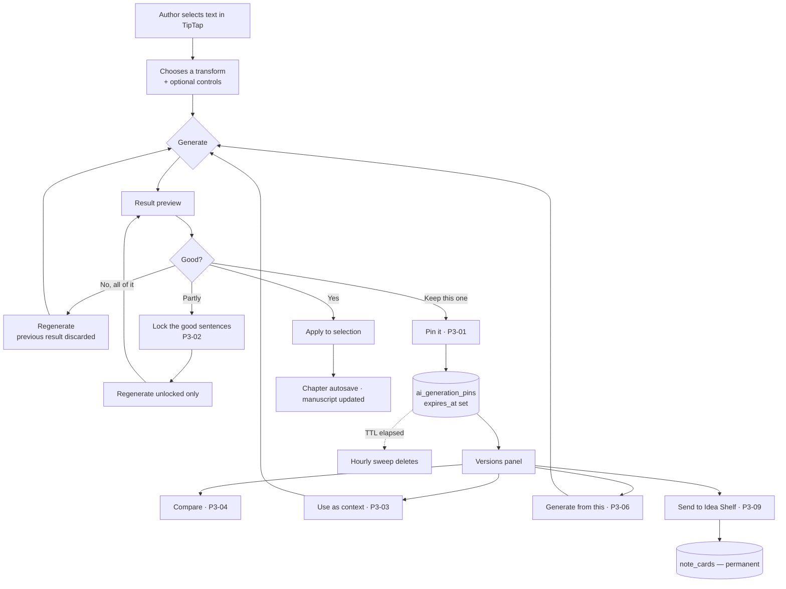
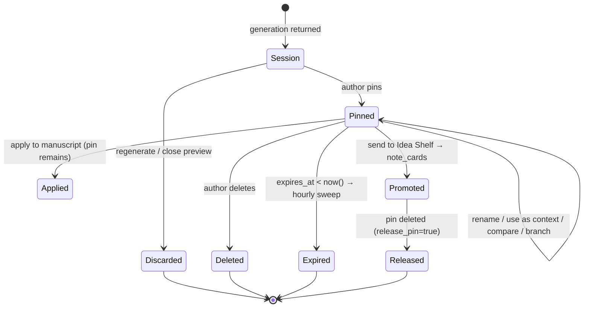
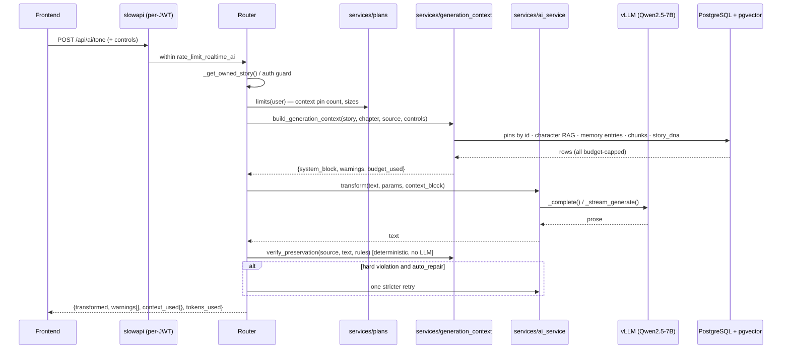
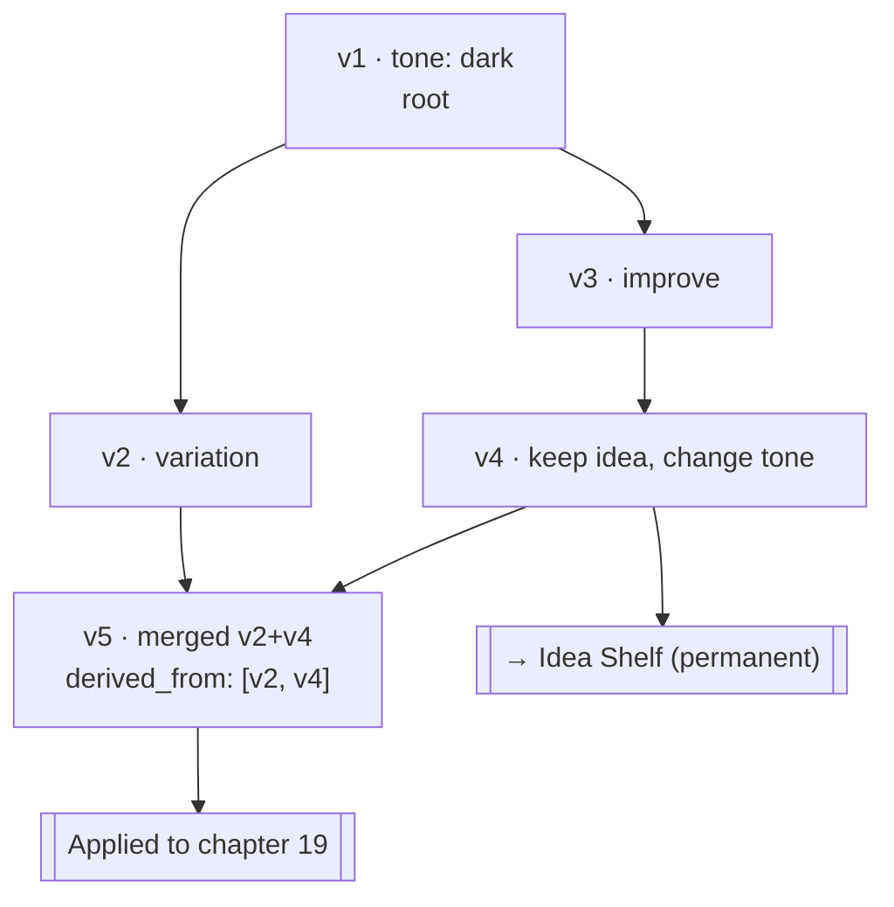
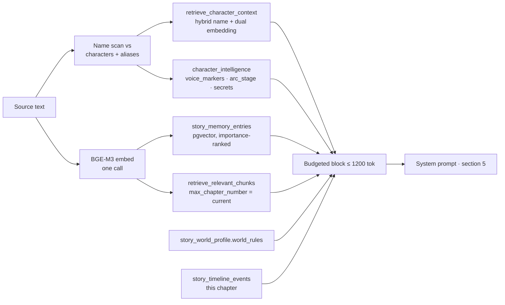
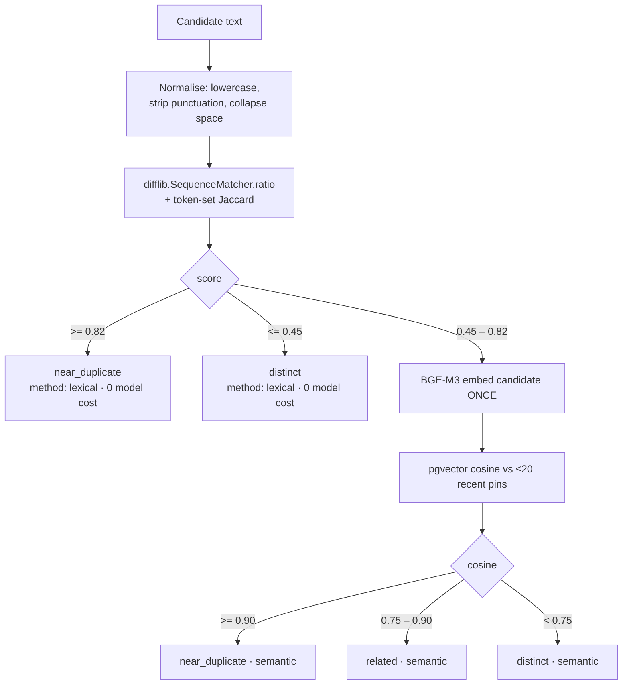

# Phase 3 — Author-Centric AI Workflow & Generation Management

Status: **Design specification — approved for implementation planning**
Author: Engineering (Product Architecture / AI Systems / Backend / Database / UX)
Scope: NarratIQ AI (FastAPI backend + Next.js 14 frontend + vLLM/Qwen2.5-7B-Instruct + BGE-M3 + PostgreSQL 16/pgvector)
Baseline: `docs/phases/phase-1-completed/phase-1-status-update.docx` (Phase 1) and `docs/phases/phase-2-completed/phase-2-intelligence-expansion-roadmap.docx` (Phase 2)
Companion design doc style reference: `docs/specifications/author-style-and-copyright-risk-features.md`

---

## 1. Executive Summary

Phase 1 delivered the manuscript platform (editor, RAG, characters, OCR, notes, export).
Phase 2 delivered manuscript **intelligence** (emotional arc, continuity, story bible, threads,
pacing, audio). Both phases optimised the *quality of a single AI answer*.

Phase 3 optimises something different and, for a working novelist, more important:
**the loop the author actually lives in** — generate, reject, regenerate, compare, keep a
fragment, and try again. Today that loop is lossy. Every regeneration destroys the previous
result. There is no way to keep one good sentence out of a rewrite, no way to say "use the
villain from attempt 4 but the tone from attempt 2", no way to tell the model "change the
tension but do not touch the character names", and no way to see how two candidate versions
actually differ. Authors compensate by pasting drafts into a separate document — outside the
product, outside the story context, and outside any AI reuse.

Phase 3 introduces eleven capabilities (P3-01 … P3-11) that make that loop lossless, controllable
and cheap:

| ID | Capability | New storage | New infrastructure |
|----|-----------|-------------|--------------------|
| P3-01 | Temporary generation pins (keep good attempts) | 1 new table | none |
| P3-02 | Sentence-level lock + partial regeneration | none | none |
| P3-03 | Use pinned versions as generation context | reuses P3-01 | none |
| P3-04 | Side-by-side version comparison + merge | none (client-side diff) | none |
| P3-05 | Preservation rules ("do not change X") | 1 new small table | none |
| P3-06 | Generate from a specific previous version | reuses P3-01 (lineage columns) | none |
| P3-07 | Session-level idea-repetition avoidance | none (session state) | none |
| P3-08 | Character & story-fact consistency guard | none (reuses Phase 1/2 data) | none |
| P3-09 | Idea Shelf (future ideas) | extends existing `note_cards` | none |
| P3-10 | Author writing-style preservation | extends P3-05 table; reuses `story_dna` | none |
| P3-11 | Duplicate / near-duplicate generation detection | 1 nullable vector column on P3-01 | none |

**The headline architectural decision: Phase 3 adds no new services.**
No Redis. No object storage. No queue. No second database. Two new PostgreSQL tables, four
nullable columns on one existing table, one nullable column on `users`, one new router, two new
service modules, and a new cleanup sweep inside the *existing* hourly cleanup loop in `main.py`.

**The headline storage decision: pinned generations live in PostgreSQL** (`ai_generation_pins`),
with plan-based caps and a materialised `expires_at`, accessed exclusively through a
`PinContentStore` abstraction so a future move to object storage requires no router or schema
change. At the modelled 100,000-active-user scale this table is ≈ 3.6 GB (≈ 8.5 GB with
embeddings) — well inside what a single PostgreSQL instance handles comfortably, and *cheaper*
than object storage once request costs are counted (§16, §32). Because pinned generations are
by definition disposable, the table is excluded from logical backups, so it does not inflate
backup size or restore time at all.

**The headline product rule: unpinned means gone.** A regeneration discards the previous
unpinned result. Nothing an author did not explicitly keep is ever written to the database.
That is a privacy feature, a cost feature and a trust feature simultaneously.

---

## 2. How To Read This Document

- **Product managers / stakeholders:** §3 (the problem), §5 (objectives), §6 (scope),
  §8 (feature-by-feature, "Problem / Why / Solution / What the author sees"), §21 (plans),
  §32 (cost), §41 (risks), §45 (open decisions).
- **Backend / database engineers:** §7 (what already exists and what to reuse), §11–§13,
  §17–§26, §29–§31, §35, §36.
- **Frontend engineers:** §9, §10, §19, §23, §24, §27, §38.
- **AI / prompt engineers:** §12, §25, §26, §28, §29, §38.4.
- **Everyone:** §16 (final storage recommendation) and §44 (definition of done).

Every recommendation in this document is stated as a decision with a stated reason and a stated
trade-off. Where a number is an estimate, it is labelled as an estimate and the formula that
produced it is given. Where a price is not derivable from anything in this repository, it is
marked **VERIFY** and left configurable.

---

## 3. The Current Author Workflow Problem

### 3.1 What the loop looks like today

An author selects a paragraph in the TipTap editor. The floating `SelectionToolbar`
(`frontend/components/studio/SelectionToolbar.tsx`) offers seven transform groups
(refine / tone / emotion / audience / style / author / translate). The chosen option calls
`runTransform()` in `frontend/lib/transforms.ts`, which posts the **exact selected text** to the
matching `/api/ai/*` endpoint. The result is held in one React state variable:

```ts
const [preview, setPreview] = useState<{ text; from; to; group; value } | null>(null)
```

`Apply` calls `editor.replaceRange(preview.from, preview.to, preview.text)`. `Discard` sets
`preview` to `null`. Running another transform overwrites `preview`.

That single `useState` **is** the entire generation history of the product. The same shape
exists in `AIToolsSidebar.tsx` (`const [result, setResult] = useState<TransformResponse | null>`)
and for continuations (`setContinuations([])` clears the previous three options before the new
call).

### 3.2 The seven concrete failures this causes

1. **Loss on regenerate.** Attempt 7 was the best. The author kept going to attempt 14. Attempt 7
   no longer exists anywhere.
2. **All-or-nothing rewrites.** The rewritten paragraph has one perfect sentence and four bad
   ones. Regenerating destroys the good sentence too.
3. **No cross-pollination.** Version 2 had the right mystery, version 4 the right villain. The
   model cannot see either, because neither was ever sent anywhere.
4. **Blind choosing.** Two candidate paragraphs, 300 words each, differing in maybe 40 words. The
   author must diff them by eye.
5. **Collateral edits.** "Add suspense" returns a paragraph that also switched tense, renamed
   Elara to Elara**h**, and made a shy character sarcastic. Nothing in the prompt forbade it and
   nothing in the response pipeline checks it.
6. **Circular ideas.** Ten plot suggestions that are all "an ancient prophecy" wearing different
   adjectives.
7. **Orphaned good ideas.** The model produced a superb line of dialogue for chapter 19 while the
   author was writing chapter 3. There is nowhere in the product to put it that keeps it attached
   to the story, so it goes into a text file and is lost.

### 3.3 Why this only shows up in real authoring

Every one of these failures requires *repetition* to become visible. A demo generates once and
applies. A novelist generates fifteen times on one paragraph, across four hundred paragraphs, over
nine months. The cost of a lossy loop compounds; the cost of a single lossy call is invisible.
This is why none of these problems appear in the Phase 1 or Phase 2 documents, and why they
dominate the Phase 2 production QA report (`docs/issues-and-bugs/open/phase-2-production-testing-issues.docx`).

---

## 4. Phase 3 Product Principles

These are binding rules. Every design decision below is checked against them.

| # | Rule | Consequence in the design |
|---|------|--------------------------|
| R1 | **Unpinned generations are never stored permanently.** | Session generations live in browser memory only. No table, no log, no analytics copy of the text. |
| R2 | **Pinned generations are temporary by contract.** | `expires_at` is written at insert time and always non-null. Expiry is visible in the UI before it happens. |
| R3 | **Applying text updates the manuscript, not the pin.** | Apply writes through the existing `editor.replaceRange()` → chapter autosave path. Pins are never a shadow copy of the manuscript. |
| R4 | **Pins ≠ Idea Shelf.** | Pins are disposable working memory. Idea Shelf items are permanent story assets (`note_cards`). Promotion is an explicit, one-way user action. |
| R5 | **Rejected ideas are never permanently blacklisted.** | Repetition avoidance is scoped to the current session / explicitly selected versions only. No `rejected_ideas` table exists, and §29.5 explains why one must not be added. |
| R6 | **Locked content is never silently changed.** | The model is not given the opportunity to rewrite locked spans (§24), and deterministic post-checks report any violation of a preservation rule (§25). |
| R7 | **The model receives the minimum relevant context.** | One composition point (`build_generation_context`) owns a single hard token budget for genre + preservation + style + consistency + pins (§12.3). |
| R8 | **Limits are configuration, not code.** | Plan limits live in `services/plans.py` with an env override. No business number is hardcoded in a router. |
| R9 | **Temporary data cleans itself.** | One indexed `DELETE … WHERE expires_at < now()` batch inside the existing hourly sweep. No cron, no external scheduler. |
| R10 | **No new infrastructure unless a measured trigger fires.** | §16 defines the exact trigger thresholds that would justify object storage, Redis or a queue. Until one fires, none is added. |

---

## 5. Phase 3 Objectives

**O1 — Make the generation loop lossless.** An author can always get back to a version they
liked, for as long as their plan retains it.

**O2 — Make the generation loop surgical.** An author can keep exactly the words they like and
regenerate exactly the words they do not.

**O3 — Make the generation loop compositional.** Earlier attempts become first-class input to
later attempts.

**O4 — Make the AI controllable.** The author declares what must not change, and the system both
instructs and verifies.

**O5 — Make AI output consistent with the story.** Character voice, story facts, timeline and
world rules are enforced from data the platform already computes.

**O6 — Preserve the author's own voice.** Rewrites match the manuscript's measured style rather
than defaulting to generic LLM prose.

**O7 — Do all of the above at near-zero marginal infrastructure cost.** Two tables, no new
services, and a storage footprint that is a rounding error until 100k active users.

---

## 6. Scope

### 6.1 In scope

- P3-01 … P3-11 as specified in §8.
- Two new PostgreSQL tables (`ai_generation_pins`, `story_ai_preferences`), four nullable columns
  on `note_cards`, one nullable column on `users`, one nullable `vector(1024)` column on
  `ai_generation_pins`.
- Alembic migrations `0016` → `0019`.
- One new backend router (`routers/ai_workspace.py`) and two new service modules
  (`services/generation_context.py`, `services/plans.py`), plus additive changes to
  `routers/ai_transform.py`, `services/ai_service.py`, `schemas.py`, `config.py`, `main.py`.
- Frontend: a session-only generation store, a pins panel, a comparison view, a segment-lock
  editor, a preservation-rules control, an Idea Shelf surface, and additive changes to
  `SelectionToolbar`, `AIToolsSidebar`, `lib/api.ts`, `lib/types.ts`, `lib/registries/panels.tsx`.
- A configuration-driven subscription-limit model (`free` / `basic` / `pro` / `studio`).

### 6.2 Explicitly out of scope

| Out of scope | Reason |
|---|---|
| Billing, payment, or subscription *provisioning* | No billing system exists anywhere in the repository. Phase 3 defines and **enforces** limits; assigning a plan to a user is a manual/admin action until a billing phase exists. |
| Object storage for pin content | Not justified at the modelled scale (§15.2, §16). Designed and specified so it can be turned on later without a schema or API change. |
| Redis for anything | Not justified (§15.3). Note that `SLOWAPI_STORAGE_URI` is documented as inert in `CLAUDE.md`; introducing Redis would require a real code change and a new failure mode. |
| Account-level (cross-project) style profiles | Phase 3 style preferences are per-story. §28.6 gives the forward path. |
| Real-time multi-user collaboration on pins | Single-author model only; `CollaborationBoundary.tsx` remains the boundary. |
| Permanent AI-output audit log | Contradicts R1. `activity_events` already records *that* a transform happened with a 160-character summary; Phase 3 does not extend it to full text. |
| Replacing the existing transform endpoints | All Phase 3 generation controls are **optional additive fields** on existing schemas. No breaking change. |
| Fixing all open Phase 2 QA issues | Only the two that block Phase 3 features are in scope (§7.4). |

---

## 7. Existing Architecture Assessment

Phase 3 must extend the running system, not sit beside it. This section records what was found
in the repository and what Phase 3 reuses instead of rebuilding.

### 7.1 What already exists and is directly reusable

| Concern | Existing asset | Location | Phase 3 use |
|---|---|---|---|
| LLM call primitives | `_complete`, `_complete_json`, `_stream_generate`, `_extract_json` | `services/ai_service.py:99–312` | Every Phase 3 generation call. No new primitive. |
| Embeddings | `get_bge()`, `embed_text()`, `embed_text_sync()`, `vector_literal()`, `vector_distance()`, `vector_similarity()` | `services/ai_service.py:36–96` | P3-11 similarity. No new model, no new device. |
| Genre/prompt context | `build_genre_context()` + `_with_genre()` | `services/genre_context.py`, `ai_service.py:522` | Composed into the new unified generation context (§12.3). |
| Chapter RAG | `retrieve_relevant_chunks()` (pgvector HNSW over `chapter_chunks`) | `ai_service.py:3305` | P3-08 story-fact context. |
| Character RAG | `retrieve_character_context()` (name boost + profile emb + mention emb, 800–1200 token cap) | `ai_service.py:1113` | P3-08 character-consistency context. |
| Notes RAG | `retrieve_note_context()` (UNION ALL over `story_notes` + `note_cards`) | `ai_service.py:1244` | P3-09 Idea Shelf retrieval — works unchanged on extended cards. |
| Story facts | `story_memory_entries` (unique `(story_id, memory_key)`, importance-ranked, embedded) | `models.py:931` | P3-08 story-fact block — the intended "universal knowledge bus". |
| Character psychology | `character_intelligence` (`voice_markers`, `arc_stage`, `contradictions`, `secrets`, `fears`) | `models.py:866` | P3-08 character-voice constraints. |
| World rules / timeline | `story_world_profile.world_rules`, `story_timeline`, `story_timeline_events` | `models.py:686, 968, 991` | P3-08 world/timeline constraints. |
| **Measured author style** | `story_dna` (`pov_style`, `tense`, `sentence_rhythm`, `vocabulary_tier`, `prose_style`, `chapter_dna`) | `models.py:599` | **P3-10 reuses this instead of building a style analyser.** |
| Style drift maths | BGE-M3 centroid comparison | `routers/analysis.py` | Referenced by P3-10; unchanged. |
| Entity-safety registry | `_build_entity_registry()`, `_find_protected_spans()`, `_apply_entity_safety_filter()` | `ai_service.py:1988–2145` | **P3-05 character-name preservation check reuses this directly.** |
| Notes / cards storage + CRUD + embeddings | `story_notes`, `note_cards` + `routers/ocr.py:486–644` + `NotesPanel.tsx` | — | **P3-09 Idea Shelf extends `note_cards`; no new entity.** |
| Manuscript versions | `story_versions` (chapter-level, permanent, numbered) | `models.py:106` | Untouched. Distinct concept from pins (§22.4). |
| Editor bridge | `getSelectedText`, `getSelectionRange`, `replaceRange`, `insertText`, live `selectionUpdate` | `components/editor/EditorWithMethods.tsx` | P3-02 apply/undo and P3-04 merge apply. Sufficient as-is. |
| Studio context | `useStoryContext()` → `storyId`, `activeChapterId`, `editor`, `genreProfile`, `logActivity` | `components/studio/StoryContextEngine.tsx` | All Phase 3 panels. |
| Persisted UI memory | Zustand + `persist` (`narratiq_studio`) | `lib/studioStore.ts` | Pattern reused for the **non-persisted** generation store (§10.2). |
| Panel registry | `PANELS[]` declarative registry | `lib/registries/panels.tsx` | Phase 3 panels register as rows. |
| Rate limiting | slowapi per-JWT (`get_user_id`) with five configurable buckets | `middleware/rate_limit.py`, `config.py:87–92` | Reused; one new bucket added. |
| Background concurrency | `bg_ai_semaphore()`, `embedding_semaphore()` | `middleware/concurrency.py` | Pin embedding uses `embedding_semaphore`. |
| Periodic cleanup | Hourly `_run_periodic_cleanup()` with TTL sweeps + startup sweep | `main.py:38–161` | **Pin expiry is one more sweep in this exact loop.** |
| Idempotent migrations | `_table_exists` / `_index_exists` guards, reversible | `migrations/versions/0011_audio_uploads.py` | Template for `0016`–`0019`. |
| Error contract | `AIServiceUnavailableError` → 503 + `retry_after` | `exceptions.py`, `main.py` | Unchanged. |

### 7.2 What does **not** exist (and therefore must be built)

- Any persistence, list, or retrieval of an individual AI generation result.
- Any notion of one generation deriving from another (lineage).
- Any per-story AI behaviour preferences.
- Any text-diff capability, frontend or backend. `package.json` has no diff dependency.
- Any subscription / plan / quota concept. Grep for `subscription|plan_tier|billing|quota`
  returns nothing functional in `backend/` or `frontend/`.
- Any sentence-level segmentation of AI output.

### 7.3 Anti-patterns to avoid, learned from the current code

1. **Do not add a second notes-like entity.** `story_notes` and `note_cards` are already two
   overlapping concepts, and QA Issue 10 reports that Notes and Narrative Threads appearing in
   multiple navigation sections confuses users. A third "ideas" table would repeat that mistake.
   P3-09 therefore extends `note_cards`.
2. **Do not add a second style system.** `story_dna` + style-drift already measure author voice.
   P3-10 renders them into a prompt block; it does not re-analyse prose.
3. **Do not duplicate option lists.** `lib/transforms.ts` is documented as the single source of
   truth for transform options and is consumed by both the toolbar and the sidebar. Phase 3
   follows the same pattern with `lib/generationControls.ts`.
4. **Respect `extra="forbid"`.** `config.py` rejects any `.env` key that is not a declared field
   *at import time*. Every new setting must be added to `config.py` **and** `.env.example` in the
   same commit or the backend will not start.
5. **Do not use numpy for retrieval.** `CLAUDE.md` is explicit: all retrieval uses pgvector SQL
   with `<=>`. The only sanctioned numpy use is centroid maths in `analysis.py`. P3-11 similarity
   follows the pgvector path.

### 7.4 Pre-requisite defects found during this assessment

Two defects in the **existing** code sit directly on Phase 3's dependency path. Both must be
fixed before or during Phase 3A.

> **PRE-1 — `writing_tools.py` calls the retrieval helpers with a non-existent keyword.**
>
> `routers/writing_tools.py:93`, `:105`, `:179`, `:190` call
> `retrieve_relevant_chunks(query=…)` and `retrieve_character_context(query=…)`.
> The actual signatures are `retrieve_relevant_chunks(question, story_id, db, top_k, max_chapter_number)`
> (`ai_service.py:3305`) and `retrieve_character_context(story_id, question, db, top_k, token_budget)`
> (`ai_service.py:1113`). Neither accepts `query`, so both calls raise
> `TypeError: unexpected keyword argument 'query'` at runtime.
> This is the direct cause of QA **Issue 12 (outline generation produces no result)** and
> **Issue 13 (chapter continuation fails)**.
> Additionally `retrieve_character_context` returns `list[str]`, but the result is passed to
> `generate_continuations(character_context=…)` as if it were a string — it needs
> `"\n\n".join(...)`.
> **Phase 3 impact:** P3-08 composes both helpers. Ship the fix first, with a unit test that
> asserts the call signature, so the same class of error cannot recur.

> **PRE-2 — `SelectionToolbar` lifecycle (QA Issues 1 and 11).**
> The toolbar can remain visible after deselection and duplicates the AI Sidecar's controls when
> the sidecar is open. Phase 3A modifies this component substantially (pin, regenerate, lock,
> compare actions). Fixing the lifecycle in the same change is cheaper than fixing it twice, and
> shipping more buttons into a toolbar that will not dismiss would make the reported problem worse.
> **Recommendation:** fold both fixes into the P3-01/P3-02 UI work.

Other issues in the QA report (Story Bible hallucination, voice agent execution gaps, OCR panel,
analytics scrolling, character-hint sync) are **not** on the Phase 3 dependency path and stay out
of scope — with one observation: P3-08's grounding-and-verify pattern is the same technique that
would fix the Story Bible hallucination (Issue 8), so that fix becomes cheaper after Phase 3.

### 7.5 Naming and convention rules Phase 3 follows

| Convention | Rule observed in repo | Phase 3 compliance |
|---|---|---|
| Table names | `snake_case` plural (`chapter_chunks`, `audio_uploads`) | `ai_generation_pins`, `story_ai_preferences` |
| PK column | `<entity>_id`, `String` UUID via `gen_uuid` | `pin_id`, `preference_id` |
| Timestamps | `created_at` / `updated_at` with `datetime.utcnow` + `onupdate` | same |
| Story FK | `ForeignKey("stories.story_id", ondelete="CASCADE")` on Phase 2 tables | same |
| Feature IDs | `P2-01` … `P2-11` | `P3-01` … `P3-11` |
| Router prefix | story-scoped → `/api/stories`; transforms → `/api/ai` | §17 |
| Pydantic | `XCreate` / `XUpdate` / `XOut`, `model_config = {"from_attributes": True}` | §18 |
| Migrations | zero-padded 4-digit id, idempotent, reversible | `0016`–`0019` |
| Docs | `docs/*.md`, snake_case, "Status / Author / Scope" header | this file |
| Frontend API | grouped `xxxApi` object in `lib/api.ts` | `pinsApi`, `generationApi`, `ideaShelfApi` |

---

## 8. Feature-by-Feature Specification

Each feature below is specified with: the author's problem, why it happens, the recommended
solution, what the author sees, frontend behaviour, backend behaviour, AI/context behaviour, and
an explicit **storage verdict**.

---

### P3-01 — Temporary AI Generation History (Pins)

#### Problem
An author regenerates the same request 10–20 times. Attempt 7 was the best. By attempt 14 the
author realises this — and attempt 7 is gone.

#### Why it happens
The result of a transform is a single React state value that the next transform overwrites
(`SelectionToolbar.tsx:23`, `AIToolsSidebar.tsx:107`). Nothing is transmitted or stored.

#### Solution
A **pin** is an explicit, temporary, expiring bookmark of one generation.

- Every generation lands in a session-only history (client memory, capped ring buffer).
- **Pin** promotes one generation to server-side temporary storage.
- Unpinned generations are discarded when replaced (R1) — no server round trip, no trace.
- Pins are listed, previewed, labelled, applied, compared, used as context, branched from,
  promoted to the Idea Shelf, deleted, and eventually auto-expired.

#### What the author sees
1. Result card gains a pin icon and a "3 of 20 pins used · Free plan" hint.
2. Clicking pin turns it amber and shows "Pinned · expires in 7 days".
3. A **Versions** tab in the AI Sidecar lists pins newest-first with tool badge, word count,
   relative age, expiry countdown and a lineage indicator (`↳ from v4`).
4. Each pin row offers: Apply · Compare · Use as context · Generate from this · Send to Idea
   Shelf · Rename · Delete.
5. At the cap, pinning shows a modal: "You have 20 of 20 pins. Replace the oldest (v3, 6 days
   old) or free one first." The system never silently evicts an author's pin.

#### Frontend
- Session history in a **non-persisted** Zustand store (§10.2), keyed by
  `${chapterId}:${toolKey}`, capped at `SESSION_HISTORY_MAX` (default 10) per key, dropping
  oldest.
- Pin action: `POST /api/stories/{story_id}/ai/pins` with the generation payload and its source
  descriptor. Optimistic insert into the pins list; rollback + toast on failure.
- Pins list via React Query (`@tanstack/react-query` already present), `staleTime` 30 s,
  invalidated on create/delete/promote.
- Expiry countdown rendered from `expires_at`; pins with < 48 h remaining get a warning colour
  and an "Extend" action (plan-gated).

#### Backend
- New router `routers/ai_workspace.py`, registered at `prefix="/api/stories"` (matching
  `activity`, `analysis`, `story_bible`).
- Ownership enforced by the standard `_get_owned_story(story_id, user_id, db)` guard.
- On create: validate size against plan → count live pins → enforce cap → compute
  `content_sha256` → set `expires_at = utcnow() + timedelta(days=plan.pin_ttl_days)` → insert →
  schedule background embedding under `embedding_semaphore()` when P3-11 is enabled.
- Rate limit: new `rate_limit_pin_write` bucket (default `60/minute`, per user).

#### AI / context
None. Pinning is pure storage. Pins become AI input only through P3-03 and P3-06.

#### Storage verdict
**PostgreSQL, one new table `ai_generation_pins`, content inline, accessed via the
`PinContentStore` abstraction.** Full option analysis in §15; recommendation and triggers in §16;
cost model in §32.

---

### P3-02 — Preserve Selected Sentences, Regenerate Only the Rest

#### Problem
The author asks for a grammar/emotion/pacing rewrite of a paragraph. One sentence in the result
is perfect; the rest is wrong. Clicking Regenerate destroys the perfect sentence too.

#### Why it happens
The transform contract is whole-text-in / whole-text-out. There is no sub-unit of a generation.

#### Solution
Segment the generated result into sentences in the preview, let the author **lock** the ones to
keep, and regenerate **only the unlocked spans** — with the locked spans supplied to the model as
immutable, positioned anchors that it is instructed to read but never to emit.

The critical design choice: **the model never outputs locked text**. It is asked only for
replacements for the unlocked slots, returned as JSON keyed by slot index. The frontend
reassembles. Therefore a locked sentence *cannot* be altered — not because the model complied,
but because it was never given the chance. This satisfies R6 structurally rather than by
instruction.

#### What the author sees
1. The preview card shows the result split into sentence chips.
2. Clicking a chip locks it (lock icon, muted amber background). Shift-click extends a range.
3. Inverse action available: "Regenerate only this" selects one chip as the *sole* unlocked span.
4. Buttons become: **Regenerate unlocked (3 of 5)** and **Apply**.
5. After regeneration, locked chips are visually confirmed unchanged; changed chips animate.
6. Apply replaces exactly the originally captured range; a single Undo (⌘Z) reverts it because
   the replacement is one TipTap transaction. A local "Undo apply" restores the captured original
   text into the same range as a fallback.

#### Frontend
- `lib/segmentation.ts`: `segmentSentences(text): Segment[]` using `Intl.Segmenter('en', {granularity:'sentence'})`
  when available, with a regex fallback (`/[^.!?…]+[.!?…]+["'”’)\]]*\s*/g`) for older engines.
  Segments preserve trailing whitespace so reassembly is byte-exact.
- `components/generation/SegmentLockEditor.tsx`: chip rendering, lock state, keyboard support
  (arrow keys + space), and `buildRegenerateRequest()`.
- Reassembly is pure and unit-tested: `assemble(segments) === originalText` when nothing changed.

#### Backend
`POST /api/ai/regenerate-segments`:
```json
{
  "story_id": "…", "chapter_id": "…",
  "tool": "emotion", "params": {"emotion": "fear", "intensity": "high"},
  "source_text": "the original selected paragraph",
  "segments": [
    {"index": 0, "text": "…", "locked": true},
    {"index": 1, "text": "…", "locked": false},
    {"index": 2, "text": "…", "locked": false}
  ],
  "instruction": "optional free-text nudge",
  "controls": { /* shared GenerationControls — §18.3 */ }
}
```
Response:
```json
{"segments": [{"index": 1, "text": "…"}, {"index": 2, "text": "…"}],
 "warnings": [], "tokens_used": 412}
```

Validation, in order:
1. `segments` non-empty, ≤ `MAX_SEGMENTS` (default 40), at least one unlocked, indices contiguous
   from 0.
2. Total characters ≤ the existing 8,000-char selection cap
   (`ai_transform._validate_transform_text` — reuse it).
3. Response must contain exactly the unlocked indices, no more, no fewer.
4. On mismatch: one retry with a stricter, example-bearing prompt. On second failure: fall back to
   per-slot single-segment calls (N ≤ 5) and merge; if that also fails, return 502 with
   `detail: "The model did not return the requested segments."` and the frontend keeps the
   previous preview intact — the author loses nothing.

#### AI / context
Prompt shape (system):
> You are revising one passage. The passage is a numbered list of segments. Segments marked
> `[KEEP]` are final and must be treated as fixed context — do not rewrite, reorder, summarise or
> restate them. Rewrite **only** the segments marked `[REWRITE]`, applying: {instruction}.
> Each rewritten segment must read naturally where it sits, flowing from the segment before it and
> into the segment after it, and must be a single self-contained span of prose.
> Return ONLY a JSON object: `{"segments":[{"index":<int>,"text":"<prose>"}]}` containing exactly
> the `[REWRITE]` indices.

Temperature: inherits the tool's temperature (0.6 for creative rewrites, 0.3 for grammar).
Parsed with the existing `_extract_json(text, fallback)`.

#### Storage verdict
**None.** Segment state is transient UI state that exists only while a preview is open. If the
author pins the result, the *assembled* text is pinned (with `params.segment_lock_count` recorded
in `tool_params` for provenance) — never the segment array.

---

### P3-03 — Use Previous AI Ideas as Context

#### Problem
Version 2 had the right mystery; version 4 had the right villain; version 3 had the right
emotional register. The author wants a version that combines them, but the model has never seen
any of them.

#### Why it happens
Unsaved generations are never transmitted back to the server.

#### Solution
Any pinned generation can be selected as **context** for a new generation. The request carries
`context_pin_ids: string[]`; the backend loads them (ownership-checked, story-scoped), renders
them into a bounded `PRIOR IDEAS` block, and instructs the model how to treat them.

#### What the author sees
1. In the Versions panel, checkboxes select up to `plan.max_context_pins` pins (default: free 2,
   basic 3, pro 5, studio 8).
2. A context bar appears above the tool controls: "Using 3 pinned versions as context ✕".
3. A **Combine** control offers intent presets that map to instruction templates:
   *Merge the strongest elements* · *Keep the ideas, change the tone* · *Keep the structure,
   change the ending* · *Continue from these*.
4. Free-text refinement is always available ("keep v4's villain, v2's opening image").
5. The result card shows lineage: `↳ built from v2, v3, v4`.

#### Frontend
- Selection state lives in the generation store, not persisted.
- `context_pin_ids` is attached to any transform call by the shared `GenerationControls` mixin, so
  every existing tool gains the capability without a new endpoint.
- A live token-estimate badge ("~1,050 / 1,200 context tokens") warns before the server truncates.

#### Backend
`services/generation_context.build_pin_context(pin_ids, user_id, story_id, db, token_budget)`:
1. Load pins with `WHERE pin_id IN (...) AND user_id = :uid AND story_id = :sid` — a missing or
   foreign id is dropped silently from the list and reported in `warnings[]` (never a 500).
2. Enforce `len(pin_ids) <= plan.max_context_pins`; over-limit → 422 with the plan's value.
3. Budget: `per_pin = token_budget // n`. A pin whose content exceeds its share is **summarised
   once** to ~120 words via `_complete()` and the summary is cached in the pin's `summary` column,
   so repeated use of the same large pin costs one LLM call ever, not one per generation.
4. Render in the author's selection order:
   ```
   PRIOR IDEAS (author-selected earlier drafts — inspiration, not text to copy)
   [IDEA 1 · tone rewrite · 312 words]
   …
   [IDEA 2 · plot suggestion · 180 words, summarised]
   …
   ```

#### AI / context
Ordering and conflict resolution are explicit, because a naive merge prompt produces mush:

> The PRIOR IDEAS are earlier drafts the author chose to keep. Use them as source material for
> ideas, names, images and emotional register. **Do not copy sentences from them verbatim.**
> Where two ideas conflict, the author's instruction below decides; if the instruction is silent,
> prefer the idea listed **last**. The SOURCE TEXT, not the prior ideas, defines the current
> position in the manuscript.

Precedence, highest first: **author instruction → preservation rules (P3-05) → source text →
story consistency (P3-08) → prior ideas → genre profile → style profile.** This ordering is
implemented once in §12.3 and applies to every Phase 3 feature.

#### Storage verdict
**No new storage.** Reuses `ai_generation_pins`. Two derived fields are added to that table:
`summary` (TEXT, nullable — the cached compression above) and `derived_from_pin_ids` (JSON, the
lineage set). Both are small and both avoid *recomputation*, not duplication.

---

### P3-04 — Compare AI Versions

#### Problem
Two candidate versions of a 300-word paragraph differ in perhaps 40 words. Choosing between them
by re-reading both is slow and error-prone.

#### Why it happens
No diff exists in the product, and there is no way to hold two versions on screen at once.

#### Solution
A comparison view that diffs **client-side** at word granularity, groups changes by sentence, and
supports building a merged version by choosing per-block.

#### What the author sees
1. **Compare** on a pin (or on the live unsaved result) opens a two-pane view.
2. Header shows: word counts, delta (`+42 / −17`), sentence counts, and a similarity badge
   (from P3-11).
3. Inline highlighting: added (green), removed (red strike), unchanged (neutral).
4. View toggles: *Side by side* · *Unified* · *Changes only*.
5. Per-block radio buttons (A / B) build a merged draft in a third pane, updating live.
6. Actions: **Use A** · **Use B** · **Use merged** · **Smooth merged with AI** (optional, one
   call) · **Pin merged**.
7. Optional **Explain the difference** button calls a small AI summariser
   ("A is tenser but loses Elara's hesitation; B keeps the hesitation but slows the scene").

#### Frontend
- `lib/diff.ts` — a self-contained ~120-line word-level LCS diff (Hunt–Szymanski / Myers-style
  backtrack) returning `DiffOp[] = {type: 'eq'|'add'|'del', tokens: string[]}`.
  **Decision: no new npm dependency.** The project ships a deliberately small dependency set and
  a word-diff is a well-understood, easily unit-tested algorithm. Complexity is O(n·m) worst case;
  with the existing 8,000-character selection cap (≈ 1,400 words) that is ≈ 2 M cell operations —
  a few milliseconds in JS, and only on explicit user action.
- Sentence grouping reuses `lib/segmentation.ts` from P3-02, so "block" means the same thing in
  both features.
- `components/generation/VersionCompareView.tsx` handles pin↔pin, pin↔live, and live↔live.

#### Backend
Nothing is required for the diff itself. Two optional, non-persisted endpoints:
- `POST /api/ai/compare-summary` → `{summary, a_strengths[], b_strengths[], recommendation}`.
- `POST /api/ai/merge-versions` → transition-smoothing pass over an author-assembled merge, with
  the strict instruction to change only connective tissue, never content.

Both are rate-limited under `rate_limit_realtime_ai` and store nothing.

#### Storage verdict
**None.** Diffs are computed on demand from data already on the client. Storing diffs would be
storing a pure function of two stored values — the definition of avoidable duplication. A merged
version becomes storage only if the author pins it, at which point it is an ordinary pin whose
`derived_from_pin_ids` records both parents.

---

### P3-05 — Lock What the AI Must Not Change

#### Problem
The author asks for more suspense. The model delivers suspense — and also changes the tense,
renames a character, flips the POV, and turns a shy character sarcastic.

#### Why it happens
Nothing in the current prompts constrains the model beyond the requested transformation, and
nothing inspects the output afterwards. The only guardrail of this kind that exists anywhere in
the codebase is the OCR entity-safety filter (`ai_service.py:1988–2145`), which is not wired into
transforms.

#### Solution
**Preservation rules**: a small set of author-controlled switches that (a) are rendered into every
prompt as hard constraints, and (b) are **verified deterministically after generation**, with
violations surfaced as warnings and one automatic repair attempt.

Rule catalogue (server-authoritative, in `services/generation_context.py`):

| Rule key | Default | Prompt constraint | Post-generation check |
|---|---|---|---|
| `character_names` | **on** | Never rename, merge, split or invent named characters. | Reuse `_build_entity_registry()`: every registered name/alias present in the source must be present in the output; no new capitalised non-dictionary token may appear in a name position. Deterministic. |
| `tense` | **on** | Keep the narrative tense of the source exactly. | Past/present verb-marker ratio (`-ed`/irregular past list vs `-s`/`-ing` + present auxiliaries); flag when the ratio flips beyond a configurable margin. Heuristic. |
| `pov` | **on** | Keep the narrative person and viewpoint character. | First/second/third-person pronoun distribution shift beyond a margin. Heuristic. |
| `dialogue_meaning` | on | Quoted speech may be re-phrased only if explicitly requested; never change what a character means or commits to. | Count of quoted spans must match; per-span similarity ≥ threshold when the tool is not a dialogue tool. Deterministic + similarity. |
| `story_facts` | on | Do not introduce, alter or contradict plot facts, objects, locations or knowledge states. | Soft: P3-08 consistency block + optional strict LLM spot-check (opt-in, costs one call). |
| `timeline` | off | Do not add, remove or reorder time references. | Extract temporal markers with a regex/keyword list; flag additions. Heuristic. |
| `world_rules` | off | Obey the recorded world rules; never invent new mechanics. | Soft: prompt-only + P3-08 block. |
| `character_voice` | off | Preserve each character's speech register and verbal habits. | Soft: prompt-only, sourced from `character_intelligence.voice_markers`. |

And the complementary **scope switches** (what the AI *may* change):
`emotion_only` · `pacing_only` · `grammar_only` · `selected_text_only` (always on for selection
transforms).

#### What the author sees
1. A shield icon on the toolbar and sidebar opens **What the AI may change**.
2. Toggles grouped as *Never change* (names, tense, POV, dialogue meaning, facts, timeline, world
   rules, voice) and *Only change* (emotion / pacing / grammar).
3. "Save as default for this project" persists the set; otherwise it applies to this generation
   only.
4. If a check fails, the preview shows an amber banner:
   "⚠ The AI changed a locked element: character name **Elara → Elarah**." with
   **Regenerate with stricter instructions** · **Fix automatically** (deterministic substitution
   back to the registered name) · **Accept anyway**.

#### Frontend
- `lib/generationControls.ts` mirrors the server catalogue (ids, labels, defaults, groupings) —
  the same "single source of truth" pattern as `lib/transforms.ts`, with the **server as the
  authority** (identical to how `_AUTHOR_STYLES` is authoritative for author styles).
- `components/generation/PreservationRulesPopover.tsx` reads project defaults from
  `GET /api/stories/{id}/ai/preferences` and can `PATCH` them.

#### Backend
- `build_preservation_block(rules) -> str` renders the enabled rules as numbered constraints.
- `verify_preservation(source, output, rules, story_id, db) -> list[PreservationWarning]` runs the
  deterministic checks. **Cost: zero LLM calls.** Each warning carries `rule`, `severity`
  (`hard|soft`), `detail`, and optional `autofix` payload.
- Automatic repair: exactly one retry when a `hard` warning fires and `auto_repair` is enabled
  (default on), with the violation named explicitly in the retry prompt. A second failure returns
  the output **plus** warnings — never an error, never a silent acceptance (R6).

#### AI / context
Preservation constraints are placed **after** the author instruction and **before** the source
text, in imperative numbered form, because instruction-following degrades for constraints buried
mid-prompt on a 7B model:

```
NON-NEGOTIABLE CONSTRAINTS
1. Do not change any character name. The names in this passage are: Elara, Kira, Marn.
2. Keep the narrative tense exactly as in the source (past tense).
3. Keep the point of view exactly as in the source (third person limited, Elara).
4. Do not change what any character says they will do, know, or believe.
CHANGE ONLY: emotional intensity.
```

Note the **name enumeration** — supplying the actual registered names measurably outperforms an
abstract "don't change names" instruction on small models, and the names are already available
from the entity registry at zero extra cost.

#### Storage verdict
**One tiny new table, `story_ai_preferences`** — one row per story, holding preservation defaults,
style preferences (P3-10) and pin defaults as three JSON columns. Rationale: these are per-story
authoring settings, not genre metadata, so they do not belong in `genre_profiles`; and adding
three JSON columns to the hot `stories` table would widen every story read for a rarely-read
concern. One narrow table, cascade-deleted with the story, is the cheapest correct option.
Per-request overrides are **not** stored — they are transient by definition.
---

### P3-06 — Generate From a Specific Previous Version

#### Problem
Version 4 is close. The author wants "the same thing, but the ending lands harder". Pressing
Regenerate restarts from the original source text and loses everything version 4 got right.

#### Why it happens
Regeneration is stateless: it re-sends the original selection with the original parameters.

#### Solution
Make any pin a **base**. `base_pin_id` replaces the source text as the primary input, the original
source text is retained as positional context, and a **derivation intent** shapes the instruction.

Derivation intents (server-authoritative registry, `DERIVATION_INTENTS`):

| Intent | Instruction template | Typical temperature |
|---|---|---|
| `variation` | Produce a genuinely different execution of the same idea. Keep premise, characters and outcome; change wording, imagery and rhythm. | 0.8 |
| `improve` | Improve the craft of this draft without changing what happens. Fix rhythm, precision, imagery and redundancy. | 0.5 |
| `continue` | Continue directly from where this draft ends, in the same voice and tense. | 0.7 |
| `keep_structure_change_ending` | Keep every beat until the final beat. Replace the ending with: {user text}. | 0.7 |
| `keep_idea_change_tone` | Keep the events and meaning exactly. Change only the emotional register to: {tone}. | 0.6 |
| `expand` | Expand this draft to roughly {n} words by deepening what is already there. Add no new plot events. | 0.6 |
| `condense` | Condense to roughly {n} words. Keep every plot-relevant fact; remove ornament. | 0.4 |
| `custom` | {user text} | 0.7 |

#### What the author sees
A pin row's overflow menu lists the intents in plain language: *Make a variation* · *Improve this*
· *Continue from here* · *Keep structure, change the ending* · *Keep the idea, change the tone* ·
*Make it longer* · *Make it shorter* · *Custom instruction…*. The new result shows `↳ from v4` and
the Versions list renders lineage as an indented tree.

#### Frontend
`generationApi.generateFromPin(storyId, pinId, intent, extra)` posts to the same tool endpoint the
pin came from, with `base_pin_id` and `derivation` set. No new per-tool UI is required.

#### Backend
- `base_pin_id` is validated for ownership and story scope.
- The composed prompt uses the **pin content** as `SOURCE DRAFT` and the pin's own
  `source_excerpt` as `ORIGINAL PASSAGE (for position and continuity only)`.
- On pinning the result, `parent_pin_id` is set, `root_pin_id` is inherited from the parent (or
  set to the parent's `pin_id` when the parent is a root), and `lineage_depth = parent.depth + 1`.
- `lineage_depth` is capped at `MAX_LINEAGE_DEPTH` (default 12) to bound both tree rendering and
  the pathological "generate from generation from generation" drift case; beyond the cap the new
  pin becomes a root with `derived_from_pin_ids` still recording provenance.

#### AI / context
Same precedence chain as P3-03. The one addition is an explicit anti-echo instruction for
`variation`, which is the intent most likely to return a near-copy:

> This is a *variation*, not an edit. If your output shares more than a short phrase of wording
> with the SOURCE DRAFT, you have failed the task. Keep the idea; rebuild the prose.

P3-11 then measures whether that actually happened and reports it to the author.

#### Storage verdict
**No new table.** Three lineage columns on `ai_generation_pins`: `parent_pin_id` (self-FK,
`ON DELETE SET NULL`), `root_pin_id`, `lineage_depth`, plus `derived_from_pin_ids` (JSON) shared
with P3-03. Lineage is *metadata about content already stored*, not a second copy of it.

---

### P3-07 — Avoid Repeating Previous Ideas

#### Problem
Ten plot suggestions, all "a prophecy": secret, ancient, forgotten, hidden, buried. The author
reads ten variations of one idea.

#### Why it happens
Each call is independent and the sampler's high-probability region is the same every time. The
model has no memory of what it already proposed.

#### Solution
**Session-scoped novelty pressure.** The request carries a bounded set of "already explored"
gists; the prompt instructs the model to avoid that conceptual territory; P3-11 verifies.

Sources of the avoid-set, in priority order:
1. Generations already produced in this session for this tool + chapter (client memory).
2. Pins the author explicitly selected as "avoid these".
3. Nothing else.

**What is deliberately absent: any persistent rejection history.** §29.5 explains why in detail.

#### What the author sees
- A quiet default: from the second generation onward, the request automatically includes the
  session's earlier results, so ideas naturally diverge without any UI at all.
- An explicit control on idea-generating tools: **"Avoid ideas like: ▾ v1 v2 v3"** with per-item
  toggles.
- If a near-duplicate still arrives, P3-11's badge says so and offers **Generate something
  different** (which strengthens the avoid instruction and raises temperature by a configured
  step).

#### Frontend
- `avoid_texts: string[]` built from the session ring buffer, each truncated to
  `AVOID_GIST_CHARS` (default 240), maximum `AVOID_MAX_ITEMS` (default 8).
  Truncation is not a shortcut — the first ~240 characters of a prose idea reliably carry its
  concept, and sending full texts would multiply prompt cost for no accuracy gain.
- Explicit pin-based avoidance sends `avoid_pin_ids` instead, and the server reads the content.

#### Backend
`build_avoid_block(avoid_texts, avoid_pin_ids, …)`:
1. Load pin content for any `avoid_pin_ids` (ownership-checked).
2. Reduce each item to a one-line gist: first sentence, capped at 140 characters.
   **Deterministic string work — no LLM call.** An LLM-based "concept extractor" would double the
   cost of every generation for a marginal quality gain; that is precisely the premature
   optimisation R10 forbids.
3. Render:
   ```
   ALREADY EXPLORED — the author has seen these and wants a materially different direction:
   - A prophecy foretells the heir's return.
   - An ancient prophecy is discovered in the archive.
   Do not produce another variation of these. Change the underlying mechanism, not the adjectives.
   ```
4. Hard cap the block at `AVOID_BLOCK_TOKEN_CAP` (default 300 tokens); oldest items drop first.

#### AI / context
Two reinforcements matter on a 7B model:
- The block sits **immediately before** the instruction, not at the top of the system prompt —
  recency dominates constraint adherence.
- The instruction names the failure mode explicitly ("change the underlying mechanism, not the
  adjectives"), because "be different" alone reliably produces synonym substitution.

#### Storage verdict
**None.** Session state on the client; nothing persisted, nothing logged. This is the single
biggest cost-avoidance decision in Phase 3: an idea-history table would grow with *every*
generation rather than with pins, would violate R1, and would create the permanent rejection
record R5 forbids.

---

### P3-08 — Character Personality and Story Consistency

#### Problem
AI-generated prose slowly corrodes the story: a shy character turns aggressive, a character knows
something they were never told, a relationship inverts, the timeline slips, a world rule breaks.

#### Why it happens
Selection transforms send **only the selected text**. `lib/transforms.ts` says so explicitly, and
it is the correct default for cost and latency — but it means the model literally cannot know that
Elara is shy, that Kira does not yet know about the letter, or that magic has a blood cost.

#### Solution
A **narrow, budgeted consistency block** assembled from data the platform already computes, and
injected only when the transform plausibly touches character or story facts.

Sources, all pre-existing:

| Block | Source | Retrieval | Budget |
|---|---|---|---|
| Characters present | `characters` + `character_profiles` via `retrieve_character_context()` | name-mention boost + dual embeddings | 350 tok |
| Character psychology | `character_intelligence` (`arc_stage`, `voice_markers`, `secrets`, `fears`, `contradictions`) | direct lookup for the matched characters | 200 tok |
| Story facts | `story_memory_entries` (`is_active`, ordered by `importance`) | pgvector `<=>` on the source text | 250 tok |
| World rules | `story_world_profile.world_rules` | direct, truncated | 120 tok |
| Timeline position | `story_timeline_events` for the current chapter | direct | 80 tok |
| Nearby narrative | `chapter_summaries` via `retrieve_relevant_chunks(max_chapter_number=current)` | pgvector `<=>` | 200 tok |

Total consistency budget: **≤ 1,200 tokens**, configurable
(`consistency_context_token_budget`).

Crucially, `max_chapter_number = current chapter` is passed to `retrieve_relevant_chunks` — the
filter already exists — so the model is never shown future chapters. This prevents the most
damaging consistency failure of all: a character acting on knowledge from a chapter that has not
happened yet.

#### Activation policy (cost control)
The block is **not** attached to every call. Attachment is decided by a cheap deterministic gate:

| Tool | Consistency block |
|---|---|
| `refine` (grammar mode), `translate` | never |
| `refine` (standard/literary), `style`, `author_style` | only if a registered character name appears in the source |
| `tone`, `emotion`, `age_adapt` | if a name appears, or `preserve.story_facts` is on |
| continuation, outline, plot suggestions, `regenerate-segments` | always |

Rationale: a grammar fix cannot break the timeline, and paying ~150 ms of retrieval plus ~1,200
prompt tokens on every comma correction is exactly the waste R7 forbids.

#### What the author sees
- A small "Story-aware ✓" chip on the result card, with a hover listing what grounded the
  generation ("Elara, Kira · 3 story facts · world rules").
- Consistency warnings appear in the same banner as preservation warnings, labelled by kind:
  "⚠ Elara is recorded as *withdrawn, avoids confrontation* (chapter 4 arc stage). This rewrite
  has her confronting Marn directly." with **Regenerate** · **Accept** · **Update her profile**.

#### Backend
New module `services/generation_context.py`:
```python
async def build_consistency_context(
    story_id, chapter_number, focus_text, db,
    token_budget: int = 1200, include: set[str] | None = None,
) -> ConsistencyContext:  # .block: str, .character_ids: list[str], .facts_used: list[str]
```
Composed by the single entry point `build_generation_context()` (§12.3).

Verification is layered by cost:
- **Tier 0 (always, free):** entity-registry name check (shared with P3-05).
- **Tier 1 (always, free):** knowledge-state check — if a `story_memory_entry` of type
  `character` records "X does not know Y", flag when the output has X referencing Y. Simple
  keyword co-occurrence; high precision, low recall, zero cost.
- **Tier 2 (opt-in, one extra LLM call):** "strict consistency check" — a JSON-returning
  `_complete()` call that judges the output against the consistency block. Off by default,
  surfaced as **Strict mode** and plan-gated to `pro`/`studio`, because it doubles the cost of the
  generation.

**Hard block vs soft warning:** Phase 3 never hard-blocks a generation on consistency. The author
is the authority on their own story; the system's job is to notice and say so. The only automatic
intervention is the single P3-05 repair retry for hard rule violations.

#### Storage verdict
**No new tables and no new columns.** Every input already exists. This is the clearest example of
why the architecture assessment came first: a naive Phase 3 design would have specified a
"character consistency profile" table that duplicates `character_intelligence` and a "story facts"
table that duplicates `story_memory_entries`.

One optional, deferred optimisation is documented and **not** implemented in Phase 3: caching the
assembled block keyed by `(story_id, chapter_id, character_set, source_hash)`. Measured cost is
one BGE-M3 embed (~80–150 ms CPU) plus two indexed pgvector queries (<10 ms each), which does not
justify a cache and its invalidation complexity yet. Trigger for revisiting: p95 context assembly
above the 400 ms target in §33.1.

---

### P3-09 — Future Idea Shelf

#### Problem
While writing chapter 3, the AI produces a perfect line for chapter 19, or a twist that belongs in
act three. There is nowhere to put it that stays attached to the story, so it goes into an
external document and is lost.

#### Why it happens
The only durable homes for text are chapters (wrong position), story notes (long-form prose
research) and note cards (typed reference cards, but with no chapter targeting, no tags, no
status, and no link back to a generation).

#### Solution
**Extend `note_cards`. Do not create a new entity.**

The existing `note_cards` table already provides: story + user scoping, title, content,
`card_type` classification, a BGE-M3 `embedding` with background embedding on create/update, full
CRUD (`routers/ocr.py:582–644`), OCR provenance (`ocr_upload_id`), RAG participation via
`retrieve_note_context()`'s `UNION ALL`, and a working UI (`NotesPanel.tsx`, 594 lines). An Idea
Shelf that is a separate table would duplicate all of it and would repeat the information-
architecture mistake QA Issue 10 already reports.

**Four nullable columns** (migration `0018`):

| Column | Type | Purpose |
|---|---|---|
| `target_chapter_id` | String FK → `chapters.chapter_id`, `ON DELETE SET NULL` | "This idea belongs in chapter 12" — nullable because "unassigned" is a first-class state. |
| `tags` | JSON (list) | Free-form author tags for filtering. |
| `status` | String, default `"open"` | `open` \| `used` \| `archived` — so a used idea leaves the active shelf without being deleted. |
| `source_pin_id` | String, nullable, **not an enforced FK** | Provenance back to the pin it came from. Deliberately unenforced, exactly like the existing `ocr_upload_id` pattern, because pins expire and must not cascade-delete a permanent idea. |

**Eight new `card_type` values**, additive to the existing five
(`scene`, `location`, `theme`, `character`, `general`):
`future_scene`, `dialogue_idea`, `plot_twist`, `character_idea`, `research`, `ending_idea`,
`worldbuilding`, `style_sample` (the last one is used by P3-10).
`card_type` is a free `String` column with no DB constraint, so this is a **zero-migration**
change for the values themselves; validation lives in the Pydantic schema, matching current
practice.

#### What the author sees
1. Any result card or pin has **Send to Idea Shelf →** with a type picker and optional target
   chapter.
2. The **Ideas** surface (a new tab inside the existing Notes panel, not a new navigation entry —
   QA Issue 10) shows cards grouped by type, filterable by tag / chapter / status, searchable.
3. An idea assigned to a chapter appears as a subtle marker in that chapter's binder row; opening
   the chapter shows "3 ideas waiting here".
4. Drag an idea into the editor to insert its text at the cursor (`editor.insertText`); the card's
   status flips to `used` with an undo toast.
5. Semantic search across ideas already works, because the embedding pipeline is unchanged.

#### Backend
- Reuse the existing note-card endpoints; add optional fields to `NoteCardCreate` /
  `NoteCardUpdate` / `NoteCardOut`, plus list filters (`card_type`, `status`, `target_chapter_id`,
  `tag`, `q`).
- New convenience endpoint `POST /api/stories/{story_id}/ai/pins/{pin_id}/promote` →
  creates the card, sets `source_pin_id`, and optionally deletes the pin
  (`release_pin: bool = true`). This is the **one sanctioned content copy** in Phase 3, and it is
  a deliberate temporary→permanent promotion, not duplication.
- Plan-gated count: `max_idea_cards` (free 50, basic 200, pro unlimited, studio unlimited).

#### Storage verdict
**Permanent storage, in the existing `note_cards` table, plus four nullable columns.**
Ideas are story assets: they must survive expiry, browser loss, device change and account
re-login. This is the exact opposite of a pin, and §21.4 documents the distinction for users.

---

### P3-10 — Preserve the Author's Writing Style

#### Problem
AI rewrites read like an LLM: even sentence lengths, tidy metaphors, explanatory dialogue tags.
The author's actual voice — clipped sentences, sparse tags, dry humour, particular rhythm — is
flattened.

#### Why it happens
Transforms send the selection with no reference to how the surrounding manuscript sounds.

#### Solution
**Reuse `story_dna`. Do not build a style analyser.**

`StoryDNA` (`models.py:599`, Story Intelligence pass P2) already records `pov_style`, `tense`,
`sentence_rhythm`, `vocabulary_tier`, `prose_style`, `structural_complexity` and per-chapter
`chapter_dna`. Style drift analysis already computes BGE-M3 centroids of early vs late chapters.
Phase 3 adds a *renderer* and a *control*, not an analysis.

Style context sources, in precedence order:
1. **Explicit author preferences** (`story_ai_preferences.style_prefs`) — always wins.
2. **Author-chosen exemplar passages** — stored as `note_cards` with `card_type='style_sample'`
   (reuses P3-09's storage, embeddings and CRUD; nothing new).
3. **`story_dna`** — the measured fingerprint.
4. **Local context** — the paragraph immediately before and after the selection, ≤ 120 words,
   sent from the client with the selection. This is the cheapest and often the most effective
   signal, because it captures the *local* rhythm the rewrite must sit inside.

Match levels: `off` · `light` (fingerprint only) · `strong` (fingerprint + exemplars + local
context + an explicit "match this voice" instruction). Default: **`light`**, because `strong`
costs ~400 extra prompt tokens per call and is not always wanted (an author deliberately shifting
register does not want their old voice enforced).

#### What the author sees
- A **Voice** control next to the preservation shield: *Off · Match my voice (light) · Match my
  voice (strong)*.
- Under *strong*: "Using: your prose fingerprint + 2 sample passages + surrounding paragraphs".
- **Mark as a style sample** on any selection saves it as a `style_sample` card (cap
  `max_style_samples`: free 1, basic 3, pro 8, studio 15) — capped because samples are prompt
  tokens, not just rows.
- If `story_dna` has not been generated, the control says "Run Story Intelligence to enable
  fingerprint matching" and falls back to local context only — degrading exactly as
  `build_genre_context()` already degrades to `""`.

#### Backend
`services/generation_context.build_style_context(story_id, level, local_context, db, token_budget)`
renders, e.g.:
```
AUTHOR VOICE — match this, do not improve it
Point of view: third person limited (Elara)      Tense: past
Sentence rhythm: short, clipped; frequent fragments
Vocabulary: plain, concrete; avoids Latinate words
Prose character: sparse dialogue tags; physical detail over interiority
Sample of the author's voice:
"…"
Immediately surrounding text (match this rhythm):
"…"
```
The phrase "match this, do not improve it" is deliberate: instruction-tuned models default to
"improving" clipped prose into smooth prose, which is the exact failure being prevented.

#### Privacy
Manuscript text is already sent to the self-hosted vLLM instance for every transform; style
context adds no new data-egress class. Exemplars are per-story and per-user, never shared, never
used to train anything (the stack has no training loop). Account-level style profiles — which
*would* cross project boundaries — are explicitly out of scope (§28.6).

#### Storage verdict
**No new table.** `style_prefs` is one JSON column on `story_ai_preferences` (created by P3-05);
exemplars are `note_cards` rows (created by P3-09); the fingerprint is `story_dna` (already
exists). **No new embeddings** are computed — `note_cards` already embeds on write, and the style
block is retrieved by id, not by similarity.

---

### P3-11 — Detect Duplicate or Highly Similar Versions

#### Problem
Attempt 12 is almost identical to pinned version 5. The author reads 300 words to discover they
have already read them.

#### Why it happens
Nothing compares a new generation to anything.

#### Solution
A **two-stage similarity check**, deliberately cheap-first:

**Stage 1 — lexical, free, in-process.**
Normalise (lowercase, strip punctuation, collapse whitespace) and compute
`difflib.SequenceMatcher.ratio()` plus token-set Jaccard over content words.
Cost: microseconds. `difflib` is already used in `ai_service.py` (`_suggest_difflib`), so this
introduces no new technique.
- `lexical ≥ hi` (default 0.82) → **report near-duplicate**, no embedding needed.
- `lexical ≤ lo` (default 0.45) → **report distinct**, no embedding needed.
- between → escalate to stage 2.

**Stage 2 — semantic, only for the ambiguous band.**
BGE-M3 embed the candidate once and compare against candidate pins via pgvector `<=>`, using the
existing `vector_similarity()` helper.
- Cost: one embed (~80–150 ms CPU, bounded by `embedding_semaphore()`) plus one indexed query.
- Candidates are limited to `similarity_candidate_limit` (default 20) most-recent pins in the same
  story and tool.
- `cosine ≥ semantic_hi` (default 0.90) → "same idea, different words".

**Empirically, most comparisons resolve in stage 1**: a true regeneration duplicate is usually
lexically similar, and a genuinely new idea is usually lexically distant. Stage 2 exists for the
case P3-06 `variation` is designed to produce and P3-07 is designed to catch — the same concept
rewritten from scratch.

#### What the author sees
- A badge on the new result: **"92% similar to pinned v5"**, clickable straight into the P3-04
  comparison view, with **Show only what changed** · **Keep v5 instead** · **Generate something
  different**.
- No modal, no blocking. Automatic regeneration happens **only** if the author has enabled
  "auto-retry on near-duplicate" (default off, max 1 retry) — because silent extra LLM calls are
  both a cost surprise and a latency surprise.

#### Backend
`POST /api/stories/{story_id}/ai/similarity`
```json
{"text": "candidate generation", "against_pin_ids": ["…"], "against_texts": ["…"],
 "tool": "emotion", "mode": "auto"}
```
→ `{"matches": [{"pin_id": "…", "score": 0.92, "method": "lexical|semantic", "label": "near_duplicate"}], "checked": 14, "embedded": false}`

The endpoint is idempotent, stores nothing about the candidate, and is rate-limited under
`rate_limit_realtime_ai`.

#### Storage verdict
**One nullable `vector(1024)` column on `ai_generation_pins`** (`embedding`), computed in the
background on pin creation under `embedding_semaphore()`, and only when
`pin_store_embedding=True` (default). No HNSW index initially — see below.

Two deliberate sub-decisions:

1. **Embeddings are stored only for pins, never for session generations.** A session generation is
   compared once, in the moment; embedding it for storage would violate R1 and would triple the
   embedding load.
2. **No HNSW index on `ai_generation_pins.embedding` in Phase 3.** Candidate sets are ≤ 20 rows
   already filtered by `(story_id, tool)`; an exact scan over 20 vectors is faster than an ANN
   probe and avoids the index build/maintenance cost on a high-churn table. The index becomes
   worthwhile only if the design changes to cross-story similarity search (§34.4).
3. **Cost gate:** `pin_store_embedding=False` removes ~4.1 KB per pin (§32.2) and disables stage 2
   only. Stage 1 keeps working. This gives operators a single switch to cut pin storage by ~55 %.

---

## 9. User Experience Flows

### 9.1 The end-to-end Phase 3 loop



### 9.2 Partial regeneration sequence (P3-02)

```mermaid
sequenceDiagram
  participant A as Author
  participant UI as SegmentLockEditor
  participant API as POST /api/ai/regenerate-segments
  participant GC as generation_context
  participant LLM as vLLM / Qwen2.5-7B

  A->>UI: Lock sentence 1 and 4
  A->>UI: Click "Regenerate unlocked (3 of 5)"
  UI->>API: segments[] with locked flags + tool + params + controls
  API->>API: validate (count, size, ≥1 unlocked, contiguous)
  API->>GC: build_generation_context(preserve, style, consistency, pins)
  GC-->>API: bounded context block (≤ budget)
  API->>LLM: system(constraints + [KEEP]/[REWRITE] list) + user(instruction)
  LLM-->>API: {"segments":[{index:1,…},{index:2,…},{index:3,…}]}
  API->>API: assert returned indices == unlocked indices
  alt mismatch
    API->>LLM: one stricter retry
  end
  API->>API: verify_preservation(source, assembled, rules)
  API-->>UI: replaced segments + warnings
  UI->>UI: reassemble; locked chips provably unchanged
  A->>UI: Apply → editor.replaceRange(from, to, assembled)
```

### 9.3 Pin lifecycle



### 9.4 Where each capability appears in the UI

| Surface | Existing component | Phase 3 addition |
|---|---|---|
| Floating selection toolbar | `studio/SelectionToolbar.tsx` | Pin, Regenerate, Lock sentences, Compare, preservation shield, voice control (+ PRE-2 lifecycle fix) |
| AI dock | `ai-tools/AIToolsSidebar.tsx` via `studio/AISidecar.tsx` | New **Versions** tab (pins), context selection bar, similarity badges |
| Analyze workspace | `lib/registries/panels.tsx` | No new analysis panel — Phase 3 is a *write*-workspace feature |
| Notes panel | `notes/NotesPanel.tsx` | New **Ideas** tab (P3-09), tag/type/chapter filters |
| Binder | `editor/ChapterSidebar.tsx` | "n ideas waiting" marker per chapter |
| Command palette | `studio/CommandPalette.tsx` | `Pin last result`, `Open versions`, `Compare last two` |
| Activity timeline | `studio/ActivityTimeline.tsx` | `pin_created`, `pin_promoted`, `version_merged` events (metadata only, no content — R1) |

---

## 10. Frontend Architecture

### 10.1 Module map

```
frontend/
  lib/
    generationControls.ts     NEW  control catalogue (mirrors server), request builders
    generationStore.ts        NEW  session-only Zustand store (NOT persisted)
    segmentation.ts           NEW  sentence segmentation + byte-exact reassembly
    diff.ts                   NEW  word-level LCS diff, zero dependencies
    api.ts                    EDIT + pinsApi, generationApi, ideaShelfApi, aiPrefsApi
    types.ts                  EDIT + Pin, PinLineage, GenerationControls, DiffOp, PreservationWarning…
    transforms.ts             EDIT buildTransformCall() accepts optional controls
  components/generation/      NEW
    GenerationHistoryPanel.tsx    pins list, filters, lineage tree
    PinCard.tsx                   one pin row + action menu
    SegmentLockEditor.tsx         sentence chips + lock state (P3-02)
    VersionCompareView.tsx        side-by-side / unified / changes-only + merge (P3-04)
    PreservationRulesPopover.tsx  what the AI may change (P3-05)
    VoiceMatchControl.tsx         style match level (P3-10)
    SimilarityBadge.tsx           duplicate warning (P3-11)
    ContextPinBar.tsx             "using N pinned versions as context" (P3-03)
    GenerationWarnings.tsx        preservation + consistency warnings
  components/ideas/           NEW
    IdeaShelfTab.tsx              rendered inside NotesPanel (P3-09)
    IdeaCard.tsx
    SendToIdeaShelfDialog.tsx
  components/studio/SelectionToolbar.tsx   EDIT  (+ PRE-2 fix)
  components/ai-tools/AIToolsSidebar.tsx   EDIT  (+ Versions tab)
  components/notes/NotesPanel.tsx          EDIT  (+ Ideas tab)
  components/editor/ChapterSidebar.tsx     EDIT  (+ idea markers)
```

### 10.2 The generation store — and why it is not persisted

```ts
// lib/generationStore.ts — SESSION ONLY. Deliberately excluded from zustand/persist.
interface GenerationEntry {
  id: string            // client-side uuid, never sent as an identifier
  text: string
  tool: string
  params: Record<string, unknown>
  sourceExcerpt: string
  createdAt: number
  pinned: boolean
  pinId?: string        // set once the server accepts a pin
}

interface GenerationState {
  byKey: Record<string, GenerationEntry[]>   // key = `${chapterId}:${tool}`
  contextPinIds: string[]
  avoidEntryIds: string[]
  push: (key: string, e: GenerationEntry) => void   // capped ring buffer
  clearAll: () => void                              // called on logout + story switch
}
```

**Decision: this store must not use `persist`.** `studioStore.ts` persists to
`localStorage['narratiq_studio']`, and copying that pattern here would be the single easiest way
to violate R1 — unpinned AI text would silently survive on disk, outlive the session, and be
readable by anyone with access to the browser profile. Session-only memory makes "discarded" mean
discarded. The cap (`SESSION_HISTORY_MAX`, default 10 per key) bounds memory at roughly
10 × 3 KB × a handful of active keys — under 200 KB.

**Consequence, stated plainly:** a page refresh loses unpinned generations. That is the intended
contract (R1) and the UI states it once, on the first regeneration: *"Only pinned versions are
kept. Everything else disappears when you refresh."*

### 10.3 State ownership

| State | Owner | Lifetime |
|---|---|---|
| Live selection `{from,to,text}` | `StoryContextEngine` (already) | until selection changes |
| Current preview + segment locks | `SelectionToolbar` / `AIToolsSidebar` local state | until applied/discarded |
| Session generation history | `generationStore` (memory) | until refresh/logout |
| Pins list | React Query cache, key `['pins', storyId, filters]` | 30 s stale, invalidated on mutation |
| Project AI preferences | React Query, key `['ai-prefs', storyId]` | 5 min stale |
| Plan limits | React Query, key `['plan-limits']` | 15 min stale |
| Idea cards | React Query, key `['idea-cards', storyId, filters]` | 60 s stale |

### 10.4 Rendering and bundle-size discipline

Phase 2 hardening brought `/projects/[id]` to 108 kB page-specific / 235 kB first-load via
`next/dynamic` with `ssr:false`. Phase 3 preserves that:

- `VersionCompareView`, `GenerationHistoryPanel`, `IdeaShelfTab` are all `next/dynamic`,
  `ssr:false`, loaded on first open.
- `lib/diff.ts` is imported **only** by `VersionCompareView`, so the diff code never enters the
  main editor chunk.
- `SegmentLockEditor` is small (< 6 kB) and loads with the toolbar, because it is on the primary
  path.
- Target: **≤ +12 kB** on the page-specific bundle and **0 kB** added to first-load JS.
- `ChunkLoadError` auto-recovery (`components/chunk-error-recovery.tsx`) already covers the new
  lazy chunks; no change needed.

### 10.5 Accessibility and interaction rules

- Sentence chips are real buttons with `aria-pressed`, reachable by keyboard, and announce
  "locked / unlocked, sentence 2 of 5".
- The comparison view exposes a "changes only" list that is linear and screen-reader friendly;
  colour is never the sole signal (added/removed also carry `+`/`−` markers and
  `<ins>`/`<del>` semantics).
- Destructive actions (delete pin, replace oldest pin) require confirmation; expiry never deletes
  without at least one prior UI warning state.
- All Phase 3 network calls render explicit loading / empty / error states and toast on failure,
  matching the existing panel conventions.

---

## 11. Backend Architecture

### 11.1 Module map

```
backend/
  routers/
    ai_workspace.py        NEW   pins CRUD, promote, similarity, preferences   → /api/stories
    ai_transform.py        EDIT  + /regenerate-segments, /merge-versions, /compare-summary,
                                 + /limits; all existing endpoints accept optional controls
  services/
    generation_context.py  NEW   THE single context composition point (§12.3)
    plans.py               NEW   plan catalogue + limit resolution + enforcement helpers
    pin_store.py           NEW   PinContentStore abstraction (DB impl now, object impl later)
    ai_service.py          EDIT  + regenerate_segments(), merge_versions(), compare_versions(),
                                 + summarize_for_context(); reuses _complete/_extract_json
  schemas.py               EDIT  + Pin*, GenerationControls, SegmentRegen*, Similarity*, AiPrefs*
  models.py                EDIT  + AiGenerationPin, StoryAiPreferences; NoteCard +4 cols;
                                 User +plan
  config.py                EDIT  + 29 settings, all with defaults (§35)
  main.py                  EDIT  + router registration, + _cleanup_expired_pins() in the
                                 existing hourly sweep
  migrations/versions/     NEW   0016, 0017, 0018, 0019
```

### 11.2 Request pipeline for a Phase 3 generation



Note what is **not** in that diagram: no write to the database on the generation path. A
generation is read-only against storage unless the author pins it. This keeps the hot path fast
and keeps R1 structurally true rather than policy-true.

### 11.3 `services/pin_store.py` — the abstraction that buys the migration path

```python
class PinContentStore(Protocol):
    def put(self, pin: AiGenerationPin, content: str) -> None: ...
    def get(self, pin: AiGenerationPin) -> str: ...
    def delete_many(self, pins: Sequence[AiGenerationPin]) -> int: ...

class DbPinStore:
    """Phase 3 default. Content lives in ai_generation_pins.content."""

class ObjectPinStore:
    """Deferred (§14). Writes s3://.../{user}/{story}/{pin}.txt, sets content_uri,
    leaves content NULL. Enabled by settings.pin_storage_backend='object'."""

def get_pin_store() -> PinContentStore:   # lazy module singleton, same pattern as
    ...                                    # middleware/concurrency.py semaphores
```

Routers, services and schemas only ever call `get_pin_store()`. The model carries **both**
`content` (nullable) and `content_uri` (nullable) from migration `0016`, so switching backends is
a config change plus an optional backfill job — **no schema migration, no API change, no frontend
change**. This is the concrete answer to "what abstraction should be created from the beginning".

### 11.4 Concurrency, rate limiting and failure behaviour

| Concern | Mechanism | Setting |
|---|---|---|
| Pin writes | slowapi per-user | `rate_limit_pin_write` = `60/minute` (new) |
| Generation calls | existing per-user bucket | `rate_limit_realtime_ai` = `20/minute` |
| Strict consistency check (Tier 2) | existing heavy bucket | `rate_limit_heavy_ai` = `5/minute` |
| Pin embedding | `embedding_semaphore()` (existing, default 2) | `EMBEDDING_CONCURRENCY` |
| Context summarisation of oversized pins | `bg_ai_semaphore()` (existing, default 3) | `BG_AI_CONCURRENCY` |
| vLLM unavailable | `AIServiceUnavailableError` → 503 + `retry_after` (existing) | — |
| Pin embedding failure | logged warning; `embedding` stays NULL; P3-11 degrades to stage 1 only | — |
| Context assembly failure | caught; generation proceeds with a reduced block + `warnings[]` | — |

**Rule: context assembly never fails a generation.** Every sub-builder is individually
try/except'd and returns `""` on error, exactly as `build_genre_context()` already returns `""`
when Story Intake was skipped, and exactly as `ai_transform._genre_ctx()` swallows exceptions
today. A missing character profile must never cost the author their rewrite.
---

## 12. AI Prompting and Context Architecture

### 12.1 The problem this section solves

Phase 3 introduces six new context sources (preservation rules, prior pins, avoid-set, consistency
block, style block, derivation intent) on top of the existing genre block. Without a single owner
they would be assembled ad hoc per router, would each grow independently, and would collectively
blow the 16,384-token `max_model_len` the pod runs with — or, worse, quietly crowd out the source
text.

**Decision: one composition function owns the entire prompt budget.**

### 12.2 Anatomy of a Phase 3 prompt

```
┌─ SYSTEM ───────────────────────────────────────────────────────────────┐
│ 1. ROLE           the tool's existing persona (unchanged)              │
│ 2. TASK           what to do, from the tool + derivation intent        │
│ 3. CONSTRAINTS    preservation rules, enumerated, with real names      │  P3-05
│ 4. VOICE          author style fingerprint / exemplars / local rhythm  │  P3-10
│ 5. STORY          characters · facts · world rules · timeline position │  P3-08
│ 6. GENRE          build_genre_context() — unchanged                    │  Phase 1
│ 7. PRIOR IDEAS    author-selected pins                                 │  P3-03
│ 8. ALREADY SEEN   session avoid-set                                    │  P3-07
│ 9. OUTPUT         exact output contract (prose | strict JSON)          │
└────────────────────────────────────────────────────────────────────────┘
┌─ USER ─────────────────────────────────────────────────────────────────┐
│ SOURCE TEXT (or SOURCE DRAFT when base_pin_id is set)                  │
│ AUTHOR INSTRUCTION (free text, last — highest recency weight)          │
└────────────────────────────────────────────────────────────────────────┘
```

Ordering rationale, specific to Qwen2.5-7B-Instruct:
- Constraints early **and** the instruction last exploits both primacy and recency; a 7B model
  loses mid-prompt constraints far more readily than a frontier model.
- Prior ideas and the avoid-set sit late because they are the most likely to be over-weighted; the
  source text must remain the anchor.
- The output contract is always the final system line, immediately before the user turn, because
  JSON-format compliance degrades fastest with distance.

### 12.3 The single composition point

```python
# services/generation_context.py

@dataclass
class GenerationContext:
    system_block: str                 # sections 3–8 above, already budget-trimmed
    warnings: list[str]               # e.g. "2 selected pins were dropped (budget)"
    context_used: dict                # for the UI chip + telemetry (counts, not text)
    tokens_estimate: int

async def build_generation_context(
    *, story_id: str, chapter_id: str | None, chapter_number: int | None,
    source_text: str, tool: str, controls: GenerationControls,
    user_id: str, db: Session,
) -> GenerationContext:
    ...
```

**Budget allocation** (`generation_context_token_budget`, default **2,600 tokens**):

| Section | Default cap | Priority when over budget |
|---|---|---|
| Preservation constraints | 220 | 1 — never trimmed |
| Output contract | 120 | 1 — never trimmed |
| Consistency (P3-08) | 1,200 | 2 — trimmed sub-block by sub-block, lowest-importance first |
| Prior ideas (P3-03) | 800 | 3 — per-pin share shrinks, then summarisation, then drop oldest |
| Voice (P3-10) | 400 | 4 — exemplars dropped before the fingerprint |
| Genre (existing) | 250 | 5 — already self-capped at 180 chars/field |
| Avoid-set (P3-07) | 300 | 6 — oldest gists dropped first |

Trimming is deterministic and reported: anything dropped appears in `warnings[]` and the UI says
"2 of 5 pinned versions did not fit the context budget". **Silent truncation is forbidden** — an
author who selected five versions and got a result influenced by three must be told.

Token estimation uses a `chars/4` heuristic (`estimate_tokens(s) = len(s)//4 + 1`), not a
tokenizer call. It over-estimates slightly for English prose, which is the safe direction, and it
costs nothing. A real tokenizer round-trip per request would add latency for accuracy nobody
consumes.

**Headroom check.** Worst case: 2,600 context + 2,000 source (8,000-char cap) + 2,000 output
= 6,600 tokens against `max_model_len` 16,384 (2×GPU config) or 8,192 (1×GPU config). The 1-GPU
configuration is the binding constraint; `generation_context_token_budget` must therefore be
validated against `settings.max_model_len` at startup, with a logged warning and automatic
reduction to `max_model_len // 4` when the configured budget would risk overflow.

### 12.4 Per-feature context contract

| Feature | Input context | Locked content | Editable content | Output schema | Validation | Retry |
|---|---|---|---|---|---|---|
| P3-02 partial regen | segments + tool params + full §12.2 stack | `[KEEP]` segments — never emitted by the model | `[REWRITE]` segments only | `{"segments":[{index,text}]}` | index set equality; per-segment non-empty | 1 stricter retry → per-segment fallback → 502 |
| P3-03 pins as context | up to N pins, budget-shared, summarised if oversized | — | whole output | prose | non-empty; preservation checks | standard |
| P3-04 compare summary | both texts (capped 3,000 chars each) | — | — | `{summary, a_strengths[], b_strengths[], recommendation}` | `_extract_json` with `{}` fallback | none (best-effort) |
| P3-04 merge smoothing | merged text + block boundary offsets | every author-selected block | connective tissue only | prose | word-count delta ≤ 12 %; block content similarity ≥ 0.9 | 1 retry, then return the unsmoothed merge |
| P3-05 rules | enumerated constraints + real character names | per rule | rest | prose | deterministic checks (§25.3) | 1 repair retry |
| P3-06 derivation | base pin as SOURCE DRAFT + original excerpt for position | — | whole output | prose | P3-11 anti-echo score | none |
| P3-07 avoid | ≤ 8 gists × 140 chars | — | whole output | prose | P3-11 similarity vs avoid-set | 1 retry only if auto-retry enabled |
| P3-08 consistency | characters · facts · world · timeline · nearby summaries | — | whole output | prose | Tier 0/1 free checks; Tier 2 opt-in JSON | 1 repair retry on hard rule only |
| P3-10 voice | fingerprint · exemplars · surrounding paragraphs | — | whole output | prose | none (style is not machine-verifiable at this scale) | none |

### 12.5 Hallucination prevention

Phase 3 inherits and extends the grounding discipline that QA Issue 8 (Story Bible inventing
timeline events) shows is not yet universal:

1. **Never send future chapters.** `max_chapter_number` is always passed.
2. **Name the sources.** Facts in the consistency block carry their origin
   (`[from chapter 4 summary]`, `[story fact: Kira does not know about the letter]`), so the model
   is anchored to attributable statements rather than a soup of prose.
3. **Explicit uncertainty instruction.** "If the passage requires a fact that is not in STORY
   CONTEXT, keep the existing wording rather than inventing a detail."
4. **Zero-context degradation is stated, not hidden.** With no Story Intelligence run, the block is
   empty and the result card says "Story grounding unavailable — run Story Intelligence for
   consistency checks", instead of pretending the output was grounded.
5. **Deterministic post-checks beat model self-assessment.** A model asked "did you change any
   names?" is unreliable; a set-difference over the entity registry is not.

### 12.6 Temperature policy

| Situation | Temperature | Reason |
|---|---|---|
| Grammar-only refine, condense | 0.3–0.4 | Determinism matters more than variety |
| Standard transforms (existing) | unchanged | No regression to existing behaviour |
| `variation` derivation | 0.8 | The task *is* divergence |
| Retry after near-duplicate | previous + `duplicate_retry_temp_step` (default +0.15), capped 0.95 | Sampling, not prompting, is the lever for repetition |
| Preservation repair retry | previous − 0.1, floor 0.2 | Compliance beats creativity when a rule was broken |
| Any JSON-returning call | 0.0–0.2 | Matches existing analysis conventions |

---

## 13. Database Schema Changes

Current chain head: `0015_story_bible_status`. Phase 3 adds `0016` → `0019`, all idempotent and
reversible, following `0011_audio_uploads.py` exactly (`_table_exists` / `_index_exists` guards).

### 13.1 `ai_generation_pins` (new) — migration `0016`

```python
class AiGenerationPin(Base):
    """
    A temporary, expiring, author-pinned AI generation.

    NOT a manuscript version (see story_versions) and NOT a permanent idea
    (see note_cards / Idea Shelf). Every row has a non-null expires_at and is
    deleted by the hourly sweep in main.py once it passes.

    Content is addressed exclusively through services/pin_store.PinContentStore.
    `content` holds the text under the DB backend; `content_uri` holds an object
    key under the (deferred) object backend. Exactly one is non-null.
    """
    __tablename__ = "ai_generation_pins"

    pin_id         = Column(String,   primary_key=True, default=gen_uuid)
    user_id        = Column(String,   ForeignKey("users.user_id"),                       nullable=False, index=True)
    story_id       = Column(String,   ForeignKey("stories.story_id", ondelete="CASCADE"), nullable=False, index=True)
    chapter_id     = Column(String,   ForeignKey("chapters.chapter_id", ondelete="SET NULL"), nullable=True)

    # What produced it
    tool           = Column(String,   nullable=False)        # refine|tone|emotion|style|author_style|
                                                             # age_adapt|translate|continuation|outline|
                                                             # plot_suggestion|segment_regen|merge
    scope          = Column(String,   default="selection")   # selection|chapter|story|idea
    tool_params    = Column(JSON,     default=dict)          # {"emotion":"fear","intensity":"high",...}

    # Where it came from in the manuscript (reference first, excerpt for display only)
    source_from    = Column(Integer,  nullable=True)         # TipTap doc offset at capture time
    source_to      = Column(Integer,  nullable=True)
    source_excerpt = Column(Text,     default="")            # capped at pin_source_excerpt_chars (300)
    source_sha256  = Column(String(64), default="")          # detects "source has changed since"

    # The generation itself — exactly one of content / content_uri is set
    content        = Column(Text,     nullable=True)
    content_uri    = Column(Text,     nullable=True)
    content_sha256 = Column(String(64), nullable=False, index=True)
    content_bytes  = Column(Integer,  default=0)
    word_count     = Column(Integer,  default=0)
    summary        = Column(Text,     nullable=True)         # cached compression for P3-03 reuse

    # Lineage (P3-06)
    parent_pin_id        = Column(String, ForeignKey("ai_generation_pins.pin_id", ondelete="SET NULL"), nullable=True)
    root_pin_id          = Column(String, nullable=True, index=True)
    lineage_depth        = Column(Integer, default=0)
    derived_from_pin_ids = Column(JSON,   default=list)      # full provenance set (P3-03 merges)
    derivation           = Column(String, default="")        # variation|improve|continue|…

    # Similarity (P3-11) — nullable; NULL simply disables stage 2 for this row
    embedding      = Column(Vector(1024), nullable=True)

    # Author metadata + lifecycle
    label          = Column(String,   default="")
    is_favourite   = Column(Boolean,  default=False)
    applied_at     = Column(DateTime, nullable=True)
    promoted_card_id = Column(String, nullable=True)         # traceability, unenforced (ocr_upload_id pattern)
    expires_at     = Column(DateTime, nullable=False, index=True)
    created_at     = Column(DateTime, default=datetime.utcnow)
    updated_at     = Column(DateTime, default=datetime.utcnow, onupdate=datetime.utcnow)
```

**Indexes** (deliberately few — this is a high-churn table and every index is write cost):

| Index | Columns | Serves |
|---|---|---|
| `ix_ai_generation_pins_expires_at` | `expires_at` | the hourly cleanup sweep — the single most important index here |
| `ix_ai_generation_pins_user_story` | `(user_id, story_id, created_at DESC)` | the Versions list and the per-user cap count |
| `ix_ai_generation_pins_chapter` | `chapter_id` | "pins for this chapter" filter |
| `ix_ai_generation_pins_content_sha` | `content_sha256` | exact-duplicate detection before an embed |
| `ix_ai_generation_pins_root` | `root_pin_id` | lineage tree rendering |

No HNSW index on `embedding` — justified in P3-11 and §34.4.

**Column-level notes:**
- `source_from` / `source_to` will go stale as the author edits; that is expected and handled —
  `source_sha256` lets the UI say "the original text has changed since this was generated" and
  offer *Apply at cursor* instead of *Apply to range*.
- `source_excerpt` is capped at 300 characters. It is the **only** place Phase 3 stores manuscript
  text, it exists purely so a pin is identifiable in a list, and the cap keeps it from becoming a
  shadow manuscript.
- `content_sha256` is `NOT NULL` and indexed: pinning the identical text twice is detected before
  any embedding work.

### 13.2 `story_ai_preferences` (new) — migration `0017`

```python
class StoryAiPreferences(Base):
    """Per-story AI behaviour settings. One row per story, created lazily on first write."""
    __tablename__ = "story_ai_preferences"

    preference_id  = Column(String,  primary_key=True, default=gen_uuid)
    story_id       = Column(String,  ForeignKey("stories.story_id", ondelete="CASCADE"),
                            nullable=False, unique=True)
    user_id        = Column(String,  ForeignKey("users.user_id"), nullable=False)

    preserve_rules = Column(JSON, default=dict)   # {"character_names": true, "tense": true, ...}
    style_prefs    = Column(JSON, default=dict)   # {"match_level":"light","exemplar_card_ids":[],
                                                  #  "use_story_dna":true,"custom_notes":""}
    pin_prefs      = Column(JSON, default=dict)   # {"auto_pin_first_result":false,
                                                  #  "auto_evict_oldest":false,
                                                  #  "duplicate_auto_retry":false,
                                                  #  "strict_consistency":false}

    created_at     = Column(DateTime, default=datetime.utcnow)
    updated_at     = Column(DateTime, default=datetime.utcnow, onupdate=datetime.utcnow)
```

Three JSON columns rather than ~20 boolean columns: these are UI-shaped preference bags that will
gain keys every release, and JSON avoids a migration per toggle. They are never queried by
predicate — only fetched whole by `story_id` — so there is no index or query-planning cost to
JSON here. Defaults live in `services/generation_context.DEFAULT_PRESERVE_RULES`, so a missing key
is always safe and an absent row means "all defaults".

### 13.3 `note_cards` extension — migration `0018` (P3-09 / P3-10)

```sql
ALTER TABLE note_cards ADD COLUMN target_chapter_id VARCHAR NULL
    REFERENCES chapters(chapter_id) ON DELETE SET NULL;
ALTER TABLE note_cards ADD COLUMN tags          JSON    NULL;
ALTER TABLE note_cards ADD COLUMN status        VARCHAR NULL DEFAULT 'open';
ALTER TABLE note_cards ADD COLUMN source_pin_id VARCHAR NULL;   -- unenforced, by design
CREATE INDEX ix_note_cards_target_chapter ON note_cards (target_chapter_id);
CREATE INDEX ix_note_cards_type_status    ON note_cards (story_id, card_type, status);
```

All nullable with safe defaults, so every existing row remains valid with zero backfill. Existing
cards read as `status='open'`, no tags, unassigned — which is exactly right.

### 13.4 `users.plan` — migration `0019`

```sql
ALTER TABLE users ADD COLUMN plan VARCHAR NULL DEFAULT 'free';
```

One nullable column. `NULL` resolves to `free` in `services/plans.get_limits()`, so no backfill is
required and no code path can crash on an unset plan. Deliberately **not** a separate
`subscriptions` table: there is no billing system, no billing period, no payment state and no
invoice to model. Modelling a subscription lifecycle before a billing provider exists would be
speculative schema. When billing arrives, `users.plan` becomes a denormalised cache of the
subscription record and nothing that reads it has to change.

### 13.5 Entity relationships

```mermaid
erDiagram
    USERS ||--o{ STORIES : owns
    USERS ||--o{ AI_GENERATION_PINS : owns
    USERS { string user_id PK
            string plan "NEW - nullable, default free" }
    STORIES ||--o{ CHAPTERS : has
    STORIES ||--o| STORY_AI_PREFERENCES : "NEW 1:1"
    STORIES ||--o{ AI_GENERATION_PINS : "scopes"
    STORIES ||--o{ NOTE_CARDS : has
    STORIES ||--o| STORY_DNA : "existing - style fingerprint"
    STORIES ||--o{ STORY_MEMORY_ENTRIES : "existing - story facts"
    CHAPTERS ||--o{ AI_GENERATION_PINS : "optional origin"
    CHAPTERS ||--o{ NOTE_CARDS : "NEW target_chapter_id"
    AI_GENERATION_PINS ||--o{ AI_GENERATION_PINS : "parent_pin_id (lineage)"
    AI_GENERATION_PINS ..o{ NOTE_CARDS : "source_pin_id (unenforced)"
    CHARACTERS ||--o| CHARACTER_INTELLIGENCE : "existing - voice markers"
```

### 13.6 What was considered and rejected

| Rejected design | Why rejected |
|---|---|
| `ai_generations` table storing every generation | Violates R1; grows with call volume rather than with author intent; at 20 generations/session/user it would be ~40× the pin table for content nobody asked to keep. |
| Separate `ai_generation_pin_contents` table (metadata/content split) | Adds a join to the hottest read path to solve a problem (`content_uri`) that a nullable column already solves. The split is exactly what `PinContentStore` abstracts. |
| `rejected_ideas` table | Forbidden by R5; see §29.5. |
| `idea_shelf_items` table | Duplicates `note_cards` wholesale (§P3-09). |
| `author_style_profiles` table | Duplicates `story_dna` (§P3-10). |
| `generation_diffs` table | A diff is a pure function of two stored values (§P3-04). |
| Widening `stories` with preference JSON | Widens every story read for a rarely-read concern. |
| `subscriptions` table | Speculative without a billing provider (§13.4). |
| Adding `embedding` to session generations | Violates R1 and triples embedding load for single-use vectors. |

---

## 14. Object Storage Design (Specified, Deferred)

This design is **not implemented in Phase 3**. It is specified now so that (a) the decision in
§16 is a real comparison rather than a hand-wave, and (b) the switch is later a configuration
change rather than a redesign.

### 14.1 What would move
Only `ai_generation_pins.content`. All metadata — ids, tool, params, lineage, hashes, word counts,
labels, `expires_at`, embeddings — stays in PostgreSQL, because it is what every list, filter,
cap-count and cleanup query reads.

### 14.2 Layout and format

```
narratiq-pins/                       bucket
  {user_id}/{story_id}/{pin_id}.txt  object key
```
- Plain UTF-8 text, not JSON — content is prose and metadata is elsewhere; a wrapper would add
  parse cost for nothing.
- Key includes `user_id` first so a per-user deletion (§31.3) is a single prefix delete.
- Object metadata mirrors `content_sha256` and `created_at` for integrity checks and for
  lifecycle-rule targeting.

### 14.3 Access, security, expiry

- **No public access, no browser-direct reads.** Content is fetched server-side inside the
  ownership-checked pin endpoint and returned in the JSON response. Presigned URLs are explicitly
  rejected: they would leak an unauthenticated, time-boxed URL to manuscript-derived text and
  create an access path that bypasses the ownership guard.
- **Expiry is dual.** The authoritative record is `expires_at` in PostgreSQL and the sweep deletes
  both the row and the object. A bucket lifecycle rule (`expire after max_plan_ttl + 7 days`) is a
  belt-and-braces backstop for objects orphaned by a failed delete, never the primary mechanism —
  lifecycle rules cannot express per-plan TTLs.
- **Encryption:** server-side encryption at rest, TLS in transit, and the bucket in the same
  region as the pod to keep the added latency at one RTT.

### 14.4 Cost and operational consequences (both directions)

| | Gain | Cost |
|---|---|---|
| Database | ~55–65 % smaller pins table; smaller physical backups if pins were included | none |
| Latency | — | +5–20 ms per pin read (same-region), and a new network failure mode on a path that is currently a local index lookup |
| Availability | — | Pin reads now depend on a second service. A bucket outage makes pinned content unreadable while the app is otherwise healthy. |
| Consistency | — | Row and object can diverge (write succeeded, object failed). Needs a reconciliation sweep. |
| Cost | Storage $/GB lower | Request charges dominate at small object sizes (§32.4) |
| Code | — | New dependency (boto3), new credentials, new IAM surface, new integration tests, first external storage dependency in the entire product |

### 14.5 Migration procedure, if a trigger fires

1. Deploy `ObjectPinStore`; keep `pin_storage_backend="db"`. No behaviour change.
2. Flip to `"dual_write"`: new pins write both; reads prefer `content`. Verify object writes.
3. Backfill in batches (`content` → object, set `content_uri`, keep `content` for one TTL cycle).
4. Flip to `"object"`: new pins write objects only; reads use `content_uri` and fall back to
   `content` for pre-migration rows.
5. After one full `max_plan_ttl` window every legacy row has expired naturally.
   Run `UPDATE ai_generation_pins SET content = NULL WHERE content_uri IS NOT NULL` and
   `VACUUM FULL` (or let autovacuum reclaim).

**Zero migrations, zero API changes, zero frontend changes** — because both columns exist from
`0016` and all access is through `PinContentStore`.

---

## 15. Storage Options Comparison

Evaluated against: infrastructure budget, current and future scale, backup size, database growth,
storage cost, implementation complexity, retrieval speed, expiry and cleanup, plan-based limits,
privacy and deletion, and multi-device access.

### 15.1 Option A — Main PostgreSQL database

**How it works.** One table (§13.1); `content` in a `TEXT` column; `expires_at` written at insert;
hourly batched `DELETE … WHERE expires_at < now()`; per-user cap enforced by an indexed
`COUNT(*)`; ownership by `user_id`/`story_id` predicates already used everywhere in this codebase.

| | |
|---|---|
| **Growth** | ≈ 3.6 KB/pin without embedding, ≈ 8.5 KB with (§32.2). Bounded by `plan_cap × users`, not by call volume, because only explicit pins are stored. |
| **Backup impact** | **Zero, by decision.** Pins are disposable by definition, so `pg_dump --exclude-table-data=ai_generation_pins` keeps them out of logical backups. The schema is still dumped; only the rows are skipped. Physical/PITR backups do include them; §32.5 quantifies that. |
| **Retrieval speed** | Sub-millisecond by primary key; the Versions list is one index scan. No network hop, no second service. |
| **Cleanup** | One indexed delete in the existing hourly loop (`main.py:149`). No new scheduler, no lifecycle rules, no drift between two systems. |
| **Multi-device** | Native. A pin made on a laptop is on the phone immediately. |
| **Privacy / deletion** | `ON DELETE CASCADE` from `stories`; account deletion removes pins in the same transaction as everything else. One system to prove compliance over. |
| **Plan limits** | Trivially enforced with `COUNT(*)` and a TTL written at insert. |
| **Complexity** | Lowest possible: one model, one router, one sweep. Everything reuses existing patterns. |
| **Advantages** | Transactional consistency with metadata; no new failure mode; no new credentials; instant reads; simplest correct implementation; the exact pattern Phase 1 already chose when it replaced the in-memory `_jobs` dict with `manuscript_jobs` rather than adding Redis. |
| **Disadvantages** | Table churn (insert/delete cycles) produces bloat that autovacuum must reclaim; a large `TEXT` column lives in TOAST; unbounded growth would eventually pressure a single instance. |
| **Suitable scale** | Comfortable to ~100k active users (≈ 3.6–8.5 GB). Re-evaluate past ~50 GB or if average pin size exceeds ~64 KB. |
| **Cost** | Storage only, on infrastructure that already exists and is already paid for. No request charges, no egress. |

### 15.2 Option B — Object storage (S3 / R2 / Spaces) + PostgreSQL metadata

**How it works.** §14.

| | |
|---|---|
| **Growth (DB)** | ~1.2 KB/pin metadata — roughly a third of Option A. |
| **Backup impact** | DB backups shrink; object data needs its own backup/versioning story (or an explicit decision not to back it up, which for disposable data is defensible — and which Option A already achieves for free). |
| **Retrieval speed** | +5–20 ms same-region per pin read; a Versions list of 20 pins showing previews becomes 20 GETs unless previews are duplicated back into PostgreSQL — which reintroduces the duplication this option was meant to avoid. |
| **Cleanup** | Two-phase: delete row, delete object, reconcile failures. Lifecycle rules cannot express per-plan TTL, so they can only be a backstop. |
| **Multi-device** | Native. |
| **Privacy / deletion** | Two systems must be proven consistent; a failed object delete leaves manuscript-derived text at rest after the author deleted the pin — a real compliance hazard that Option A does not have. |
| **Advantages** | Cheapest per-GB at large volume; keeps large blobs out of the DB; the right answer for genuinely large objects. |
| **Disadvantages** | First external storage dependency in the product (uploads today are local dirs, `upload_dir_audio` / `upload_dir_ocr`); new credential and IAM surface; new failure mode; consistency reconciliation; request charges dominate at ~3.6 KB objects (§32.4). |
| **Suitable scale** | Correct when the average object is large (≥ 64 KB) or total volume is in the hundreds of GB. |
| **Cost** | Illustrative at 100k active users: ~$13–16/month, **more** than the equivalent DB storage, because ~24M GETs/month at ~3.6 KB each is a request-cost problem, not a storage-cost problem. All prices **VERIFY**. |

### 15.3 Option C — Redis

| | |
|---|---|
| **Fit** | Poor for pin content; good for what Redis is actually for. |
| **Memory cost** | Pin content in RAM is the most expensive byte in the stack. At 10k active users × 10 pins × 3.6 KB ≈ 360 MB of RAM held for up to 90 days — RAM priced like RAM, holding data accessed a handful of times per week. |
| **TTL** | Genuinely excellent: native per-key TTL removes the cleanup sweep entirely. This is Redis's one real advantage here. |
| **Durability** | A Redis restart or eviction silently loses pins the author was told would last 30 days. AOF/RDB durability configuration converts Redis into a slow, expensive database. |
| **Operational** | A new service, new failure mode, new memory-pressure eviction policy — for data that already has a durable home. |
| **Where Redis *would* be right** | Cross-worker rate limiting (today slowapi is in-memory and per-process — `middleware/rate_limit.py:67`, documented in `CLAUDE.md`), distributed locks (e.g. the `_generating: set[str]` guard in `story_bible.py`), and a job queue when `asyncio.create_task()` stops being enough. |
| **Verdict** | **Rejected for Phase 3 pin storage.** Recommended as a *later, separate* decision for rate limiting and locking when the deployment moves to multiple workers or replicas. Note that adding it requires a real code change (`storage_uri=` on the `Limiter`); the `SLOWAPI_STORAGE_URI` env var is inert. |

### 15.4 Option D — Browser / session state only

| | |
|---|---|
| **Fit** | Correct for unpinned session generations. Wrong for pins. |
| **Multi-device** | Impossible. A pin made on the desktop does not exist on the tablet. |
| **Refresh / logout / browser close** | `sessionStorage` dies with the tab; `localStorage` survives but then unpinned AI text persists on disk indefinitely, violating R1 and creating a privacy exposure with no server-side deletion path. |
| **Capacity** | ~5 MB `localStorage` quota, shared with `narratiq_studio` and the JWT; large pins would silently fail to write. |
| **Cost** | Zero. |
| **Where it is right** | Exactly what Phase 3 uses it for: session generation history (in memory, not `localStorage`), segment-lock state, the avoid-set, compare selections, and UI preferences via the existing `studioStore`. |
| **Verdict** | **Used for session state, rejected for pins.** |

### 15.5 Option E — Hybrid (rejected as a starting point)

A "small pins in DB, large pins in object storage" split was considered. It is rejected **for
Phase 3** because it means writing, testing and operating both backends from day one to serve a
population where the p99 pin is under 16 KB. The `PinContentStore` abstraction makes hybrid a
later configuration decision (`pin_storage_backend="hybrid"` with a size threshold) if pin sizes
ever bimodalise. Building it now is the textbook premature optimisation R10 forbids.

### 15.6 Side-by-side

| Criterion | A: PostgreSQL | B: Object storage | C: Redis | D: Browser |
|---|---|---|---|---|
| New infrastructure | **none** | bucket + credentials | server + memory | none |
| Implementation effort | **lowest** | medium | medium | lowest |
| Read latency | **<1 ms** | 5–20 ms | <1 ms | 0 ms |
| Multi-device | **yes** | yes | yes | **no** |
| Durable for the promised TTL | **yes** | yes | not without extra config | no |
| Cleanup complexity | **one indexed delete** | two-phase + reconcile | **native TTL** | n/a |
| Deletion provable in one place | **yes** | no | no | no |
| Cost at 10k active users | **~360–850 MB storage** | ~$2–4/mo + DB metadata | ~360 MB RAM | $0 |
| Cost at 100k active users | **~3.6–8.5 GB storage** | ~$13–16/mo | ~3.6 GB RAM | $0 |
| Backup impact | **zero (excluded)** | zero for DB | n/a | n/a |
| Right for | **pins** | large blobs | TTL/locks/queues | session state |

---

## 16. Final Storage Recommendation

### 16.1 The decision

> **Store pinned generations in PostgreSQL (`ai_generation_pins`), with content inline, plan-based
> caps, a materialised `expires_at`, cleanup inside the existing hourly sweep, the table excluded
> from logical backups, and all content access mediated by `services/pin_store.PinContentStore`.
> Keep unpinned generations in browser memory only. Add no Redis, no object storage and no queue
> in Phase 3.**

### 16.2 Why

1. **The data is small and bounded.** Growth is a function of *pins* (capped per plan), not of
   *generations* (uncapped). ≈ 3.6 GB at 100k active users is a non-problem for PostgreSQL 16.
2. **Object storage is not cheaper here.** At ~3.6 KB per object, request charges dominate storage
   charges by two orders of magnitude (§32.4). It would cost more money *and* more complexity.
3. **It is the pattern this codebase already chose.** Phase 1 explicitly replaced an in-memory
   `_jobs` dict with a PostgreSQL table rather than adding Redis, and explicitly replaced Qdrant
   with pgvector to avoid a second service. Phase 3 following a different philosophy would be
   inconsistent for no gain.
4. **One system to delete from.** GDPR-style erasure, story deletion and account deletion are all
   one transaction. Two systems means eventual consistency on a compliance-critical path.
5. **Backups are already solved.** Excluding a disposable table from logical backups is one
   `pg_dump` flag; making object storage disposable-but-recoverable is a project.
6. **Latency matters in this loop.** The Versions panel is opened constantly during drafting; a
   local index scan beats N network round trips.
7. **The migration path is free.** Both `content` and `content_uri` exist from migration `0016`
   and all access goes through one interface, so the door stays open at zero ongoing cost.

### 16.3 Growth triggers — the exact conditions that would change this

Review when **any one** fires (all are measurable; §34.5 defines how they are measured):

| # | Trigger | Then |
|---|---|---|
| T1 | `ai_generation_pins` total size > **25 GB** | Enable `pin_storage_backend="dual_write"`, begin the §14.5 migration. |
| T2 | p95 pin `content_bytes` > **64 KB** | Object storage becomes cost-effective; consider `"hybrid"` with a 16 KB threshold. |
| T3 | Hourly cleanup delete takes > **30 s** or blocks writes | Reduce batch size first; then partition by month; then object storage. |
| T4 | DB write IOPS attributable to pins > **15 %** of instance capacity | Move content out; metadata-only writes are ~⅓ the volume. |
| T5 | Retention demand exceeds **1 year** for any plan | Long-lived content belongs in object storage, not a churn table. |
| T6 | Backend runs > 1 worker or > 1 replica | *Unrelated to pins* — that is the trigger for Redis-backed rate limiting and locks. |

### 16.4 Staged plan

| Stage | When | What |
|---|---|---|
| **Stage 0 — now** | Phase 3 | `DbPinStore`; content inline; both columns exist; cleanup sweep; caps; backup exclusion. |
| **Stage 1 — instrument** | Phase 3 ship + 1 sprint | Weekly metric log: row count, total bytes, p50/p95/p99 `content_bytes`, delete duration, cap-hit rate. Numbers, not guesses, drive Stage 2. |
| **Stage 2 — object storage** | Any trigger T1/T2/T4/T5 | §14.5 five-step migration. |
| **Stage 3 — partitioning** | > 100M rows or T3 persists | Monthly range partitions on `created_at`; expiry becomes `DROP PARTITION`, which is O(1). |
| **Stage 4 — Redis** | T6 | Rate limiting + locks only. **Never** pin content. |

### 16.5 The abstraction contract (what must exist from day one)

1. `PinContentStore` with `put` / `get` / `delete_many`, resolved by `get_pin_store()`.
2. Both `content` and `content_uri` columns present and nullable from `0016`.
3. `content_sha256` and `content_bytes` always populated, backend-independent.
4. **No SQL anywhere reads `pins.content` directly** — including in the cleanup sweep, which calls
   `delete_many()` so the object backend can delete objects in the same pass.
5. `settings.pin_storage_backend ∈ {"db","dual_write","object","hybrid"}` exists from day one,
   with only `"db"` implemented; unknown values fail fast at startup.

---

## 17. API Design

Conventions followed: story-scoped resources under `/api/stories/{story_id}/…` (as with
`activity`, `analysis`, `story-bible`); selection transforms under `/api/ai/…`; per-user JWT rate
limiting via `@limiter.limit(..., key_func=get_user_id)`; ownership via `_get_owned_story`;
`XCreate`/`XUpdate`/`XOut` schemas; 404 for not-found-or-not-owned (never 403, to avoid confirming
existence).

### 17.1 New router — `routers/ai_workspace.py` (registered `prefix="/api/stories"`)

| Method | Path | Purpose | Rate bucket |
|---|---|---|---|
| `POST` | `/{story_id}/ai/pins` | Pin a generation | `rate_limit_pin_write` |
| `GET` | `/{story_id}/ai/pins` | List (filters: `chapter_id`, `tool`, `scope`, `root_pin_id`, `q`, `limit`, `offset`) | default |
| `GET` | `/{story_id}/ai/pins/{pin_id}` | Full content + lineage | default |
| `PATCH` | `/{story_id}/ai/pins/{pin_id}` | `label`, `is_favourite`, `extend_ttl` (plan-gated) | `rate_limit_pin_write` |
| `DELETE` | `/{story_id}/ai/pins/{pin_id}` | Delete now | `rate_limit_pin_write` |
| `POST` | `/{story_id}/ai/pins/{pin_id}/promote` | → Idea Shelf `note_card` | `rate_limit_pin_write` |
| `POST` | `/{story_id}/ai/pins/{pin_id}/applied` | Mark applied (sets `applied_at`; drives the activity event) | default |
| `POST` | `/{story_id}/ai/similarity` | P3-11 two-stage check | `rate_limit_realtime_ai` |
| `GET` | `/{story_id}/ai/preferences` | Preservation + style + pin prefs | default |
| `PATCH` | `/{story_id}/ai/preferences` | Update (creates the row lazily) | default |

Names are `pins`, not `drafts` or `generations`, because "pin" is the word the UI uses and the
codebase consistently names endpoints after the user-facing concept (`story-bible`,
`narrative-threads`, `pacing-goals`).

### 17.2 Additions to `routers/ai_transform.py` (prefix `/api/ai`)

| Method | Path | Purpose | Rate bucket |
|---|---|---|---|
| `POST` | `/regenerate-segments` | P3-02 partial regeneration | `rate_limit_realtime_ai` |
| `POST` | `/merge-versions` | P3-04 merge smoothing | `rate_limit_realtime_ai` |
| `POST` | `/compare-summary` | P3-04 AI difference summary | `rate_limit_realtime_ai` |
| `GET` | `/limits` | Resolved plan limits for the current user | default |

**All existing transform endpoints stay backward compatible.** They gain one optional field:

```jsonc
// TransformRequest / ToneRequest / EmotionRequest / … all gain:
"controls": {
  "context_pin_ids": ["…"],          // P3-03
  "base_pin_id": "…",                // P3-06
  "derivation": "variation",         // P3-06
  "avoid_texts": ["…"],              // P3-07
  "avoid_pin_ids": ["…"],            // P3-07
  "preserve": {"character_names": true, "tense": true},   // P3-05 (per-request override)
  "style_match": "light",            // P3-10
  "local_context": {"before": "…", "after": "…"},         // P3-10
  "consistency": "auto",             // P3-08: auto | off | strict
  "instruction": "keep v4's villain" // free text
}
```

Omitting `controls` reproduces today's exact behaviour byte for byte. Existing clients, the voice
agent adapters, and the Playwright transform tests are unaffected.

### 17.3 Worked examples

**Pin a generation**
```http
POST /api/stories/8f3a…/ai/pins
Authorization: Bearer <jwt>

{
  "chapter_id": "c19…",
  "tool": "emotion",
  "scope": "selection",
  "tool_params": {"emotion": "fear", "intensity": "high"},
  "content": "The corridor breathed. Elara counted four doors and trusted none of them.",
  "source_excerpt": "The corridor was long and dark. Elara walked down it.",
  "source_from": 1420, "source_to": 1473,
  "label": "",
  "parent_pin_id": null,
  "derived_from_pin_ids": []
}
```
```json
201 Created
{ "pin_id": "p_9c2…", "expires_at": "2026-07-31T09:14:00Z", "word_count": 13,
  "content_sha256": "3f0a…", "lineage_depth": 0,
  "limits": {"used": 4, "max": 20, "plan": "free"} }
```

**Cap reached**
```json
409 Conflict
{ "detail": "Pin limit reached for the free plan (20 of 20).",
  "code": "pin_limit_reached",
  "limits": {"used": 20, "max": 20, "plan": "free"},
  "oldest_pin": {"pin_id": "p_11…", "label": "v3", "created_at": "2026-07-18T…",
                 "expires_at": "2026-07-25T…"} }
```
409 rather than 402/429: this is a state conflict the author can resolve, and the payload gives
the UI everything it needs to offer "replace the oldest".

**Partial regeneration**
```http
POST /api/ai/regenerate-segments
{
  "story_id": "8f3a…", "chapter_id": "c19…",
  "tool": "emotion", "params": {"emotion": "fear", "intensity": "high"},
  "source_text": "…the full original paragraph…",
  "segments": [
    {"index": 0, "text": "The corridor breathed.", "locked": true},
    {"index": 1, "text": "She was very scared indeed.", "locked": false},
    {"index": 2, "text": "There were four doors.", "locked": false}
  ],
  "controls": {"preserve": {"character_names": true, "tense": true}, "style_match": "light"}
}
```
```json
200 OK
{ "segments": [
    {"index": 1, "text": "Her pulse found her throat and stayed there."},
    {"index": 2, "text": "Four doors, and not one of them she trusted."}],
  "warnings": [], "context_used": {"characters": ["Elara"], "facts": 2, "pins": 0},
  "tokens_used": 388 }
```

**Similarity check**
```http
POST /api/stories/8f3a…/ai/similarity
{ "text": "Her pulse found her throat…", "against_pin_ids": ["p_9c2…","p_7b1…"], "mode": "auto" }
```
```json
200 OK
{ "matches": [{"pin_id": "p_9c2…", "score": 0.91, "method": "lexical", "label": "near_duplicate"}],
  "checked": 2, "embedded": false }
```

**Promote to the Idea Shelf**
```http
POST /api/stories/8f3a…/ai/pins/p_9c2…/promote
{ "card_type": "future_scene", "title": "Corridor of four doors",
  "target_chapter_id": "c31…", "tags": ["act3","elara"], "release_pin": true }
```
```json
201 Created
{ "card_id": "nc_5d…", "card_type": "future_scene", "status": "open",
  "target_chapter_id": "c31…", "source_pin_id": "p_9c2…", "pin_released": true }
```

**Plan limits**
```http
GET /api/ai/limits
```
```json
{ "plan": "free",
  "limits": {"max_pins": 20, "pin_ttl_days": 7, "max_pin_chars": 8000,
             "max_context_pins": 2, "max_idea_cards": 50, "max_style_samples": 1,
             "can_extend_ttl": false, "strict_consistency": false},
  "usage": {"pins": 4, "idea_cards": 11, "style_samples": 0} }
```

### 17.4 Error contract

| Status | When | Body |
|---|---|---|
| 400 | Malformed segments, empty text | `{"detail": "..."}` |
| 401 | Missing/expired JWT (existing interceptor redirects to `/login`) | — |
| 404 | Story/chapter/pin not found **or not owned** | `{"detail": "Pin not found"}` |
| 409 | Pin cap reached | `code: pin_limit_reached` + `oldest_pin` |
| 413 | Content exceeds `max_pin_chars` for the plan | `code: pin_too_large` + `limits` |
| 422 | Too many context pins, invalid `card_type`, no unlocked segments | `{"detail": "...", "limits": {...}}` |
| 429 | Rate limit (existing global handler) | `Retry-After` header |
| 502 | Model returned an unusable segment payload after retry + fallback | `code: segment_contract_failed` |
| 503 | vLLM unavailable (existing `AIServiceUnavailableError`) | `{"detail": "...", "retry_after": 30}` |
---

## 18. Data Models

### 18.1 Pydantic schemas (`backend/schemas.py`, appended in the existing style)

```python
# ── Phase 3: Generation controls (shared, all optional) ───────────────────────

class LocalContext(BaseModel):
    before: str = ""
    after:  str = ""

class PreserveRules(BaseModel):
    character_names:  Optional[bool] = None
    tense:            Optional[bool] = None
    pov:              Optional[bool] = None
    dialogue_meaning: Optional[bool] = None
    story_facts:      Optional[bool] = None
    timeline:         Optional[bool] = None
    world_rules:      Optional[bool] = None
    character_voice:  Optional[bool] = None
    # None = inherit the project default from story_ai_preferences

class GenerationControls(BaseModel):
    context_pin_ids: List[str] = []
    base_pin_id:     Optional[str] = None
    derivation:      Optional[str] = None       # DERIVATION_INTENTS key
    avoid_texts:     List[str] = []
    avoid_pin_ids:   List[str] = []
    preserve:        Optional[PreserveRules] = None
    style_match:     Optional[str] = None       # off | light | strong
    local_context:   Optional[LocalContext] = None
    consistency:     str = "auto"               # auto | off | strict
    instruction:     Optional[str] = None

    @field_validator("avoid_texts")
    @classmethod
    def _cap_avoid(cls, v):                      # bound prompt cost at the edge
        return [t[:240] for t in v[:8]]

# ── Phase 3: Pins ─────────────────────────────────────────────────────────────

class PinCreate(BaseModel):
    chapter_id:  Optional[str] = None
    tool:        str
    scope:       str = "selection"
    tool_params: dict = {}
    content:     str
    source_excerpt: str = ""
    source_from: Optional[int] = None
    source_to:   Optional[int] = None
    label:       str = ""
    parent_pin_id: Optional[str] = None
    derived_from_pin_ids: List[str] = []
    derivation:  str = ""

class PinUpdate(BaseModel):
    label:        Optional[str] = None
    is_favourite: Optional[bool] = None
    extend_ttl:   Optional[bool] = None          # plan-gated

class PinLimits(BaseModel):
    used: int
    max:  int
    plan: str

class PinOut(BaseModel):                          # list view — never carries content
    pin_id: str
    story_id: str
    chapter_id: Optional[str]
    tool: str
    scope: str
    tool_params: dict
    label: str
    is_favourite: bool
    word_count: int
    content_bytes: int
    preview: str                                  # computed: first 180 chars
    source_excerpt: str
    parent_pin_id: Optional[str]
    root_pin_id: Optional[str]
    lineage_depth: int
    derivation: str
    applied_at: Optional[datetime]
    expires_at: datetime
    created_at: datetime
    model_config = {"from_attributes": True}

class PinDetailOut(PinOut):                       # detail view — carries content
    content: str
    derived_from_pin_ids: List[str]

class PinPromoteRequest(BaseModel):
    card_type: str = "future_scene"
    title: str = ""
    target_chapter_id: Optional[str] = None
    tags: List[str] = []
    release_pin: bool = True

# ── Phase 3: Partial regeneration ─────────────────────────────────────────────

class Segment(BaseModel):
    index: int
    text: str
    locked: bool = False

class SegmentRegenRequest(BaseModel):
    story_id: str
    chapter_id: Optional[str] = None
    tool: str
    params: dict = {}
    source_text: str
    segments: List[Segment]
    controls: GenerationControls = GenerationControls()

class SegmentOut(BaseModel):
    index: int
    text: str

class PreservationWarning(BaseModel):
    rule: str
    severity: str            # hard | soft
    detail: str
    autofix: Optional[dict] = None

class SegmentRegenResponse(BaseModel):
    segments: List[SegmentOut]
    warnings: List[PreservationWarning] = []
    context_used: dict = {}
    tokens_used: int = 0

# ── Phase 3: Similarity, compare, merge, preferences ──────────────────────────

class SimilarityRequest(BaseModel):
    text: str
    against_pin_ids: List[str] = []
    against_texts:   List[str] = []
    tool: Optional[str] = None
    mode: str = "auto"                            # auto | lexical | semantic

class SimilarityMatch(BaseModel):
    pin_id: Optional[str] = None
    index:  Optional[int] = None                  # position in against_texts
    score:  float
    method: str                                   # lexical | semantic
    label:  str                                   # duplicate | near_duplicate | related | distinct

class SimilarityResponse(BaseModel):
    matches: List[SimilarityMatch]
    checked: int
    embedded: bool

class CompareSummaryRequest(BaseModel):
    story_id: Optional[str] = None
    text_a: str
    text_b: str

class CompareSummaryResponse(BaseModel):
    summary: str
    a_strengths: List[str] = []
    b_strengths: List[str] = []
    recommendation: str = ""

class MergeVersionsRequest(BaseModel):
    story_id: Optional[str] = None
    merged_text: str
    block_boundaries: List[int] = []              # char offsets where A/B blocks join
    controls: GenerationControls = GenerationControls()

class AiPreferencesOut(BaseModel):
    story_id: str
    preserve_rules: dict
    style_prefs: dict
    pin_prefs: dict
    model_config = {"from_attributes": True}

class AiPreferencesUpdate(BaseModel):
    preserve_rules: Optional[dict] = None
    style_prefs:    Optional[dict] = None
    pin_prefs:      Optional[dict] = None

class PlanLimitsOut(BaseModel):
    plan: str
    limits: dict
    usage: dict
```

### 18.2 TypeScript types (`frontend/lib/types.ts`, appended)

```ts
export interface Pin {
  pin_id: string; story_id: string; chapter_id: string | null
  tool: string; scope: string; tool_params: Record<string, unknown>
  label: string; is_favourite: boolean
  word_count: number; content_bytes: number
  preview: string; source_excerpt: string
  parent_pin_id: string | null; root_pin_id: string | null
  lineage_depth: number; derivation: string
  applied_at: string | null; expires_at: string; created_at: string
}
export interface PinDetail extends Pin { content: string; derived_from_pin_ids: string[] }

export interface GenerationControls {
  context_pin_ids?: string[]; base_pin_id?: string | null; derivation?: string
  avoid_texts?: string[]; avoid_pin_ids?: string[]
  preserve?: Partial<Record<PreserveRuleId, boolean>>
  style_match?: 'off' | 'light' | 'strong'
  local_context?: { before: string; after: string }
  consistency?: 'auto' | 'off' | 'strict'
  instruction?: string
}
export type PreserveRuleId =
  | 'character_names' | 'tense' | 'pov' | 'dialogue_meaning'
  | 'story_facts' | 'timeline' | 'world_rules' | 'character_voice'

export interface PreservationWarning {
  rule: PreserveRuleId | string; severity: 'hard' | 'soft'
  detail: string; autofix?: { replace: string; with: string }
}
export interface DiffOp { type: 'eq' | 'add' | 'del'; tokens: string[] }
export interface SimilarityMatch {
  pin_id?: string; index?: number; score: number
  method: 'lexical' | 'semantic'
  label: 'duplicate' | 'near_duplicate' | 'related' | 'distinct'
}
export interface PlanLimits {
  plan: 'free' | 'basic' | 'pro' | 'studio'
  limits: { max_pins: number; pin_ttl_days: number; max_pin_chars: number
            max_context_pins: number; max_idea_cards: number; max_style_samples: number
            can_extend_ttl: boolean; strict_consistency: boolean }
  usage: { pins: number; idea_cards: number; style_samples: number }
}
export interface IdeaCard extends NoteCard {
  target_chapter_id: string | null; tags: string[]
  status: 'open' | 'used' | 'archived'; source_pin_id: string | null
}
```

### 18.3 Data classification — what is what

| Class | Examples | Where | Lifetime | Backed up |
|---|---|---|---|---|
| **Permanent project data** | chapters, characters, notes, note cards / Idea Shelf, story bible, preferences | PostgreSQL | until the author deletes it | yes |
| **Temporary data** | pin content, pin summary | PostgreSQL (`ai_generation_pins`) | `expires_at` (plan TTL) | **no** — excluded from logical backups |
| **Metadata** | pin tool/params/lineage/hashes/word counts/timestamps | PostgreSQL | with the pin | no (same table) |
| **Derived data** | `content_sha256`, `word_count`, cached `summary`, `preview` | PostgreSQL | with the pin; recomputable | no |
| **Derived embeddings** | `ai_generation_pins.embedding` | PostgreSQL `vector(1024)` | with the pin; recomputable | no |
| **Session-only state** | unpinned generations, segment locks, avoid-set, compare selection | browser memory | until refresh/logout | never persisted anywhere |
| **UI state** | panel sizes, last chapter, last workspace | `localStorage['narratiq_studio']` | until cleared | n/a |

---

## 19. Temporary Draft Lifecycle

### 19.1 States and transitions

| State | Where | Enters when | Leaves when |
|---|---|---|---|
| `session` | browser memory | a generation returns | regenerate, discard, refresh, logout, story switch |
| `pinned` | `ai_generation_pins` | author pins | delete, promote+release, expiry |
| `applied` | manuscript + pin retained | author applies to the editor | pin lifecycle continues independently |
| `promoted` | `note_cards` | Send to Idea Shelf | the card's own lifecycle (permanent) |
| `expiring` | pinned, < 48 h left | clock | extended (plan-gated), deleted, or expired |
| `expired` | — | `expires_at < now()` | removed by the hourly sweep |

### 19.2 TTL rules

- `expires_at = created_at + plan.pin_ttl_days` is **materialised at insert**. The sweep therefore
  never joins to `users` or evaluates plan logic — it is one predicate on one index. If a user
  upgrades, existing pins keep their original expiry; new pins get the new TTL. This is stated in
  the upgrade UI ("New pins will be kept for 90 days") rather than silently re-writing history.
- **Extension** (`PATCH … {"extend_ttl": true}`) sets `expires_at = utcnow() + plan.pin_ttl_days`,
  allowed only when `plan.can_extend_ttl`, and capped at `max_total_pin_age_days` (default 365) so
  a "temporary" pin cannot become permanent by repeated extension. Beyond the cap the UI says:
  "This has been kept for a year — send it to the Idea Shelf to keep it permanently." That is the
  correct product answer: permanence has a home, and it is not the pin table.
- **Applying does not extend.** Applied text lives in the manuscript; the pin's job is done (R3).
- **Favourite does not extend.** `is_favourite` is a sort key, not a lifetime. Anything worth
  keeping goes to the Idea Shelf. Otherwise "favourite" quietly becomes an unbounded retention
  loophole.

### 19.3 What the author is told, and when

| Moment | Message |
|---|---|
| First regeneration in a session | "Only pinned versions are kept. Everything else disappears when you refresh." |
| On pin | "Pinned · kept for 7 days" |
| < 48 h remaining | Amber chip: "Expires tomorrow" + *Extend* (or *Send to Idea Shelf* on plans without extension) |
| At the cap | "20 of 20 pins used" with *Replace oldest* / *Manage pins* |
| After expiry | Nothing. Silence is correct — the contract was stated at pin time and warned before expiry. A post-hoc "we deleted your pin" notification would be alarming and useless. |

---

## 20. Cleanup and Expiry System

### 20.1 Where it runs

Inside the existing loop — `main.py:149` `_run_periodic_cleanup()` — which already performs a
startup sweep and then runs hourly for OCR images, audio files and voice analytics. Phase 3 adds
one function to that list. **No new scheduler, no cron, no external job runner.**

```python
_PIN_CLEANUP_BATCH = settings.pin_cleanup_batch_size      # default 5000
_PIN_CLEANUP_MAX_BATCHES = 20                             # ≤ 100k rows per sweep

async def _cleanup_expired_pins() -> int:
    """Delete pins past expires_at, in bounded batches, via the pin store."""
    from database import SessionLocal
    from models import AiGenerationPin
    from services.pin_store import get_pin_store

    store, removed, now = get_pin_store(), 0, datetime.utcnow()
    for _ in range(_PIN_CLEANUP_MAX_BATCHES):
        db = SessionLocal()
        try:
            batch = (db.query(AiGenerationPin)
                       .filter(AiGenerationPin.expires_at < now)
                       .order_by(AiGenerationPin.expires_at)
                       .limit(_PIN_CLEANUP_BATCH).all())
            if not batch:
                break
            store.delete_many(batch)      # object backend deletes blobs here; DB backend no-ops
            for pin in batch:
                db.delete(pin)
            db.commit()
            removed += len(batch)
        except Exception as exc:
            logger.error("[pin_cleanup] batch failed: %s", exc)
            db.rollback()
            break
        finally:
            db.close()
    if removed:
        logger.info("[pin_cleanup] removed %d expired pin(s)", removed)
    return removed
```

### 20.2 Why batched, and why a per-batch session

- **Batched** so a single delete never holds a long transaction or a large lock footprint. 5,000
  rows is a few milliseconds via the `expires_at` index.
- **Bounded** (`MAX_BATCHES`) so one pathological sweep cannot monopolise the loop; leftovers go
  in the next hour.
- **Fresh session per batch** matching the existing sweeps, which each open and close their own
  `SessionLocal()`.
- **Fail-soft**: any error logs and breaks; the next hourly pass retries. Cleanup failure must
  never take the backend down — same posture as `_cleanup_ocr_images`.
- **Startup sweep included**, so a pod that was down for a week catches up immediately.

### 20.3 Cascades and orphans

| Event | Effect on pins |
|---|---|
| Story deleted | `ON DELETE CASCADE` — pins go with it |
| Chapter deleted | `chapter_id` set NULL; the pin survives as story-scoped |
| Parent pin deleted/expired | `parent_pin_id` set NULL; `root_pin_id` and `derived_from_pin_ids` are plain strings and keep provenance readable ("from a version that has expired") |
| Promoted card deleted | `source_pin_id` dangles harmlessly — deliberate, matching `ocr_upload_id` |
| Account deleted | §31.3 |

### 20.4 Bloat management

High insert/delete churn produces dead tuples. Autovacuum handles this, but the default thresholds
are tuned for low-churn tables. Recommended table-level settings in migration `0016`:

```sql
ALTER TABLE ai_generation_pins SET (
  autovacuum_vacuum_scale_factor = 0.05,   -- vacuum at 5% dead tuples, not 20%
  autovacuum_vacuum_cost_delay   = 2
);
```

This is a small, reversible, well-understood knob and it is the single most likely operational
surprise of Option A. Naming it now is cheaper than diagnosing it later.

### 20.5 Cleanup observability

`_cleanup_expired_pins` logs `removed`, batch count and duration. Additionally a weekly metric log
(Stage 1 of §16.4) records: total pins, total bytes, p50/p95/p99 `content_bytes`, mean pins per
active user, cap-hit rate and delete duration. These are the exact numbers the §16.3 triggers are
evaluated against.

---

## 21. Subscription-Based Limits

### 21.1 Design

No billing system exists, so Phase 3 defines **enforcement** and leaves **provisioning** to a
future phase (§6.2). Limits are configuration, not code (R8).

```python
# services/plans.py

@dataclass(frozen=True)
class PlanLimits:
    max_pins: int
    pin_ttl_days: int
    max_pin_chars: int
    max_context_pins: int
    max_idea_cards: int          # -1 = unlimited
    max_style_samples: int
    can_extend_ttl: bool
    strict_consistency: bool     # Tier-2 consistency check (extra LLM call)

_DEFAULT_PLANS: dict[str, PlanLimits] = {
    "free":   PlanLimits(20,   7, 8_000, 2,  50, 1, False, False),
    "basic":  PlanLimits(60,  30, 8_000, 3, 200, 3, True,  False),
    "pro":    PlanLimits(200, 90, 16_000, 5,  -1, 8, True,  True),
    "studio": PlanLimits(500, 180, 32_000, 8, -1, 15, True, True),
}

def get_limits(user) -> PlanLimits: ...          # NULL/unknown plan → "free"
def resolve_plans() -> dict[str, PlanLimits]:    # settings.plan_limits_json overrides defaults
    ...
```

`settings.plan_limits_json` (default `""`) accepts a JSON object that overrides any subset of any
plan, so limits can be tuned per deployment without a code change — and it is parsed and validated
at import time, failing fast on a malformed value.

### 21.2 Why these values

They are **starting points derived from the cost model**, not arbitrary numbers, and every one is
overridable:

| Dimension | Reasoning |
|---|---|
| `max_pins` free = 20 | Comfortably covers one intensive drafting session (a 15-attempt paragraph plus a few keepers) without letting a free account hold unbounded rows. |
| `pin_ttl_days` free = 7 | A pin's real half-life is one working session; a week covers "I'll come back to this on the weekend". |
| `max_pin_chars` = 8,000 (free/basic) | Matches the **existing** selection cap in `ai_transform._validate_transform_text`, so pins can never exceed what transforms accept. Higher tiers get more for chapter-scope generations. |
| `max_context_pins` 2 → 8 | Prompt-budget driven: at 800 context tokens, 8 pins get ~100 tokens each — the practical floor before summarisation makes them useless. |
| `max_idea_cards` free = 50 | Permanent storage; generous but not unbounded on a free tier. Unlimited above `basic` because cards are ~1.5 KB. |
| `max_style_samples` 1 → 15 | Samples are prompt tokens on every strong-match generation, so the cap is a latency and cost control, not a storage one. |
| `strict_consistency` pro+ | Doubles LLM cost per generation; gated to plans that fund GPU time. |

Steady-state storage per plan (using §32.2's 3.6 KB/pin, without embeddings):
free ≈ 72 KB, basic ≈ 216 KB, pro ≈ 720 KB, studio ≈ 1.8 MB per user **at 100 % cap fill**.
Even a wholly implausible 100k users all at studio cap is 180 GB; the realistic mix in §32.3 is
~3.6 GB.

### 21.3 Enforcement points

| Layer | What is enforced | How |
|---|---|---|
| **Database** | `expires_at NOT NULL`; FK cascades; content-size ceiling via `content_bytes` | schema |
| **Backend service** | every limit, in `services/plans.py`; the single authority | `enforce_pin_create()`, `enforce_context_pins()`, `enforce_idea_card_create()`, `enforce_style_sample_create()` |
| **API** | 409 `pin_limit_reached`, 413 `pin_too_large`, 422 over-limit context, plan payload on every error | router |
| **Frontend** | live "4 of 20" counters, disabled controls with an explanatory tooltip, pre-flight checks | `GET /api/ai/limits`, React Query |
| **Storage cleanup** | plan TTL materialised into `expires_at` at insert | §19.2 |

The frontend never *decides* a limit — it only displays what `/api/ai/limits` returns and is
prepared for the server to reject anyway. A tampered client hits the same server-side check.

### 21.4 Plan-independent product rules

- Every plan gets **all Phase 3 features**. Plans scale *quantity* (pins, retention, context
  breadth) and one *cost-bearing* option (strict consistency), never core capability. Partial
  regeneration, comparison, preservation rules and the Idea Shelf are not paywalled — they are the
  product.
- Downgrade: existing pins keep their original `expires_at` and are not deleted; the user simply
  cannot create new pins until they are under the new cap. Deleting an author's kept work on a
  billing event is unacceptable.
- The pins UI always shows both the cap and the plan name, so a limit is never a mystery.

---

## 22. Version Lineage

### 22.1 Model

Each pin carries `parent_pin_id` (immediate ancestor), `root_pin_id` (tree root, for O(1) tree
fetch), `lineage_depth` (bounded at `MAX_LINEAGE_DEPTH`, default 12) and `derived_from_pin_ids`
(the full set, for merges with several parents). One indexed query by `root_pin_id` returns a whole
tree; the client renders it.



### 22.2 Why a materialised `root_pin_id` rather than a recursive CTE

A recursive CTE would work, but the tree is displayed on every Versions-panel open. `root_pin_id`
is written once at insert (inherited from the parent) and turns tree fetch into a single index
scan. The cost is one denormalised column that can never disagree with `parent_pin_id`, because it
is only ever written at creation.

### 22.3 Broken chains are normal, not exceptional

Ancestors expire on their own schedule. A pin whose parent has gone shows `↳ from a version that
has expired`, still knows its `root_pin_id` and `derivation`, and remains fully functional. The
design never assumes an ancestor is alive.

### 22.4 Pins vs `story_versions` — two different things

| | `story_versions` (Phase 1) | `ai_generation_pins` (Phase 3) |
|---|---|---|
| Granularity | whole chapter | one generation (usually a selection) |
| Origin | manuscript snapshot | AI output |
| Lifetime | permanent | expiring |
| Numbering | sequential `version_number` | lineage graph |
| Purpose | recover the manuscript | choose between candidates |

They must not be merged. Putting AI candidates into `story_versions` would pollute manuscript
history with drafts the author never accepted and would make chapter recovery ambiguous.

---

## 23. Comparison and Diff Architecture

### 23.1 Algorithm

Word-level LCS with sentence-level grouping, implemented in `lib/diff.ts` — no dependency.

```ts
export function tokenize(s: string): string[]        // words + attached punctuation + whitespace
export function diffWords(a: string, b: string): DiffOp[]
export function groupBySentence(ops: DiffOp[], a: string, b: string): DiffBlock[]
export function stats(ops: DiffOp[]): { added: number; removed: number; unchanged: number }
```

- **Tokenisation** keeps whitespace attached to the preceding token so reassembly is exact and
  whitespace-only changes never render as diffs.
- **LCS** via the classic dynamic-programming table with backtrack. Bounded by the existing
  8,000-character cap (≈ 1,400 tokens ⇒ ≈ 2 M cells), a few milliseconds, on explicit user action
  only. A `MAX_DIFF_TOKENS` guard (default 4,000) falls back to sentence-level-only diffing for
  pathological inputs rather than freezing the tab.
- **Grouping** reuses `segmentSentences()` from P3-02, so "block" means the same thing in the
  comparison view and the lock editor. This is what makes per-block A/B merge coherent.

### 23.2 Why client-side

The inputs are already on the client (pins are fetched for display; the live generation never left
the browser). A server round trip would add latency, add a rate-limited endpoint, and — for a
live-vs-pinned comparison — would require **uploading an unpinned generation to the server**,
violating R1. Client-side diff is the only design compatible with "unpinned means gone".

### 23.3 What can be compared

| Left | Right | Note |
|---|---|---|
| pinned | pinned | both fetched via `GET …/pins/{id}` |
| pinned | live unsaved | the live side never leaves the browser |
| live unsaved | live unsaved | two entries in the session ring buffer |
| pinned | current manuscript text | uses `editor` text for the pin's range when `source_sha256` still matches |

### 23.4 Merge

1. The author picks A or B per block; the merged text is assembled client-side.
2. Optional **Smooth with AI** posts the merged text plus block-boundary offsets to
   `/api/ai/merge-versions`, which is instructed to alter only connective tissue.
3. Validation: word-count delta ≤ 12 % and per-block content similarity ≥ 0.9 (reusing the P3-11
   lexical scorer). Out of tolerance ⇒ one retry ⇒ then return the unsmoothed merge with a
   warning. The author's chosen blocks are never silently rewritten (R6).
4. The merged result behaves like any generation: applicable, pinnable, comparable. Pinning it
   records both sources in `derived_from_pin_ids`.

### 23.5 AI comparison summary

`POST /api/ai/compare-summary`, temperature 0.2, strict JSON via `_extract_json`, both texts capped
at 3,000 characters. Nothing is stored. It is explicitly framed to the model as *describe the
trade-off*, not *pick a winner*, because a 7B model asked to choose produces confident noise, while
the same model describing differences is genuinely useful.

---

## 24. Partial Regeneration Architecture

### 24.1 The guarantee

**Locked text cannot change, because the model is never asked to produce it.** The output contract
is a JSON array of replacements for unlocked indices only. Even a maximally disobedient model
cannot alter segment 0 if segment 0 is not in the response schema and the client reassembles from
its own copy.

This is the difference between a *policy* guarantee ("we told it not to") and a *structural* one.
R6 demands the structural version.

### 24.2 Segmentation contract

```ts
interface Segment { index: number; text: string; trailing: string; locked: boolean }
assemble(segments) === originalText   // when nothing was replaced — unit-tested invariant
```
`trailing` holds the whitespace that followed the sentence, so reassembly is byte-exact and
paragraph breaks inside a selection survive.

- `Intl.Segmenter` with `granularity: 'sentence'` where available (all current evergreen browsers).
- Regex fallback: `/[^.!?…]+[.!?…]+["'”’)\]]*\s*/gu`, with the remainder emitted as a final segment.
- Dialogue-aware: a closing quote following terminal punctuation stays with its sentence, so
  `"Run," she said.` is one segment, not two. This matters — dialogue is the most-edited prose in
  the product.

### 24.3 Failure ladder

| Failure | Response |
|---|---|
| Model returns wrong index set | One retry with a stricter, example-bearing prompt |
| Retry also wrong | Per-slot individual calls (N ≤ `MAX_FALLBACK_SEGMENTS`, default 5), merged |
| Fallback fails or N too large | 502 `segment_contract_failed`; the client keeps the current preview and locks untouched — the author loses nothing |
| A returned segment is empty | Treated as a contract failure (empty is never a valid rewrite) |
| vLLM down | Existing 503 path |

### 24.4 Editor integration

- Apply is `editor.replaceRange(from, to, assembled)` — the existing bridge, one TipTap
  transaction, so ⌘Z undoes the whole apply.
- If the author edited the document between generation and apply, offsets may be stale.
  `source_sha256` detects it, and the UI offers *Insert at cursor* instead of a wrong-range
  replacement. Silently writing to a shifted range would corrupt the manuscript — the one failure
  mode this feature absolutely must not have.
- An in-panel **Undo apply** restores the captured original text into the same range, for authors
  who do not reach for ⌘Z.

---

## 25. Lock and Preservation Rules

### 25.1 Resolution order

`request.controls.preserve` (this generation) → `story_ai_preferences.preserve_rules` (project) →
`DEFAULT_PRESERVE_RULES` (server). `None` at any level means "inherit", so a per-request override
can enable or disable exactly one rule without restating the rest.

### 25.2 Prompt rendering

Rules become numbered imperatives placed after the task and before the source text, with
**concrete story values interpolated** — the enumerated character names, the detected tense, the
detected POV. Abstract constraints underperform concrete ones on a 7B model, and every one of these
values is already available at zero extra cost (names from the entity registry, tense/POV from
`story_dna`, falling back to a heuristic scan of the source).

### 25.3 Deterministic verification

```python
def verify_preservation(source: str, output: str, rules: dict,
                        story_id: str, db) -> list[PreservationWarning]
```

| Rule | Check | Cost | Severity |
|---|---|---|---|
| `character_names` | `_build_entity_registry(story_id, db)` (existing): every registered name/alias present in `source` must appear in `output`; any new capitalised token in a name position that is not a registry entry, a sentence-start word, or a stop-word is reported | 1 indexed query, string ops | **hard** |
| `tense` | past-marker vs present-marker ratio; flag when the sign flips and the margin exceeds `tense_flip_margin` (0.25) | none | **hard** |
| `pov` | 1st/2nd/3rd person pronoun distribution shift beyond `pov_shift_margin` (0.30) | none | **hard** |
| `dialogue_meaning` | quoted-span count must match; each span's lexical similarity ≥ 0.6 unless the tool is dialogue-oriented | none | soft |
| `timeline` | temporal-marker extraction (keyword + regex list); flag markers present in output but absent from source | none | soft |
| `story_facts` / `world_rules` / `character_voice` | prompt-only; verified by the opt-in Tier-2 check | 0 or 1 LLM call | soft |

Every check is **conservative**: it reports only what it can justify. A false "the AI broke a
rule" is more damaging than a missed violation, because it trains the author to ignore the banner.

### 25.4 On violation

1. `hard` warning + `auto_repair` enabled (default) → **one** retry naming the violation
   explicitly ("You changed the character name Elara to Elarah. Keep every name exactly as written:
   Elara, Kira, Marn."), temperature reduced by 0.1.
2. Still violating → return the output **with warnings**. Never silently accept (R6), never fail
   the request.
3. `character_names` violations carry an `autofix` payload (`{replace: "Elarah", with: "Elara"}`)
   for a deterministic client-side substitution, which is exact and free.

### 25.5 Interaction with the entity-safety system

`_build_entity_registry` / `_find_protected_spans` / `_apply_entity_safety_filter`
(`ai_service.py:1988–2145`) were built to stop OCR correction from mangling character names. That
is the same problem in a different pipeline. Phase 3 reuses the registry builder and the span
finder rather than writing a second name-matcher, which keeps alias handling in one place — a
character renamed in the Characters UI immediately affects both systems.

---

## 26. Character and Story Consistency Integration

### 26.1 Assembly

```python
async def build_consistency_context(
    story_id, chapter_number, focus_text, db, token_budget=1200, include=None
) -> ConsistencyContext
```



Every source is Phase 1 or Phase 2 data. Nothing new is computed or stored.

### 26.2 Rendering

```
STORY CONTEXT — facts already established. Do not contradict or extend these.
CHARACTERS IN THIS PASSAGE
- Elara (protagonist) — withdrawn, avoids confrontation; speaks in short sentences;
  arc stage: refusal of the call (ch. 4). Does not yet know Marn betrayed her.
- Kira (ally) — blunt, teases when nervous.
ESTABLISHED FACTS
- [story fact] The letter is still sealed. (ch. 3)
- [story fact] Kira does not know about the letter. (ch. 2)
WORLD RULES
- Blood magic costs the caster a memory, permanently.
TIMELINE
- This scene is the night of the third day, after the market fire.
```

Attribution markers (`[story fact]`, chapter numbers) are not decoration — they anchor the model
to statements it can point at, which measurably reduces invention (§12.5).

### 26.3 Cost discipline

- One BGE-M3 embed (~80–150 ms CPU) shared by both pgvector queries.
- Two indexed HNSW queries (<10 ms each).
- Two or three direct lookups by id.
- **Skipped entirely** for grammar-only refine and translate (§P3-08 activation table).
- Budget-capped at 1,200 tokens regardless of story size — a 200k-word novel and a 5k-word draft
  produce the same context size. That is what makes this scale.

### 26.4 Warning taxonomy

| Kind | Source | Severity | Action offered |
|---|---|---|---|
| Name changed | entity registry (Tier 0) | hard | Auto-fix · Regenerate · Accept |
| Knowledge violation | `story_memory_entries` "does not know" (Tier 1) | soft | Regenerate · Accept · Update the fact |
| Trait contradiction | `character_intelligence` (Tier 2, opt-in) | soft | Regenerate · Accept · Update the profile |
| World-rule breach | `story_world_profile` (Tier 2, opt-in) | soft | Regenerate · Accept · Update the rule |
| Timeline addition | marker extraction (Tier 0) | soft | Regenerate · Accept |

"Update the fact/profile/rule" matters: sometimes the AI is right and the recorded fact is stale.
The warning links to the entity so the author can correct the record instead of fighting it —
and `story_memory_entries` already supports author-added entries (`is_author_added`).

### 26.5 Never hard-block

Phase 3 never refuses to generate on consistency grounds. Authors deliberately break their own
rules — a shy character *should* eventually confront someone; that is called an arc. The system's
job is to notice, name it precisely, and let the author decide.
---

## 27. Notes and Idea Shelf Integration

### 27.1 The three text homes, disambiguated

| | `story_notes` | `note_cards` (incl. Idea Shelf) | `ai_generation_pins` |
|---|---|---|---|
| Shape | long-form prose research | short typed cards | one AI generation |
| Author intent | "I am thinking about the world" | "I want to use this later" | "I might want this back today" |
| Lifetime | permanent | permanent | expiring |
| Chapter target | no | **yes (new)** | origin only |
| Tags / status | no | **yes (new)** | label + favourite |
| Embedded | yes | yes | optional (P3-11) |
| In RAG | yes | yes | **no — deliberately** |

**Pins are excluded from RAG.** A pin is a draft the author has not committed to. Letting rejected
or provisional prose influence Plot Assistant answers would poison story grounding with text that
is not in the manuscript. Ideas enter RAG only when promoted to a card — which is exactly what the
promotion action means.

### 27.2 Extending `note_cards` — the migration in practice

Migration `0018` adds four nullable columns and two indexes (§13.3). Every existing card remains
valid: `status` defaults to `open`, the rest are `NULL`. `retrieve_note_context()` continues to
work with **no change**, because it selects `title`/`content`/`embedding`, none of which moved.

`card_type` gains eight values by convention, validated in Pydantic (`_IDEA_CARD_TYPES`), with no
DB constraint — matching how `card_type` is already used as a free string.

### 27.3 UI placement

The Idea Shelf is a **tab inside the existing Notes panel**, not a new navigation destination.
QA Issue 10 already reports that Notes and Narrative Threads appearing in multiple navigation
sections confuses users; adding a twelfth top-level surface would compound a known problem.

```
NotesPanel
├── Notes        (story_notes — existing)
├── Cards        (note_cards where card_type ∈ the original 5 — existing)
└── Ideas  NEW   (note_cards where card_type ∈ the 8 idea types)
        ├── filters: type · chapter · tag · status · search
        ├── grouping: by type (default) | by chapter | by date
        └── card actions: insert into chapter · assign chapter · tag · mark used · archive · delete
```

### 27.4 Chapter assignment and drag-to-use

- `target_chapter_id` is set at promotion or later from the card.
- `ChapterSidebar` shows a small marker with the count of `open` ideas per chapter.
- Dragging an idea into the editor calls the existing `editor.insertText(card.content)` and flips
  `status` to `used`, with an undo toast. HTML5 drag-and-drop with a keyboard-accessible
  alternative ("Insert into current chapter" in the card menu) — drag must never be the only path.

### 27.5 Search

Exact search over ideas uses the existing card list filter. Semantic search works with **zero new
code**: `retrieve_note_context()` already covers `note_cards`, so an idea card is retrievable by
the Plot Assistant the moment its background embedding lands. That is the strongest single
argument for extending `note_cards` rather than creating a new table — a new table would have
needed its own embedding pipeline, its own RAG integration and its own retrieval tests.

---

## 28. Writing-Style Integration

### 28.1 What already exists (and must not be rebuilt)

| Asset | Where | What it gives |
|---|---|---|
| `story_dna` | `models.py:599`, Story Intelligence pass | `pov_style`, `tense`, `sentence_rhythm`, `vocabulary_tier`, `prose_style`, `structural_complexity`, `chapter_dna` |
| Style drift | `routers/analysis.py` | BGE-M3 centroid comparison of early vs late chapters + a Qwen description |
| Author-style rewrite | `ai_service.py:626–724` | Rewriting *as another author* — a **different** feature |
| Genre context | `services/genre_context.py` | Tone/audience/direction, already injected everywhere |

Phase 3 adds a **renderer and a control**. It does not add an analyser, a table or an embedding.

### 28.2 "Match my voice" vs "Author style" — keeping them distinct

`author_style` rewrites the author's prose *as Shakespeare*. P3-10 rewrites AI prose *as the
author*. They are opposites and must never be conflated in the UI: the Author control lives in the
transform groups; the Voice control lives beside the preservation shield. When `author_style` is
the active tool, the voice control is disabled with the explanation "Author style replaces your
voice by design."

### 28.3 Match levels

| Level | Included | ≈ prompt cost |
|---|---|---|
| `off` | nothing | 0 |
| `light` (default) | `story_dna` fingerprint (POV, tense, rhythm, vocabulary, prose character) | ~90 tokens |
| `strong` | fingerprint + up to `max_style_samples` exemplars + surrounding paragraphs + explicit match instruction | ~400 tokens |

Default `light` because it captures most of the benefit for a fifth of the cost, and because
`strong` is occasionally *wrong* — an author deliberately changing register does not want their
established voice enforced.

### 28.4 Exemplars

Stored as `note_cards` with `card_type='style_sample'`: existing table, existing CRUD, existing
embedding, existing UI, plan-capped count. Zero new storage concepts. "Mark as a style sample" on
any selection creates one.

### 28.5 Local context — the cheapest signal

The client sends ≤ 120 words before and after the selection (`controls.local_context`). This costs
one field on an existing request, requires no retrieval, and often outperforms the global
fingerprint because it captures the *local* rhythm the rewrite has to sit inside. It is included
at `strong` and can be enabled independently.

### 28.6 Project vs account scope

Phase 3 style preferences are **per story** (`story_ai_preferences.style_prefs`), because a
thriller and a children's book by the same author need different voices. An account-level default
is out of scope; the forward path is a `user_ai_preferences` table with identical shape and
`story → user → server` resolution, which is why the resolver in §25.1 is written as a chain rather
than a two-level lookup.

### 28.7 Privacy

Style context adds no new data-egress class: manuscript text already goes to the self-hosted vLLM
instance for every transform. Exemplars are per-story, per-user, never shared, and never used for
training — the stack has no training loop. Deleting a story deletes its exemplars by cascade.

---

## 29. Similarity Detection

### 29.1 Two stages, cheap first



### 29.2 Thresholds (all configurable)

| Setting | Default | Meaning |
|---|---|---|
| `similarity_lexical_hi` | 0.82 | ≥ ⇒ near-duplicate without embedding |
| `similarity_lexical_lo` | 0.45 | ≤ ⇒ distinct without embedding |
| `similarity_semantic_hi` | 0.90 | ≥ ⇒ same idea, different words |
| `similarity_semantic_mid` | 0.75 | ≥ ⇒ related; shown only on request |
| `similarity_candidate_limit` | 20 | most-recent pins compared, filtered by `(story_id, tool)` |
| `similarity_report_min` | 0.75 | below this nothing is shown to the author |
| `duplicate_retry_temp_step` | 0.15 | temperature bump on an opt-in duplicate retry |

Starting values, tunable per deployment. They were chosen so that stage 1 resolves the common
cases: a regeneration that barely moved is lexically ≥ 0.82; a genuinely fresh idea is ≤ 0.45.

### 29.3 Cost

| Path | Model cost | Latency |
|---|---|---|
| Lexical only (majority) | none | < 5 ms |
| Escalated to semantic | 1 BGE-M3 embed (~80–150 ms CPU, bounded by `embedding_semaphore`) + 1 indexed query | ~100–200 ms |
| Pin embedding at creation | 1 BGE-M3 embed, background | off the request path |

`pin_store_embedding=False` disables stage 2 entirely, keeps stage 1, and removes ~4.1 KB per pin.
One switch, one clear trade-off.

### 29.4 Is plain text comparison enough?

For "did the regeneration actually change anything", **yes** — that failure is lexical and stage 1
catches it at zero cost. Embeddings are needed only for the harder case P3-06 `variation` is
designed to produce: the same concept rebuilt in different words. That is exactly why the design
escalates rather than embedding everything. Note also that BGE-M3 is already loaded in-process and
already required at startup, so stage 2 adds no model, no memory and no dependency — only CPU
time.

### 29.5 Why rejected ideas are never permanently blacklisted

This is a product rule (R5) with concrete engineering consequences, and it deserves an explicit
argument.

1. **Rejection is contextual, not absolute.** "A prophecy" is wrong for chapter 3 and may be
   exactly right for chapter 27. A permanent blacklist encodes a moment's judgement as a
   permanent constraint.
2. **It would require permanent storage of rejected content** — the direct opposite of R1, and a
   larger, more sensitive corpus than the pins table (every rejection, forever).
3. **It silently narrows the model's space.** Suppression is invisible: the author cannot see what
   they are no longer being offered, cannot audit it, and cannot recover from a bad early
   rejection.
4. **It compounds.** Each rejection permanently shrinks the option space; over a novel-length
   project the assistant becomes progressively less useful in a way that looks like model
   degradation.
5. **It would need a management UI** ("show me what I have blocked, unblock this") — real product
   surface for negative value.
6. **The session-scoped version already solves the actual complaint.** The author's problem is
   *"stop showing me this right now"*, not *"never think of this again"*.

Therefore: no `rejected_ideas` table, no permanent suppression list, and no persistence of the
avoid-set. Repetition avoidance ends when the session ends.

---

## 30. Security and Access Control

| Concern | Control |
|---|---|
| Authentication | Existing JWT bearer; `get_current_user` on every Phase 3 endpoint |
| Story ownership | `_get_owned_story(story_id, user_id, db)` — the pattern used by every story-scoped router |
| Pin ownership | Every query filters `user_id = current_user.user_id` **and** `story_id`, including `context_pin_ids` and `avoid_pin_ids` resolution. A foreign id is dropped and reported in `warnings[]`, never fetched |
| Enumeration | Not-found and not-owned both return **404**. A 403 would confirm the id exists |
| IDOR on lineage | `parent_pin_id` and `derived_from_pin_ids` are re-checked for ownership on read; lineage never widens access |
| Rate limiting | Per-user JWT buckets: `rate_limit_pin_write` (new), `rate_limit_realtime_ai`, `rate_limit_heavy_ai`. **Known limitation:** slowapi storage is in-memory and per-process (`middleware/rate_limit.py:67`), so limits are per worker. Documented, unchanged by Phase 3, and part of the T6 trigger |
| Payload size | Plan-based `max_pin_chars`; existing 8,000-char transform cap; segment count cap; `avoid_texts` capped at 8 × 240 chars in the validator |
| Prompt injection via pinned content | Pins are rendered inside a clearly delimited `PRIOR IDEAS` block with the instruction that they are *material*, not *instructions*. Content is never concatenated into the instruction position. This is the same containment approach the OCR pipeline uses for extracted text |
| Prompt injection via `instruction` | Free text goes into the **user** turn, never the system prompt; the system prompt's constraints are not overridable from the user turn |
| Cross-story leakage | Pins are story-scoped; a pin from story A cannot be used as context in story B (checked, not assumed) |
| Content exposure | Pin content is returned only from the ownership-checked detail endpoint; list responses carry a 180-character `preview`, not the body |
| Object storage (if ever enabled) | No presigned URLs; server-side fetch inside the ownership check (§14.3) |
| Logging | Log ids, sizes, tool names and durations — **never generation content**. This is both privacy and log-volume hygiene |
| Client tampering | The frontend enforces nothing; every limit and ownership rule is server-side |

---

## 31. Privacy and Data Deletion

### 31.1 What is stored, restated plainly

- Pinned AI generations (author-initiated, expiring).
- A ≤ 300-character excerpt of the source selection per pin, for identification.
- Metadata: tool, parameters, timestamps, hashes, lineage, word counts.
- Optionally a 1024-dimension embedding of the pin content.
- **Not** stored: unpinned generations, rejected ideas, the avoid-set, segment-lock state,
  comparison state, or any full copy of the manuscript beyond what chapters already hold.

### 31.2 Author-initiated deletion

| Action | Effect | Latency |
|---|---|---|
| Delete a pin | Row deleted (and object, under an object backend) | immediate |
| Delete all pins for a story | Bulk delete via the same store interface | immediate |
| Delete a story | `ON DELETE CASCADE` removes pins and preferences with it | immediate |
| Let a pin expire | Hourly sweep | ≤ 1 h after `expires_at` |
| Log out / refresh | Session generations vanish (memory only) | immediate |

### 31.3 Account deletion

Phase 3 does not introduce a new obligation, but it does add rows that must be covered. The
account-deletion routine (whenever it is implemented) must delete, in one transaction:
`ai_generation_pins WHERE user_id = :uid`, then all stories by cascade (which removes
`story_ai_preferences` and story-scoped pins), plus any pin objects under the `{user_id}/` prefix
if an object backend is enabled. Because the DB backend is a single table, this is one statement —
which is a real, if unglamorous, argument for Option A.

### 31.4 Data-egress boundary

All AI processing is on self-hosted vLLM inside the pod. Nothing in Phase 3 introduces a third-party
processor, a new egress path, or a new data class. Embeddings are computed in-process by BGE-M3.

### 31.5 Retention statement (for a privacy policy)

> Pinned AI drafts are temporary working copies. They are automatically and permanently deleted
> after the retention period of your plan (7–180 days), or immediately when you delete them or the
> project they belong to. AI drafts you do not pin are never stored on our servers. Ideas you save
> to the Idea Shelf are permanent project content and are kept until you delete them.

---

## 32. Cost Estimation

> **All figures in this section are estimates.** Every formula is shown so the numbers can be
> recomputed with real telemetry. No provider pricing exists anywhere in this repository, so every
> currency figure is marked **VERIFY** and is illustrative only. The deployment is a self-hosted
> RunPod GPU pod (`start-narratiq.sh`), so **LLM inference is priced in GPU-seconds, not in
> per-token API charges** — a per-token cost model borrowed from a hosted API would be misleading
> here.

### 32.1 Assumptions

| # | Assumption | Value | Basis |
|---|---|---|---|
| A1 | Average pinned generation | 380 words ≈ 2,300 bytes | A selection transform on a paragraph/short scene; the existing 8,000-char cap bounds the tail |
| A2 | Row metadata (ids, params, excerpt, timestamps, hashes) | ≈ 700 bytes | Column-by-column estimate of §13.1 |
| A3 | `vector(1024)` float4 + overhead | ≈ 4,100 bytes | 1024 × 4 B + array header |
| A4 | Index overhead | +20 % of row bytes | Five indexes, mostly narrow |
| A5 | TOAST compression on `content` | ≈ 2.5× on prose | **Not applied** to the figures below — headroom, not budget |
| A6 | Users who ever pin | 55 % of active users | Assumption; measure in Stage 1 |
| A7 | Steady-state cap fill | 35 % of the plan cap | Assumption; measure in Stage 1 |
| A8 | Plan mix | 70 % free · 20 % basic · 8 % pro · 2 % studio | Assumption for an early-stage product |
| A9 | Idea Shelf usage | 12 cards/user × 1.5 KB (+4.1 KB embedding, already the existing behaviour) | Assumption |

### 32.2 Per-pin size

```
pin_bytes = (content + metadata [+ embedding]) × (1 + index_overhead)

without embedding: (2300 + 700)        × 1.2 = 3,600 B ≈ 3.6 KB
with embedding:    (2300 + 700 + 4100) × 1.2 = 8,520 B ≈ 8.5 KB
```

### 32.3 Live pins per active user

```
live_pins_per_user = Σ_plan  share_plan × cap_plan × fill_factor
                   = 0.70×20×0.35 + 0.20×60×0.35 + 0.08×200×0.35 + 0.02×500×0.35
                   = 4.9 + 4.2 + 5.6 + 3.5
                   = 18.2 pins per pinning user
effective          = 18.2 × 0.55 (A6)  ≈ 10.0 pins per active user
```

### 32.4 Storage at three scales

```
total_pin_storage = active_users × 10.0 × pin_bytes
```

| Active users | Pins | Without embeddings | With embeddings | Idea Shelf (permanent) |
|---|---|---|---|---|
| 1,000 | 10,000 | **36 MB** | 85 MB | ~67 MB |
| 10,000 | 100,000 | **360 MB** | 852 MB | ~672 MB |
| 100,000 | 1,000,000 | **3.6 GB** | 8.5 GB | ~6.7 GB |

Comparison at 100,000 active users (all prices **VERIFY**):

| | PostgreSQL (Option A) | Object storage (Option B) |
|---|---|---|
| Content stored | 3.6 GB in-table | 2.3 GB objects + 1.2 GB DB metadata |
| Storage price | 3.6 GB × `PRICE_DB_GB_MONTH` (illustrative $0.10–0.30) = **$0.36–1.08/mo** | 2.3 GB × `PRICE_OBJ_GB_MONTH` (illustrative $0.015–0.023) = **$0.03–0.05/mo** |
| PUT/writes | included | ~1.0 M PUT/mo × `PRICE_PUT_PER_M` (illustrative $4.50–5.00) = **$4.50–5.00/mo** |
| GET/reads | included | ~24 M GET/mo × `PRICE_GET_PER_M` (illustrative $0.36–0.40) = **$8.60–9.60/mo** |
| Egress | none (same host) | $0 on R2; **VERIFY** elsewhere |
| **Total** | **≈ $0.36–1.08/mo** | **≈ $13–15/mo** |
| Extra latency | 0 | +5–20 ms per pin read |
| Extra failure modes | 0 | bucket availability, credential rotation, row/object divergence |

GET volume assumes 8 pin opens per active user per day (`100,000 × 8 × 30 = 24 M`). The point is
not the exact dollar figure — it is the **shape**: at ~3.6 KB objects, request pricing dominates
storage pricing by roughly two orders of magnitude, so object storage costs more money *and* more
complexity at this scale. That inverts only when objects get large (trigger T2).

### 32.5 Backup impact

Logical backups exclude the pins table by decision (§15.1), so pins add **0 bytes** to `pg_dump`
output and 0 seconds to restore. Physical/PITR backups do include them: at 100k active users the
incremental cost is ~3.6 GB of base backup plus WAL from pin churn. Estimated WAL from pins:

```
wal_per_day ≈ pins_created_per_day × pin_bytes × wal_amplification(≈2)
            = (100,000 × 1.5 pins/day) × 3.6 KB × 2 ≈ 1.1 GB/day
```
Material but not alarming; it is a direct input to trigger T4.

### 32.6 Compute cost

| Operation | Cost | Notes |
|---|---|---|
| Pin create | 1 INSERT + optional background embed | Embed is ~80–150 ms CPU, off the request path, bounded by `embedding_semaphore` |
| Pins list | 1 index scan | Sub-millisecond |
| Consistency context | 1 BGE-M3 embed + 2 pgvector queries + 2–3 lookups | ~100–200 ms, and skipped entirely for grammar/translate |
| Similarity, stage 1 | pure CPU string ops | < 5 ms |
| Similarity, stage 2 | 1 embed + 1 query | Only for the ambiguous band |
| Partial regeneration | 1 LLM call (2 on retry, ≤ 5 on fallback) | Typically **cheaper** than a full regeneration — fewer output tokens |
| Compare summary | 1 LLM call | On demand only |
| Merge smoothing | 1 LLM call | On demand only |
| Strict consistency (Tier 2) | 1 extra LLM call | Opt-in, plan-gated |
| Pin context summarisation | 1 LLM call **per oversized pin, once ever** | Cached in `pins.summary` |

**GPU cost direction.** Phase 3 plausibly *reduces* GPU load per unit of author progress:
partial regeneration produces fewer output tokens than a full regeneration, and pins plus
duplicate detection reduce the number of blind retries — which is where GPU time is actually
wasted today. The offsetting additions (context assembly, opt-in checks) are CPU or optional.
This should be measured post-launch, not assumed.

### 32.7 Cost-control switches (single-flip, no code change)

| Setting | Effect |
|---|---|
| `pin_store_embedding=False` | −55 % pin storage; disables similarity stage 2 |
| `generation_context_token_budget` ↓ | Fewer prompt tokens ⇒ less GPU time per call |
| `consistency_context_token_budget` ↓ | Cheaper grounding |
| plan `max_pins` / `pin_ttl_days` ↓ | Directly and linearly reduces storage |
| plan `strict_consistency=False` | Removes the optional second LLM call |
| `similarity_candidate_limit` ↓ | Fewer comparisons per check |
| `pin_cleanup_batch_size` ↑ | Faster reclamation of dead space |

---

## 33. Performance Considerations

### 33.1 Latency budget for a Phase 3 generation

| Stage | Target (p50) | Notes |
|---|---|---|
| Auth + ownership | < 5 ms | indexed lookups |
| Plan limits | < 2 ms | cached per request |
| Context assembly | < 200 ms | 1 embed + 2 pgvector + 2–3 lookups; **0 ms** when skipped |
| LLM generation | 1–6 s | unchanged from Phase 1/2; dominates |
| Preservation verification | < 20 ms | deterministic, no model |
| Total added by Phase 3 | **< 250 ms p50** | ≈ 5 % of a typical transform |

### 33.2 Query performance

| Query | Plan | Expected |
|---|---|---|
| Pins list for a story | `ix_ai_generation_pins_user_story` | < 5 ms at 1M rows |
| Cap count | same index, `COUNT(*)` | < 5 ms |
| Cleanup batch | `ix_ai_generation_pins_expires_at`, limit 5,000 | < 50 ms/batch |
| Lineage tree | `ix_ai_generation_pins_root` | < 5 ms |
| Similarity candidates | `(story_id, tool)` filter + exact scan over ≤ 20 vectors | < 10 ms |
| Idea cards filtered | `ix_note_cards_type_status` | < 5 ms |

### 33.3 Frontend performance

- Diff is O(n·m) but capped and runs on explicit action; `MAX_DIFF_TOKENS` guards pathological
  inputs.
- Sentence segmentation is memoised per generation.
- The pins list is virtualised beyond 50 rows.
- Session history is capped at 10 entries per key (< 200 KB).
- Bundle target: ≤ +12 kB page-specific, 0 kB first-load (§10.4).

### 33.4 Concurrency

Pin embedding shares the existing `embedding_semaphore` (default 2) with OCR embedding, and pin
summarisation shares `bg_ai_semaphore` (default 3) with story-bible/threads/audio work. Reusing
the existing semaphores rather than adding new ones is deliberate: it keeps one global ceiling on
background AI work, so Phase 3 cannot starve Phase 2 features under load.

---

## 34. Scalability Strategy

### 34.1 What scales with what

| Dimension | Grows with | Bounded by |
|---|---|---|
| Pin rows | active users × plan cap × fill | **plan caps** — not call volume |
| Pin bytes | rows × content size | `max_pin_chars` per plan |
| Context assembly cost | fixed | token budgets — independent of manuscript size |
| Similarity cost | candidate limit | `similarity_candidate_limit` |
| Cleanup cost | expired rows/hour | batch size × max batches |
| Idea cards | author behaviour | `max_idea_cards` |

The essential property: **nothing in Phase 3 scales with manuscript size.** A 200k-word novel and
a 5k-word draft produce identical context sizes, identical similarity costs and identical pin
sizes. That is what makes the design viable for long-form work.

### 34.2 Vertical headroom

At 100k active users the pins table is ~3.6 GB with ~1M rows. PostgreSQL 16 handles this without
special measures; the connection pool (`pool_size=10, max_overflow=20`) is unchanged because Phase
3 adds no long-running transactions.

### 34.3 Partitioning (Stage 3, if T3 persists)

Monthly range partitions on `created_at`. Expiry then becomes `DROP PARTITION` — O(1), no dead
tuples, no vacuum pressure. This is the natural end-state for a TTL table and is a mechanical
change: no application code moves, because all access is by `pin_id`, `story_id` or `expires_at`,
all of which partition cleanly.

### 34.4 Vector search at scale

No HNSW index in Phase 3 (candidate sets are ≤ 20 pre-filtered rows). If the product later adds
cross-story or cross-user idea search, add:
```sql
CREATE INDEX ix_pins_embedding_hnsw ON ai_generation_pins
  USING hnsw (embedding vector_cosine_ops) WITH (m = 16, ef_construction = 64);
```
— the same parameters migration `0001` already uses for the other vector columns. On a high-churn
table this index costs real write throughput, which is precisely why it is not added speculatively.

### 34.5 Instrumentation that drives the triggers

A weekly log line (Stage 1 of §16.4) emits: `pins_total`, `pins_bytes_total`,
`content_bytes_p50/p95/p99`, `pins_per_active_user`, `cap_hit_rate`, `cleanup_rows`,
`cleanup_duration_ms`, `embed_failures`. Every §16.3 trigger is expressed in these fields, so the
decision to move storage is a threshold crossing, not an argument.

### 34.6 Multi-worker / multi-replica

Phase 3 is stateless per request and safe to run under multiple workers **with one caveat that
already exists**: slowapi's in-memory storage makes rate limits per process. Two Phase 3-specific
notes for that future: the cleanup sweep should run on one instance only (leader election, an
advisory lock, or a dedicated worker), and the `story_bible.py` `_generating: set[str]` guard has
the same single-process assumption. Both are §16.3 trigger T6 items, not Phase 3 work.
---

## 35. Configuration

All values below must be added to **`backend/config.py` as declared fields** *and* to
`.env.example`. `Settings` uses `extra="forbid"`, so a key present in `.env` without a matching
field prevents the backend from starting (`CLAUDE.md`, Config Gotchas). Every field has a default,
so an untouched `.env` continues to work.

| Setting | Default | Purpose |
|---|---|---|
| `pin_storage_backend` | `db` | `db` \| `dual_write` \| `object` \| `hybrid`. Only `db` implemented in Phase 3; unknown values fail fast at startup |
| `pin_object_bucket` | `""` | Bucket name when an object backend is enabled |
| `pin_object_prefix` | `pins` | Key prefix |
| `pin_store_embedding` | `True` | Compute/store `vector(1024)` per pin (enables similarity stage 2) |
| `pin_source_excerpt_chars` | `300` | Hard cap on stored manuscript excerpt per pin |
| `pin_cleanup_batch_size` | `5000` | Rows deleted per cleanup batch |
| `max_total_pin_age_days` | `365` | Ceiling on repeated TTL extension |
| `rate_limit_pin_write` | `60/minute` | Per-user bucket for pin writes |
| `plan_limits_json` | `""` | JSON overriding any subset of `services/plans._DEFAULT_PLANS` |
| `generation_context_token_budget` | `2600` | Total budget for prompt sections 3–8 |
| `consistency_context_token_budget` | `1200` | Sub-budget for the story-consistency block |
| `pin_context_token_budget` | `800` | Sub-budget for prior-ideas |
| `style_context_token_budget` | `400` | Sub-budget for the voice block |
| `avoid_block_token_cap` | `300` | Sub-budget for the avoid-set |
| `avoid_gist_chars` | `240` | Per-item truncation before a gist is derived |
| `avoid_max_items` | `8` | Maximum avoid-set entries |
| `session_history_max` | `10` | Session ring-buffer size (served to the client via `/api/ai/limits`) |
| `max_segments_per_regen` | `40` | Segment count cap |
| `max_fallback_segments` | `5` | Per-slot fallback ceiling |
| `max_lineage_depth` | `12` | Lineage depth cap |
| `similarity_lexical_hi` | `0.82` | Near-duplicate without embedding |
| `similarity_lexical_lo` | `0.45` | Distinct without embedding |
| `similarity_semantic_hi` | `0.90` | Semantic near-duplicate |
| `similarity_semantic_mid` | `0.75` | Semantic "related" |
| `similarity_candidate_limit` | `20` | Pins compared per check |
| `duplicate_retry_temp_step` | `0.15` | Temperature bump on an opt-in duplicate retry |
| `tense_flip_margin` | `0.25` | Tense-check sensitivity |
| `pov_shift_margin` | `0.30` | POV-check sensitivity |
| `preservation_auto_repair` | `True` | One automatic repair retry on a hard violation |

**Startup validation** (added to `lifespan`): if
`generation_context_token_budget + 4000 > settings.max_model_len`, log a warning and clamp the
budget to `max_model_len // 4`. This protects the 1-GPU configuration where `max_model_len` is
8,192.

---

## 36. Migration Strategy

### 36.1 Schema migrations

| Rev | Name | Contents | Reversible |
|---|---|---|---|
| `0016` | `ai_generation_pins` | table + 5 indexes + autovacuum settings | yes — drops table |
| `0017` | `story_ai_preferences` | table + unique `story_id` | yes |
| `0018` | `note_cards` idea-shelf columns | 4 nullable columns + 2 indexes | yes — drops columns |
| `0019` | `users.plan` | 1 nullable column, default `'free'` | yes |

All follow `0011_audio_uploads.py`: `_table_exists` / `_index_exists` guards, no data
transformation, no backfill, no locking DDL beyond a brief `ALTER TABLE … ADD COLUMN` with a
constant default (metadata-only in PostgreSQL 11+, so effectively instant).

`start-narratiq.sh` already runs `Base.metadata.create_all()` then `alembic upgrade head`, so
deployment is unchanged.

### 36.2 Backward compatibility

| Surface | Compatibility |
|---|---|
| Existing transform endpoints | `controls` is optional; omitting it reproduces current behaviour exactly |
| Existing frontend | Ships unchanged and keeps working; Phase 3 UI is additive |
| Voice agent adapters | Unaffected — they call service functions with the current signatures |
| `retrieve_note_context()` | Unaffected by the `note_cards` columns |
| Existing note cards | Read as `status='open'`, unassigned, untagged |
| Existing users | `plan = NULL` resolves to `free` |
| Playwright `transforms.spec.ts` | `buildTransformCall` keeps its current shape; `controls` is a new optional argument |

### 36.3 Rollback

| Layer | Rollback |
|---|---|
| Frontend | Feature-flag the Phase 3 UI (`NEXT_PUBLIC_P3_ENABLED`); off ⇒ the existing UI, unchanged |
| Backend | `alembic downgrade 0015` drops all Phase 3 objects; endpoints 404; optional `controls` is ignored |
| Data loss on rollback | Pins and preferences are lost. Idea Shelf cards **survive** (they are `note_cards`; only the four new columns drop). This asymmetry is correct: temporary data may be lost on rollback, permanent data may not |

### 36.4 Deployment order

1. Backend with migrations, endpoints live, Phase 3 UI flag off. Verify existing behaviour is
   byte-identical.
2. Enable the flag for internal accounts; verify pin create/list/expire, partial regeneration and
   comparison end to end.
3. Enable for all users with conservative plan limits.
4. After one full free-plan TTL cycle (7 days), verify the cleanup sweep has actually deleted rows
   (`cleanup_rows > 0` in the log). **This is the single most important post-launch check** — an
   expiry system that silently never runs is indistinguishable from working until the table is
   huge.

---

## 37. Error Handling

### 37.1 Principles

1. **A generation must never be lost to an error in a Phase 3 feature.** Context assembly,
   verification, similarity and pin creation all degrade rather than fail.
2. **Never silently degrade.** Anything dropped, truncated or skipped appears in `warnings[]` and
   in the UI.
3. **Reuse the existing contract.** `AIServiceUnavailableError` → 503 with `retry_after`;
   `RateLimitExceeded` → 429 with `Retry-After`; the 401 interceptor is untouched.

### 37.2 Matrix

| Failure | Backend | Frontend |
|---|---|---|
| vLLM unreachable | 503 + `retry_after` (existing) | "AI is temporarily unavailable" + retry; preview and locks preserved |
| Context assembly partial failure | logged; reduced block; `warnings[]` | small "reduced story context" note on the result |
| Context assembly total failure | logged; empty block; generation proceeds | "Story grounding unavailable" chip |
| Pin cap reached | 409 + `oldest_pin` | Replace-oldest modal |
| Pin too large | 413 + `limits` | "This result is too long to pin on your plan" + Idea Shelf suggestion |
| Pin create network failure | — | optimistic insert rolled back + toast; generation stays in session history |
| Pin embedding failure | logged; `embedding` stays NULL | invisible; similarity falls back to stage 1 |
| Segment contract failure after fallback | 502 `segment_contract_failed` | "Could not regenerate just those sentences — try regenerating the whole passage"; locks intact |
| Preservation hard violation persisting after repair | 200 + warnings | amber banner with Auto-fix / Regenerate / Accept |
| Stale source range on apply | — | "The text has changed since this was generated" → Insert at cursor |
| Context pin missing/expired | dropped + `warnings[]` | "1 selected version has expired and was not used" |
| Diff too large | — | falls back to sentence-level diff + notice |
| Cleanup sweep failure | logged; next hour retries | invisible |
| Idea-card cap reached | 409 | "Idea Shelf is full for your plan" + manage link |
| Malformed `plan_limits_json` | **fails at import** | n/a — an invalid limits config must not run silently |

---

## 38. Edge Cases

| # | Case | Behaviour |
|---|---|---|
| E1 | Author pins the same text twice | `content_sha256` matches ⇒ 200 with the existing `pin_id` and `already_pinned: true`. No duplicate row, no second embed |
| E2 | Selection is one sentence | Segmentation yields one segment; locking it leaves nothing to regenerate ⇒ the Regenerate button is disabled with an explanation |
| E3 | Generation has no sentence terminator (fragment, dialogue line) | Whole text is one segment; feature degrades to whole-text regeneration |
| E4 | Author locks every segment | 422 `no_unlocked_segments`; UI prevents the call |
| E5 | Source text changed between generation and apply | `source_sha256` mismatch ⇒ Insert at cursor offered instead of range replacement |
| E6 | Chapter deleted while pins reference it | `chapter_id` → NULL; pin survives, shown as "chapter deleted" |
| E7 | Parent pin expires mid-lineage | `parent_pin_id` → NULL; child shows "from an expired version"; tree still renders via `root_pin_id` |
| E8 | Context pin expires between selection and generation | Dropped + warning; generation proceeds with the rest |
| E9 | Selecting more context pins than the plan allows | 422 with the plan's limit; UI disables checkboxes at the cap |
| E10 | Pin content exceeds the model's context alone | Summarised into the budget; the pin itself is untouched |
| E11 | Story has no Story Intelligence data | Consistency block empty; "Story grounding unavailable" chip; generation proceeds |
| E12 | Story has no characters | Name checks are no-ops; `character_names` reports nothing |
| E13 | Non-English manuscript | Segmentation uses `Intl.Segmenter` with the document locale; tense/POV heuristics are English-specific and are **skipped** with a soft note rather than producing false warnings |
| E14 | Translate tool + preservation rules | Name preservation applies; tense/POV checks are skipped (a translation legitimately changes both) |
| E15 | `author_style` tool + voice matching | Voice control disabled with an explanation (§28.2) |
| E16 | Two devices pin concurrently at the cap | Both may pass the count check; the DB accepts both. A background reconciliation is **not** added; instead the count check runs inside the insert transaction with `SELECT … FOR UPDATE` on the user's pin count via an advisory lock keyed on `user_id`, making the cap exact under concurrency |
| E17 | Clock skew / `expires_at` in the past at insert | Rejected at insert (`expires_at > now()` assertion); indicates a plan misconfiguration |
| E18 | Backend down for a week | Startup sweep deletes all expired pins before serving traffic |
| E19 | Author downgrades plan while over the new cap | Existing pins retained; new pins blocked until under the cap; message explains why |
| E20 | Extremely long single sentence (> 2,000 chars) | Segment cap not exceeded (count-based); diff falls back to sentence-level |
| E21 | Generation returns empty text | Treated as a generation failure, not pinned, retry offered |
| E22 | Promote a pin, then delete the card | `source_pin_id` dangles harmlessly (deliberate, matching `ocr_upload_id`) |
| E23 | Idea card targets a deleted chapter | `target_chapter_id` → NULL; card returns to "unassigned" |
| E24 | Author refreshes mid-generation | Request completes server-side; result is lost (R1). UI warns before navigation when a generation is in flight |
| E25 | Duplicate detection flags a legitimate small edit | Score shown, never blocking; "Show only what changed" makes the judgement the author's |

---

## 39. Testing Strategy

### 39.1 Backend unit tests (pytest, no DB, no LLM — matching `test_author_style_and_copyright.py`)

`backend/tests/test_generation_context.py`
- Budget enforcement: an over-budget assembly trims by priority and reports every drop in
  `warnings[]`.
- Precedence: instruction > preserve > source > consistency > pins > genre > style, asserted on the
  rendered block ordering.
- Empty inputs degrade to `""` and never raise (no genre profile, no characters, no story DNA, no
  memory entries).
- `estimate_tokens` monotonicity and over-estimation direction.

`backend/tests/test_preservation.py`
- `character_names`: rename detected; alias-preserving rewrite passes; sentence-initial capitals do
  not false-positive; a story with zero characters yields zero warnings.
- `tense`: past→present flip detected; a mixed-tense passage inside the margin does not fire.
- `pov`: first→third detected; margin respected.
- `dialogue_meaning`: quote-count mismatch detected; a dialogue tool bypasses the check.
- Autofix payload correctness for a name violation.

`backend/tests/test_segment_regen.py` (with `_complete` monkeypatched)
- Correct index set ⇒ success.
- Missing index ⇒ one retry ⇒ per-slot fallback ⇒ 502 path.
- Extra/unknown index ⇒ contract failure.
- Empty segment ⇒ contract failure.
- Locked text never appears in the request's expected-output contract and never in the response.

`backend/tests/test_pins.py` (SQLite-compatible where possible, PostgreSQL for vector paths)
- Cap enforcement returns 409 with `oldest_pin`.
- `expires_at` computed from plan TTL at insert.
- Identical content ⇒ `already_pinned` (E1).
- Lineage: `root_pin_id` inheritance, depth cap, parent deletion nulls the link.
- Ownership: a foreign `pin_id` returns 404 and is dropped from `context_pin_ids`.

`backend/tests/test_plans.py`
- Default resolution; `NULL` plan → free; `plan_limits_json` override; malformed JSON fails at
  import.

`backend/tests/test_similarity.py`
- Lexical thresholds; escalation band; identical text = 1.0; empty text handled; `mode` overrides.

`backend/tests/test_retrieval_signatures.py` **(PRE-1 regression guard)**
- Asserts via `inspect.signature` that every call site's keyword arguments match
  `retrieve_relevant_chunks` and `retrieve_character_context`. This is the test that would have
  caught QA Issues 12 and 13 before release.

### 39.2 Backend integration tests

- Full pin lifecycle: create → list → detail → use as context → branch → promote → delete.
- Cleanup: insert expired rows → run `_cleanup_expired_pins()` → assert deletion, batching and
  that `PinContentStore.delete_many` was invoked.
- Cascade: delete a story ⇒ pins and preferences gone.
- Transform with `controls` ⇒ context assembled, warnings surfaced, no DB write on the generation
  path.
- Preferences: lazily created on first PATCH; per-request override beats project default.
- Rate limits: pin writes 429 after the bucket empties.
- Concurrency (E16): two simultaneous pin creates at the cap ⇒ exactly one succeeds.

### 39.3 Frontend tests (Playwright, matching `tests/transforms.spec.ts` — pure-function first)

`tests/generation-controls.spec.ts`
- `buildTransformCall` with and without `controls`; the no-controls body is byte-identical to today.
- Avoid-set capping (8 × 240) applied client-side before the request.

`tests/segmentation.spec.ts`
- `assemble(segmentSentences(t)) === t` over a corpus including dialogue, ellipses, abbreviations,
  em-dashes and multi-paragraph selections.
- Dialogue closing-quote handling.
- Fallback path produces the same invariant when `Intl.Segmenter` is unavailable.

`tests/diff.spec.ts`
- Identical inputs ⇒ all `eq`.
- Pure insertion / pure deletion / substitution.
- Whitespace-only change ⇒ no visible diff.
- Sentence grouping aligns with `segmentSentences`.
- `MAX_DIFF_TOKENS` fallback triggers and still returns a valid `DiffOp[]`.

`tests/pins-ui.spec.ts` (component-level with a mocked API)
- Pin → appears in Versions; cap reached → modal; expiry countdown rendering; lineage indent.

### 39.4 AI behaviour tests (manual + scripted, `backend/tests/manual_*` convention)

These are **quality** checks, not pass/fail CI gates — LLM output is not deterministic.

| Check | Method | Target |
|---|---|---|
| Locked segments unchanged | 50 partial regenerations across tools | 100 % (structural — any failure is a code bug, not a model bug) |
| Name preservation | 50 rewrites on stories with 3+ characters | ≥ 95 % no violation; 100 % of violations detected |
| Tense/POV preservation | 50 rewrites | ≥ 90 % no violation; false-positive rate ≤ 5 % |
| Repetition avoidance | 10 sequential plot generations with the avoid-set | ≥ 70 % scored `distinct` by P3-11 |
| `variation` divergence | 20 variations | ≥ 80 % lexical similarity < 0.6 vs the base |
| Merge smoothing fidelity | 20 merges | 100 % of author-chosen blocks pass the ≥ 0.9 similarity guard |
| Consistency warnings | 20 deliberately inconsistent rewrites | ≥ 60 % detected at Tier 0/1; ≤ 10 % false positives |
| Style matching | 20 rewrites at `strong` vs `off`, blind author rating | measurable preference for `strong` |

### 39.5 Storage cleanup tests

- Expired rows deleted; unexpired untouched.
- Batching: 12,000 expired rows with `batch=5000` ⇒ 3 batches, all deleted.
- `MAX_BATCHES` respected; remainder deleted next sweep.
- Failure mid-sweep rolls back that batch only and logs.
- `delete_many` called with the batch (so an object backend would delete blobs).
- Startup sweep runs before the server accepts traffic.
- Cascade from story deletion is independent of the sweep.

### 39.6 Performance tests

- Context assembly p95 < 400 ms on a 200k-word story with 30 characters.
- Pins list p95 < 50 ms with 1,000 pins in the story.
- Cleanup batch < 100 ms per 5,000 rows.
- Diff of two 1,400-word texts < 150 ms in-browser.
- Bundle delta ≤ +12 kB page-specific, 0 kB first-load.

---

## 40. Acceptance Criteria

### P3-01 Pins
- [ ] Pinning a result persists it and returns `expires_at`; the pin is visible in Versions.
- [ ] Regenerating without pinning leaves **no** server-side trace (verified by row count).
- [ ] Pins survive refresh, logout/login and a different device.
- [ ] Cap reached ⇒ 409 with `oldest_pin`; no silent eviction.
- [ ] Expired pins disappear within one hour of `expires_at`.
- [ ] Deleting a story deletes its pins.

### P3-02 Partial regeneration
- [ ] Locked sentences are byte-identical after regeneration, in 100 % of runs.
- [ ] Only unlocked sentences change.
- [ ] Inverse selection ("regenerate only this") works.
- [ ] Apply replaces exactly the captured range; ⌘Z undoes it in one step.
- [ ] Stale range ⇒ Insert at cursor offered, never a wrong-range write.
- [ ] Contract failure leaves the preview and locks intact.

### P3-03 Pins as context
- [ ] Up to the plan limit of pins can be selected; over-limit ⇒ 422 with the limit.
- [ ] The result demonstrably reflects the selected versions.
- [ ] Oversized pins are summarised once and the summary is reused.
- [ ] Dropped pins are reported, never silent.

### P3-04 Comparison
- [ ] Side-by-side, unified and changes-only views render correctly.
- [ ] Word-level highlighting is accurate; counts and deltas are correct.
- [ ] pin↔pin, pin↔live and live↔live all work.
- [ ] Per-block merge produces exactly the chosen blocks.
- [ ] AI smoothing never alters chosen block content beyond the tolerance.
- [ ] The live side is never uploaded to the server.

### P3-05 Preservation rules
- [ ] Toggles are respected in the prompt and verified after generation.
- [ ] Project defaults persist; per-request overrides work.
- [ ] Name changes are detected with the autofix payload.
- [ ] One repair retry occurs; a persisting violation returns output **with** a warning.
- [ ] Locked content is never silently changed.

### P3-06 Generate from a version
- [ ] All eight derivation intents work.
- [ ] Lineage is recorded and rendered as a tree.
- [ ] Depth cap enforced.
- [ ] Expired ancestors do not break the tree.

### P3-07 Repetition avoidance
- [ ] Session generations are included automatically from the second call.
- [ ] Explicit avoid-selection works.
- [ ] No rejection data is persisted anywhere (verified by schema review + row inspection).
- [ ] Measured divergence improves versus the no-avoid baseline (§39.4).

### P3-08 Consistency
- [ ] The context block includes characters, facts, world rules and timeline within budget.
- [ ] Future chapters are never included (`max_chapter_number` asserted).
- [ ] Warnings are actionable and link to the entity.
- [ ] Generation is never hard-blocked.
- [ ] Missing intelligence data degrades gracefully with an honest chip.

### P3-09 Idea Shelf
- [ ] Send to Idea Shelf creates a `note_card` with type, tags and optional chapter.
- [ ] Ideas persist permanently and survive pin expiry.
- [ ] Filter, search, chapter assignment and drag-to-insert work.
- [ ] Semantic search finds ideas via the existing note RAG.
- [ ] No new navigation entry was added.

### P3-10 Style
- [ ] Three match levels behave as specified.
- [ ] `story_dna` is used; no new analysis was implemented.
- [ ] Exemplars are stored as `style_sample` cards and plan-capped.
- [ ] Missing `story_dna` degrades to local context with an explanation.

### P3-11 Similarity
- [ ] Stage 1 resolves clear cases with zero model cost.
- [ ] Stage 2 fires only in the ambiguous band.
- [ ] Badges are informative, never blocking.
- [ ] Auto-retry is off by default and capped at one retry.
- [ ] `pin_store_embedding=False` disables stage 2 cleanly.

### Cross-cutting
- [ ] No new service, container or external dependency was added.
- [ ] Existing endpoints are byte-compatible when `controls` is omitted.
- [ ] All limits are configuration-driven; no business number is hardcoded in a router.
- [ ] Every new `.env` key exists in `config.py` and `.env.example`.
- [ ] Bundle budget met.
- [ ] PRE-1 fixed with a regression test.

---

## 41. Implementation Order and Milestones

The order below differs from the brief's suggestion in two deliberate ways, both justified by the
codebase:

1. **The PRE-1 retrieval fix comes first.** P3-08 composes both broken helpers, and two shipped
   Phase 2 features are currently dead because of it. Fixing it first turns a Phase 3 dependency
   into a Phase 2 recovery.
2. **Preservation rules (P3-05) move earlier, into 3A.** They are the highest author-value item
   per line of code, they need no new storage beyond one tiny table, and they define the
   `GenerationControls` contract that every later feature extends. Building 3B on top of a
   contract that is still changing would cause rework.

### Milestone 0 — Foundations (≈ 3 days)
- Fix PRE-1 + regression test; verify P2-02 continuation and P2-04 outline actually work.
- Migrations `0016`–`0019`; models; `services/plans.py`; `services/pin_store.py`; config fields
  + `.env.example`; `GenerationControls` schema; startup budget validation.
- **Exit:** migrations up and down cleanly; `GET /api/ai/limits` returns correct limits; existing
  behaviour unchanged.

### Milestone 1 — Phase 3A: Generation control (≈ 8 days)
- P3-01 pins: router, store, caps, TTL, cleanup sweep, Versions panel.
- P3-02 partial regeneration: segmentation, lock editor, endpoint, contract validation, fallbacks.
- P3-05 preservation rules: catalogue, prompt block, deterministic verification, autofix, prefs
  table + UI.
- PRE-2: SelectionToolbar lifecycle fix (dismiss on deselect; defer to the sidecar when open).
- **Exit:** an author can pin, list, expire, lock sentences, regenerate the rest, and constrain
  what the AI may change — end to end.

### Milestone 2 — Phase 3B: Version intelligence (≈ 7 days)
- P3-03 pins as context (budget, summarisation cache, warnings).
- P3-06 generate-from-version (intents, lineage, tree UI).
- P3-04 comparison + merge (`lib/diff.ts`, compare view, merge, optional AI summary/smoothing).
- P3-11 similarity (two stages, badges, thresholds, background embedding).
- **Exit:** versions can be combined, branched, compared, merged and deduplicated.

### Milestone 3 — Phase 3C: Author consistency (≈ 6 days)
- P3-08 consistency context + Tier 0/1 checks + warning UI + opt-in Tier 2.
- P3-10 style context (renderer, match levels, exemplar cards, local context).
- **Exit:** rewrites are grounded in story facts and match the author's measured voice.

### Milestone 4 — Phase 3D: Idea management (≈ 4 days)
- P3-09 Idea Shelf: `note_cards` extension, promote endpoint, Ideas tab, filters, chapter
  assignment, drag-to-insert, binder markers.
- **Exit:** ideas outlive pins and are retrievable by search and by RAG.

### Milestone 5 — Hardening and launch (≈ 4 days)
- Full test suite; performance measurements; Stage-1 instrumentation; bundle check.
- Docs: `CHANGELOG.md`, `CLAUDE.md` (new tables, settings, router, cleanup sweep), `.env.example`.
- Staged rollout (§36.4) including the day-8 cleanup verification.

**Total ≈ 32 working days**, sequential. 3B and 3C are largely parallelisable across two engineers
once Milestone 1 lands, because they touch disjoint modules (`diff.ts`/compare vs
`generation_context.py`/consistency).

```mermaid
gantt
  dateFormat X
  axisFormat %s
  title Phase 3 milestones (working days)
  section Foundations
  PRE-1 fix + migrations + plans + store   :m0, 0, 3
  section 3A Generation control
  Pins + partial regen + preservation      :m1, after m0, 8
  section 3B Version intelligence
  Context + lineage + compare + similarity :m2, after m1, 7
  section 3C Author consistency
  Consistency + style                      :m3, after m1, 6
  section 3D Idea management
  Idea Shelf                               :m4, after m2, 4
  section Launch
  Hardening + rollout                      :m5, after m3, 4
```



---

## 42. Risks and Mitigations

| # | Risk | Likelihood | Impact | Mitigation |
|---|---|---|---|---|
| R-01 | Qwen2.5-7B does not reliably honour the segment JSON contract | Medium | High — P3-02 is the flagship | Strict schema + `_extract_json` (already battle-tested) + one strict retry + per-slot fallback + graceful 502 that preserves the preview. Locked text is safe regardless, because it is structurally excluded |
| R-02 | Preservation checks produce false positives and authors learn to ignore the banner | Medium | Medium | Conservative thresholds; configurable margins; heuristic checks skipped for non-English and for tools where the change is legitimate (translate); measure false-positive rate in §39.4 before enabling by default |
| R-03 | Pin table growth exceeds the model | Low | Medium | Plan caps bound growth structurally; Stage-1 instrumentation; §16.3 triggers; `PinContentStore` makes the move cheap |
| R-04 | Autovacuum cannot keep up with pin churn | Medium | Medium | Table-level autovacuum tuning in `0016`; batched deletes; partitioning as Stage 3 |
| R-05 | Context assembly slows every transform | Medium | Medium | Skipped for grammar/translate; hard token budgets; p95 target with a measured trigger; every sub-builder independently fail-soft |
| R-06 | Prompt bloat degrades output quality (the classic "more context, worse result") | Medium | High | Single budget owner; strict priority-based trimming; the source text is always the anchor; A/B the `strong` style level before defaulting to it |
| R-07 | Authors do not discover pinning | Medium | High — the feature only pays off if used | One-time inline hint on the first regeneration; the pin affordance sits on the result card, not in a menu; Versions tab shows a count badge |
| R-08 | Plan limits feel arbitrary or punitive | Medium | Medium | Every limit is visible with its plan name; all values configurable; capability is never paywalled (§21.4); downgrade never deletes |
| R-09 | Similarity embedding load competes with OCR/notes embedding | Low | Low | Shares the existing `embedding_semaphore`; stage 2 is escalation-only; `pin_store_embedding=False` is a single switch |
| R-10 | The unpinned-is-lost contract surprises authors | Medium | Medium | Stated at the first regeneration, restated on pin; refresh-during-generation warning; the alternative (persisting everything) violates R1 |
| R-11 | Object storage is needed sooner than modelled | Low | Low | Both columns and the store interface exist from day one; §14.5 is a five-step config migration |
| R-12 | slowapi's per-process limits under multiple workers | Known | Low for Phase 3 | Pre-existing and documented; T6 covers it; pin writes are cheap and additionally capped by plan limits |
| R-13 | PRE-1 is not fixed and P3-08 inherits the failure | Low (now identified) | High | Milestone 0, first task, with a signature regression test |
| R-14 | Scope creep into full version control of the manuscript | Medium | High | §22.4 draws the line explicitly: pins are candidates, `story_versions` is manuscript history. Any request to make pins permanent is answered by the Idea Shelf |
| R-15 | Concurrent pin creation exceeds the cap | Low | Low | Advisory lock keyed on `user_id` around the count-and-insert (E16) |

---

## 43. Files Likely Created or Modified

### Created — backend (10)
```
backend/routers/ai_workspace.py
backend/services/generation_context.py
backend/services/plans.py
backend/services/pin_store.py
backend/migrations/versions/0016_ai_generation_pins.py
backend/migrations/versions/0017_story_ai_preferences.py
backend/migrations/versions/0018_note_cards_idea_shelf.py
backend/migrations/versions/0019_users_plan.py
backend/tests/test_generation_context.py
backend/tests/test_preservation.py
```
(plus `test_segment_regen.py`, `test_pins.py`, `test_plans.py`, `test_similarity.py`,
`test_retrieval_signatures.py`)

### Modified — backend (7)
```
backend/models.py          + AiGenerationPin, StoryAiPreferences; NoteCard +4 cols; User +plan
backend/schemas.py         + ~20 Phase 3 schemas; controls on existing transform requests
backend/config.py          + 29 settings (§35)
backend/main.py            + include_router(ai_workspace); + _cleanup_expired_pins() in the
                             existing sweep; + startup budget validation
backend/routers/ai_transform.py   + 4 endpoints; controls threaded through existing ones
backend/routers/ocr.py     + idea-shelf fields/filters on the note-card endpoints
backend/services/ai_service.py    + regenerate_segments, merge_versions, compare_versions,
                                    summarize_for_context
```

### Also modified — backend (pre-requisite)
```
backend/routers/writing_tools.py  PRE-1: fix retrieve_* call signatures (4 sites) + join the
                                  character context list
```

### Created — frontend (16)
```
frontend/lib/generationControls.ts
frontend/lib/generationStore.ts
frontend/lib/segmentation.ts
frontend/lib/diff.ts
frontend/components/generation/GenerationHistoryPanel.tsx
frontend/components/generation/PinCard.tsx
frontend/components/generation/SegmentLockEditor.tsx
frontend/components/generation/VersionCompareView.tsx
frontend/components/generation/PreservationRulesPopover.tsx
frontend/components/generation/VoiceMatchControl.tsx
frontend/components/generation/SimilarityBadge.tsx
frontend/components/generation/ContextPinBar.tsx
frontend/components/generation/GenerationWarnings.tsx
frontend/components/ideas/IdeaShelfTab.tsx
frontend/components/ideas/IdeaCard.tsx
frontend/components/ideas/SendToIdeaShelfDialog.tsx
```

### Modified — frontend (8)
```
frontend/lib/api.ts                              + pinsApi, generationApi, ideaShelfApi, aiPrefsApi
frontend/lib/types.ts                            + Phase 3 types
frontend/lib/transforms.ts                       buildTransformCall accepts optional controls
frontend/components/studio/SelectionToolbar.tsx  + pin/lock/compare/rules; PRE-2 lifecycle fix
frontend/components/ai-tools/AIToolsSidebar.tsx  + Versions tab, context bar, badges
frontend/components/notes/NotesPanel.tsx         + Ideas tab
frontend/components/editor/ChapterSidebar.tsx    + idea markers
frontend/components/studio/CommandPalette.tsx    + pin/versions/compare commands
```

### Created — frontend tests (4)
```
frontend/tests/generation-controls.spec.ts
frontend/tests/segmentation.spec.ts
frontend/tests/diff.spec.ts
frontend/tests/pins-ui.spec.ts
```

### Documentation (4)
```
docs/phases/phase-3-planned/phase-3-author-centric-ai-workflow.md   (this file)
CHANGELOG.md    Phase 3 entry
CLAUDE.md       new tables, settings, router, cleanup sweep, Phase 3 feature table
.env.example    29 new keys with comments (mandatory — extra="forbid")
```

**Total: ≈ 30 created, ≈ 16 modified.** No file is deleted; no existing behaviour is removed.

---

## 44. Final Recommendations

### 44.1 Final architectural decision

> **Phase 3 is an additive layer over the existing architecture. It introduces no new services, no
> new external dependencies and no new deployment topology.**
>
> - **Two new tables** (`ai_generation_pins`, `story_ai_preferences`), **four nullable columns** on
>   `note_cards`, **one nullable column** on `users`.
> - **One new router** (`ai_workspace.py`), **three new service modules**
>   (`generation_context.py`, `plans.py`, `pin_store.py`), **four additive endpoints** on
>   `ai_transform.py`.
> - **One new cleanup sweep** inside the hourly loop that already exists in `main.py`.
> - **Every AI capability reuses** `_complete` / `_stream_generate` / `_extract_json`, BGE-M3,
>   pgvector, the existing RAG helpers, `story_dna`, `story_memory_entries`,
>   `character_intelligence`, the entity-safety registry, `note_cards` and the existing rate-limit
>   and concurrency middleware.
> - **A single composition point** (`build_generation_context`) owns the whole prompt budget, so
>   context can never grow feature by feature into a token overrun.
> - **Unpinned generations never touch the server's storage**, which makes R1 a structural property
>   rather than a policy.

### 44.2 Final storage decision

> **PostgreSQL, in `ai_generation_pins`, content inline, behind `PinContentStore`.**
>
> - Plan-based caps and a **materialised `expires_at`** bound growth by author intent rather than
>   by call volume.
> - **Excluded from logical backups** — pins are disposable by contract, so they add zero backup
>   bytes and zero restore time.
> - **Session generations stay in browser memory** — never `localStorage`, never the server.
> - **No Redis, no object storage, no queue in Phase 3.** Redis is the right answer for
>   cross-worker rate limiting and locks *later* (trigger T6); object storage is the right answer
>   for *large* objects *later* (triggers T1/T2/T4/T5).
> - **The migration path costs nothing to keep open:** both `content` and `content_uri` exist from
>   migration `0016`, all access goes through one interface, and `pin_storage_backend` is a config
>   value from day one.

### 44.3 Cost model summary

| Active users | Pins | Pin storage (no embeddings) | Pin storage (with embeddings) | Added logical-backup size |
|---|---|---|---|---|
| 1,000 | 10,000 | 36 MB | 85 MB | 0 |
| 10,000 | 100,000 | 360 MB | 852 MB | 0 |
| 100,000 | 1,000,000 | 3.6 GB | 8.5 GB | 0 |

Formulae: `pin_bytes = (content + metadata [+ embedding]) × 1.2`;
`live_pins_per_user = Σ share × cap × fill × pin_adoption`;
`total = active_users × live_pins_per_user × pin_bytes`.
Assumptions in §32.1. **All currency figures are illustrative and marked VERIFY**; no provider
pricing exists in this repository, and LLM inference is priced in GPU-seconds on the self-hosted
pod, not per token.

Object storage at 100k active users is estimated at **$13–15/month versus $0.36–1.08/month** for
the equivalent database storage, because request charges dominate at ~3.6 KB objects — so it would
cost more money *and* more complexity. That inverts only when average object size crosses ~64 KB
(trigger T2).

### 44.4 Implementation order

`Milestone 0 (foundations + PRE-1)` → `3A generation control` →
`3B version intelligence` ∥ `3C author consistency` → `3D idea management` → `hardening + staged
rollout`. ≈ 32 working days sequential; ≈ 24 with two engineers after Milestone 1.

---

## 45. Open Decisions Requiring Stakeholder Approval

| # | Decision | Options | Engineering recommendation | Why it needs a decision |
|---|---|---|---|---|
| D1 | Plan limit values (§21.1) | The proposed table, or product-set values | Ship the proposed values; they are cost-derived and fully configurable | Commercial, not technical |
| D2 | Plan **assignment** mechanism | Manual/admin now vs wait for billing | Manual now — enforcement is built and tested; provisioning follows billing | Blocks nothing, but the plan column is inert until someone sets it |
| D3 | Free-tier retention (7 days) | 3 / 7 / 14 days | 7 — covers "come back to it at the weekend" at ~36 MB per 1,000 users | Directly scales storage and perceived value |
| D4 | `pin_store_embedding` default | on / off | **On** — it enables P3-11's best case at +4.9 KB/pin | Storage vs feature completeness |
| D5 | Default style match level | off / light / strong | **light** — most benefit, ~90 tokens | Affects every generation's cost and character |
| D6 | Tier-2 strict consistency gating | all plans / pro+ / off | **pro+** — it doubles per-generation LLM cost | GPU capacity planning |
| D7 | Fold PRE-2 (toolbar lifecycle) into 3A | yes / separate ticket | **Yes** — the same component is being rewritten | Scope boundary |
| D8 | Fix PRE-1 as Phase 3 or as a Phase 2 hotfix | Phase 3 M0 / immediate hotfix | **Immediate hotfix**, then Phase 3 builds on it — two shipped Phase 2 features are currently dead | Two live features are broken today |
| D9 | Exclude `ai_generation_pins` from logical backups | yes / no | **Yes** — disposable by contract; the whole zero-backup-cost claim depends on it | Operational/compliance sign-off |
| D10 | Idea Shelf navigation placement | tab in Notes / new top-level surface | **Tab in Notes** — QA Issue 10 | Product/IA call |
| D11 | Account-level style profiles | Phase 3 / later | **Later** (§28.6) | Scope |
| D12 | Auto-retry on near-duplicate | default on / default off | **Off** — silent extra LLM calls are a cost and latency surprise | Cost predictability |

---

## 46. Phase 3 Definition of Done

Phase 3 is complete when **all** of the following are true:

**Functional**
1. All eleven features (P3-01 … P3-11) meet their acceptance criteria (§40).
2. Every product rule R1–R10 is verified, R1 and R6 by test rather than by inspection.
3. PRE-1 is fixed with a regression test, and P2-02 / P2-04 demonstrably work again.
4. PRE-2 is fixed: the toolbar dismisses on deselect and defers to the sidecar.

**Technical**
5. Migrations `0016`–`0019` apply and roll back cleanly on PostgreSQL 16 + pgvector.
6. No new service, container or external dependency exists in the deployment.
7. Existing endpoints are byte-compatible when `controls` is omitted.
8. Every new setting is declared in `config.py` **and** `.env.example` (`extra="forbid"`).
9. `build_generation_context` is the only place any prompt context is assembled.
10. No SQL reads `ai_generation_pins.content` outside `PinContentStore`.
11. The hourly sweep is proven to delete expired pins in a live environment (§36.4 step 4).

**Quality**
12. Backend unit + integration tests pass; frontend Playwright specs pass.
13. AI behaviour benchmarks (§39.4) meet their targets, or a deviation is documented and accepted.
14. Performance targets (§39.6) are met, including the bundle budget.

**Operational**
15. Stage-1 instrumentation emits the weekly storage/cleanup metrics the §16.3 triggers need.
16. `CHANGELOG.md`, `CLAUDE.md` and `.env.example` are updated.
17. Rollback (§36.3) is verified in staging, including that Idea Shelf cards survive.

**Product**
18. An author can complete the full loop — generate, pin, lock, partially regenerate, compare,
    merge, branch, constrain, and shelve an idea — without leaving the editor.
19. Plan limits are visible and comprehensible everywhere they bind.
20. The temporary/permanent distinction is clear in the UI at every point where it matters.

---

## 47. Phase 3 Completion Checklist

### Foundations
- [ ] PRE-1: `writing_tools.py` retrieval call signatures fixed (4 sites) + character-context join
- [ ] `test_retrieval_signatures.py` regression guard
- [ ] Migration `0016` — `ai_generation_pins` + 5 indexes + autovacuum settings
- [ ] Migration `0017` — `story_ai_preferences`
- [ ] Migration `0018` — `note_cards` +4 columns +2 indexes
- [ ] Migration `0019` — `users.plan`
- [ ] `services/plans.py` + `plan_limits_json` override + import-time validation
- [ ] `services/pin_store.py` + `DbPinStore` + `get_pin_store()`
- [ ] 29 config settings + `.env.example` + startup budget validation

### Phase 3A — Generation control
- [ ] `routers/ai_workspace.py`: pins CRUD, promote, applied, similarity, preferences
- [ ] Pin caps (advisory-locked), TTL materialisation, extension with the 365-day ceiling
- [ ] `_cleanup_expired_pins()` wired into the existing hourly sweep + startup sweep
- [ ] `lib/segmentation.ts` + byte-exact reassembly invariant test
- [ ] `POST /api/ai/regenerate-segments` + contract validation + retry + per-slot fallback
- [ ] `SegmentLockEditor.tsx` (keyboard accessible)
- [ ] Preservation rule catalogue + prompt block + deterministic verification + autofix
- [ ] `PreservationRulesPopover.tsx` + project defaults
- [ ] `GenerationHistoryPanel.tsx` + `PinCard.tsx` + expiry countdown
- [ ] `generationStore.ts` (session-only, **not** persisted)
- [ ] PRE-2: SelectionToolbar lifecycle + sidecar deference

### Phase 3B — Version intelligence
- [ ] `context_pin_ids` with budget, summarisation cache, drop warnings
- [ ] Derivation intents + lineage (`parent`/`root`/`depth`/`derived_from`) + tree UI
- [ ] `lib/diff.ts` + `MAX_DIFF_TOKENS` fallback
- [ ] `VersionCompareView.tsx` (side-by-side / unified / changes-only) + per-block merge
- [ ] `POST /api/ai/compare-summary`, `POST /api/ai/merge-versions` + merge fidelity guard
- [ ] Two-stage similarity + `SimilarityBadge.tsx` + background pin embedding

### Phase 3C — Author consistency
- [ ] `build_consistency_context()` with `max_chapter_number` always set
- [ ] Activation policy table implemented (skip for grammar/translate)
- [ ] Tier 0/1 free checks; Tier 2 opt-in and plan-gated
- [ ] `GenerationWarnings.tsx` with entity links and "update the record" actions
- [ ] `build_style_context()` + three match levels + `VoiceMatchControl.tsx`
- [ ] `style_sample` cards + plan cap + "Mark as a style sample"

### Phase 3D — Idea management
- [ ] Idea-shelf fields on the note-card endpoints + filters
- [ ] `POST …/pins/{id}/promote` with `release_pin`
- [ ] `IdeaShelfTab.tsx` inside `NotesPanel` (no new navigation entry)
- [ ] Chapter assignment + binder markers + drag-to-insert with a keyboard alternative
- [ ] Semantic search verified through the existing note RAG

### Cross-cutting
- [ ] Ownership checks on every endpoint and on every `pin_id` in every payload
- [ ] Rate limits applied; `rate_limit_pin_write` added
- [ ] No generation content in any log line
- [ ] All error codes per §17.4 implemented and surfaced in the UI
- [ ] Every edge case E1–E25 handled or explicitly accepted
- [ ] Bundle delta ≤ +12 kB page-specific, 0 kB first-load
- [ ] Stage-1 storage/cleanup instrumentation
- [ ] `CHANGELOG.md`, `CLAUDE.md`, `.env.example` updated
- [ ] Staged rollout executed, including the day-8 cleanup verification

---

## Appendix A — Terminology

| Term | Meaning |
|---|---|
| **Generation** | One AI result from one call. Lives in session memory unless pinned. |
| **Pin** | A temporary, expiring, author-kept generation stored in `ai_generation_pins`. |
| **Session history** | The client-side ring buffer of recent generations. Never persisted. |
| **Idea Shelf item** | A permanent `note_card` with an idea `card_type`. Survives pin expiry. |
| **Segment** | One sentence of a generation, lockable for partial regeneration. |
| **Lock / preserve** | Two different things: a *locked segment* (P3-02) is text the model never sees as editable; a *preservation rule* (P3-05) is a constraint plus a post-check. |
| **Derivation** | The intent that produced a pin from another pin (`variation`, `improve`, …). |
| **Lineage** | The parent/root/depth graph over pins. |
| **Context pin** | A pin deliberately fed to a new generation as prior material. |
| **Avoid-set** | Session-scoped gists the model is told not to repeat. Never persisted. |
| **Consistency block** | The budgeted story-grounding section of the prompt. |
| **Preservation warning** | A deterministic post-generation finding that a rule was violated. |

## Appendix B — Document Cross-References

| Question | Section |
|---|---|
| What problem is being solved? | §3 |
| What exactly is being built? | §8 |
| What already exists that we reuse? | §7.1 |
| What is deliberately not built? | §6.2, §13.6 |
| Where does pin content live, and why? | §15, §16 |
| What would make us change that? | §16.3 |
| How much will it cost? | §32 |
| How is the prompt assembled and budgeted? | §12.3 |
| How is locked text actually guaranteed? | §24.1 |
| Why no permanent rejection list? | §29.5 |
| Why extend `note_cards` rather than add a table? | §P3-09, §27.2 |
| Why reuse `story_dna` rather than build a style analyser? | §P3-10, §28.1 |
| What is broken today that blocks this? | §7.4 |
| What decisions do stakeholders owe us? | §45 |
| When is Phase 3 finished? | §46, §47 |

---

*End of Phase 3 specification.*
